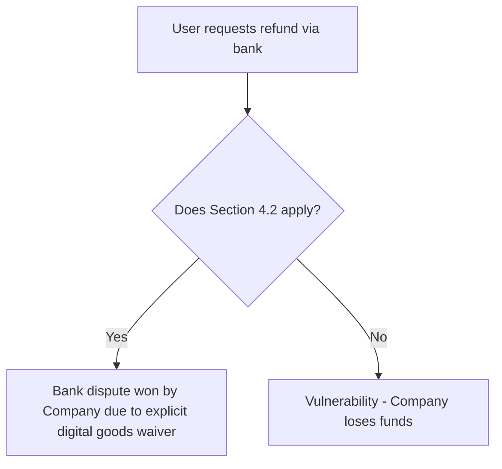

# Legal Reverse Engineering Precedent

**Date:** YYYY-MM-DD
**Target Document:** [Name of the document, e.g., Smmplan Terms of Service, Competitor X Privacy Policy]
**Category:** [e.g., Refund Policy, Limitation of Liability, Dispute Resolution]

## 1. Vulnerability Discovered (The "Legal Bug")
*Describe the flaw, loophole, or ambiguous phrasing found in the document. How could a malicious user (or regulatory body) exploit this?*
- **Vulnerable Text:** "..."
- **Exploit Scenario (Fuzzing result):** ...

## 2. Patch Applied (The "Legal Fix")
*Describe how the text was rewritten to close the loophole.*
- **Patched Text:** "..."
- **Mechanism of Protection:** *How does this protect the company? (e.g., explicit waiver, defined timeframe, shift of burden).*

## 3. Exploit Chain / Graph
*If applicable, provide a mermaid diagram showing the flow of how the protection works or how the attack was blocked.*

## 4. References to Law
*Cite specific articles of the Civil Code (ГК РФ), Consumer Protection Law (ЗоЗПП), or other regulations used to justify the patch.*
- e.g., ст. 429.4 ГК РФ (Абонентский договор)
