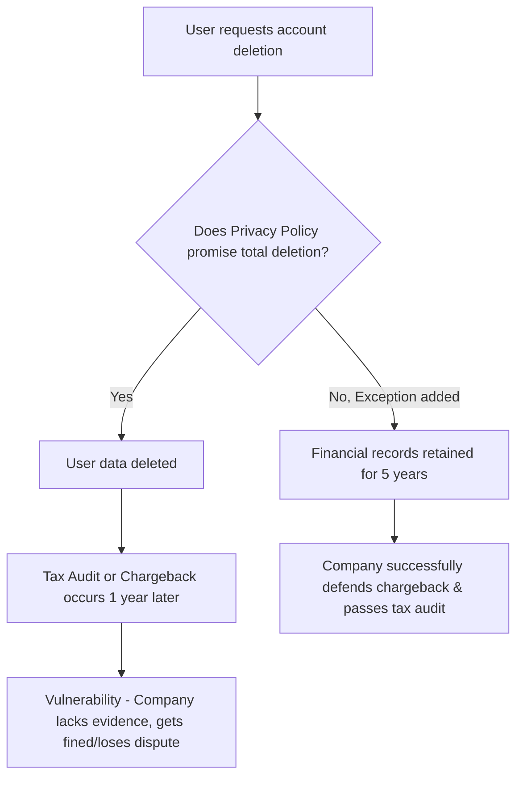

# Legal Reverse Engineering Precedent 001

**Date:** 2026-06-24
**Target Document:** Smmplan Terms of Service, Refund Policy, Privacy Policy (seed-legal.ts)
**Category:** Financial Liability, AML Compliance, Data Retention

## 1. Vulnerability Discovered (The "Legal Bug")
- **Inactive Balance Exploit:** No policy existed for inactive accounts. A user could return 5 years later and demand their money back, creating infinite liability and complicating accounting.
- **Crypto/Foreign Cards Loophole (AML):** The Refund Policy mandated returns *only* to the original payment method. If a user's bank was sanctioned or the card expired, they legally couldn't get a refund, leading to an unwinnable consumer rights dispute.
- **Data Deletion Bug (Privacy Policy):** Section 5.2 claimed *all* data would be deleted in 30 days upon request. This violates 54-FZ (cash register receipts) and the Tax Code, which require keeping financial records for 5 years.

## 2. Patch Applied (The "Legal Fix")
- **Patched Inactive Balance:** Added Section 4.2 to the Terms. "If a user is inactive for 3 years, the contract is terminated, and the remaining balance is written off as company revenue due to the expiration of the statute of limitations (ст. 196 ГК РФ)."
- **Patched AML Loophole:** Added an exception to Section 1.3 of the Refund Policy. "If refund to the original method is technically impossible, it will be sent to another bank account belonging *exclusively* to the User, after KYC identification."
- **Patched Data Deletion:** Added an exception to Section 5.2 of the Privacy Policy. "Exceptions: data about payments, receipts, and services rendered are kept in an anonymized form for up to 5 years to comply with tax laws and defend against chargebacks."

## 3. Exploit Chain / Graph

## 4. References to Law
- ст. 196 ГК РФ (Общий срок исковой давности - 3 года).
- ФЗ № 54-ФЗ (О применении контрольно-кассовой техники).
- ФЗ № 115-ФЗ (ПОД/ФТ).
