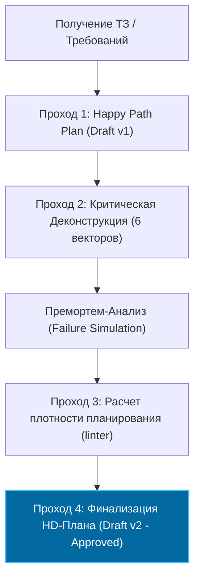

# 🕵️ GSD Plan Re-Evaluation (Double-Pass Planning Manifest)

> **Связь с контрактом:** Этот скилл полностью реализует требования **Zero-Defect Execution Protocol**, зафиксированные в [AGENTS.md](file:///d:/SMM_plan_2/AGENTS.md). Все действия ИИ-агентов по планированию обязаны следовать данному манифесту.

> **Проблема:** Первый план, созданный ИИ-агентом, практически всегда страдает от "Близорукости планирования" (Planning Myopia). Он строится по "счастливому пути" (Happy Path), упуская скрытые архитектурные стыки, рантайм-зависимости, крайние случаи (edge-cases), требования WCAG-доступности, а также неочевидные проблемы производительности и безопасности.
> 
> **Решение:** Данный скилл внедряет обязательную **двухпроходную систему планирования (Double-Pass Planning)**. Он заставляет ассистента принудительно деконструировать первый черновик плана (Draft v1), подвергать его жесткому премортем-сомнению и переоценивать все шаги с точки зрения фундаментальных векторов надежности.

---

## When to activate

Этот скилл **ОБЯЗАН** активироваться в следующих случаях:
- **Use when** receiving any major or medium-complexity task (before writing the first line of code).
- **Activate before** showing the first draft of the implementation plan (`implementation_plan.md`) to the user.
- **Trigger when** the user changes requirements mid-flight to re-evaluate architectural impact.
- **Run when** the user explicitly asks: *"перепроверь план"*, *"проведи премортем"*, *"углуби планирование"*, *"найди ошибки в плане"*.

---

## Step-by-step execution protocol

Процесс переоценки состоит из 4 последовательных фаз, которые ИИ-агент выполняет автономно в режиме саморефлексии:



### Phase 1 — Первичный набросок (Happy Path Draft v1)
Агент набрасывает базовую последовательность действий:
- Какие файлы создать/модифицировать.
- Какие библиотеки использовать.
- Как будет выглядеть базовая логика.
*На этом этапе план является хрупким и оптимистичным.* Агент переходит к принудительному Второму Проходу.

### Phase 2 — Критическая деконструкция (The Second-Pass Audit)
Агент обязан прогнать Draft v1 по **6 векторам жесткого сомнения**:

#### 1. 🛡️ Архитектурный стык (Dependency & Lifecycle Vector)
- **Вопрос:** Какие неявные связи между файлами мы задеваем?
- **Что искать:** 
  - Как изменение хука (например, `useOrderEngine.ts`) повлияет на мобильный мастер (`MobileWizard.tsx`)?
  - Не ломаем ли мы Server/Client границы Next.js? (Никаких `"use server"` в Page Components!).
  - Корректно ли отрабатывают реактивные зависимости (`useEffect`, `useMemo`)? Нет ли риска бесконечных ререндеров или ложного кэширования?

#### 2. 🕳️ Вектор Хаоса и Пустоты (Chaos & Edge-Cases)
- **Вопрос:** Что произойдет, если система окажется в экстремальных условиях?
- **Что искать:**
  - **Синдром пустой базы (Cold Start):** Что видит пользователь, если в БД нет ни одной услуги или категории?
  - **Сбой транзакционности:** Что если в момент записи заказа оборвется соединение с Redis или PostgreSQL? Есть ли транзакционный откат в Prisma?
  - **Стресс-тест раздраженного клиента:** Что если пользователь вставит битую ссылку, ссылку на закрытую группу или будет хаотично кликать на кнопку отправки формы?

#### 3. 🎨 Visual & UX Density Vector (Дизайнерская гармония)
- **Вопрос:** Не выглядит ли результат дешево и оторвано от стандартов премиальности?
- **Что искать:**
  - **Интерфейсный гигантизм:** Не слишком ли огромны элементы ввода (высота кнопок, размер шрифтов)? Не выталкивают ли они полезный контент за пределы первого экрана?
  - **Адаптивный крах:** Как верстка ведет себя на экранах 320px (iPhone SE) и на 4K-мониторах?
  - **Эстетика Tailwind 4 & HeroUI:** Используются ли семантические токены (`text-foreground`, `bg-background`) вместо inline-цветов (`text-white`, `bg-black`)? Есть ли плавные микро-анимации (`transition-all duration-200`)?

#### 4. ♿ Вектор Доступности (WCAG 2.2 AA)
- **Вопрос:** Физически ли удобен интерфейс для всех групп пользователей?
- **Что искать:**
  - **Touch Targets (WCAG 2.5.5):** Соответствуют ли интерактивные элементы стандарту 44x44px (AA) на мобильных устройствах?
  - **Цветовой контраст (WCAG 1.4.3):** Имеет ли текст на элементах управления коэффициент контрастности не менее 4.5:1 (AA)?
  - **Скринридеры (ARIA):** Все ли иконки снабжены `aria-label`, скрыты ли декоративные эмодзи (`aria-hidden="true"`)?

#### 5. 🛡️ Security & Trust Vector (OWASP & Доверие)
- **Вопрос:** Как план влияет на безопасность и лояльность пользователя?
- **Что искать:**
  - **Trust Boundary:** Не доверяем ли мы сырым данным от клиента? Проверяются ли цены на сервере перед отправкой в платежный шлюз (защита от подмены цены)?
  - **Платежная зона:** Вызывает ли финальный шаг чекаута доверие? Есть ли логотипы платежных систем (МИР, СБП, ЮKassa) под кнопкой оплаты?

#### 6. 🔄 Вектор Распределенных Систем (Race Conditions & State Transitions)
- **Вопрос:** Как план взаимодействует с очередями и асинхронным состоянием на бэкенде?
- **Что искать:**
  - **Идемпотентность:** Защищены ли платежные шлюзы, Server Actions и API вебхуков от повторной отправки одинаковых данных со стороны клиента?
  - **Гонки данных (Race Conditions):** Что произойдет, если фоновый воркер (`BullMQ`, `Cron`) изменит состояние заказа одновременно с действием пользователя? Предусмотрен ли статус `PENDING` -> `PROCESSING` с правильными локами?

### Phase 3 — Премортем-анализ и Проверка плотности плана (linter)
1. **Симуляция катастрофы:**
   Агент проводит ментальную симуляцию: *«Представим, что мы задеплоили этот код, и через 5 минут система легла. Что именно сломалось и почему?»*
   Каждый сценарий заносится в таблицу рисков плана реализации.

2. **Запуск автоматической верификации плотности планирования:**
   Агент **ОБЯЗАН** выполнить скрипт-линтер плотности перед отправкой плана пользователю:
   ```bash
   python {{SKILL_PATH}}/scripts/plan_density_linter.py <path_to_implementation_plan.md>
   ```
   Скрипт проверяет следующие жесткие критерии качества плана:
   - **Полнота разделов:** Наличие 4 обязательных разделов (`User Review Required`, `🛡️ Премортем-анализ`, `Proposed Changes`, `Verification Plan`).
   - **Минимальный объем:** Длина плана должна быть не менее 1500 символов (предотвращение Happy Path).
   - **Глубина привязки к коду:** Не менее 3 прямых ссылок в формате `[basename](file:///path/to/file)`.
   - **Анти-размытость:** Поиск более 30 хрупких выражений (TBD, "сделать заглушку", "позже", "как потребуется" и др.).
   - **Валидация премортема:** Проверка наличия структурированной таблицы или списков с рисками и программными предохранителями.
   - **Валидация верификации:** Проверка наличия в плане тестирования реальных консольных команд (`npm run test`, `vitest`, `tsc --noEmit`).

   Если скрипт возвращает ошибку (Score < 80), агент обязан переписать и детализировать план, исправив все замечания линтера.

### Phase 4 — Финализация HD-Плана (High-Definition Plan v2)
Только после успешного прохождения автоматического линтинга плотности агент генерирует итоговый `implementation_plan.md`. План **обязан** содержать:
1. **Раздел "User Review Required"** с описанием архитектурных компромиссов.
2. **Раздел "🛡️ Премортем-анализ"** со списком сценариев отказа и мерами защиты.
3. **Пошаговые доработки** с точным указанием файлов (линки в формате `[basename](file:///path)`) и строк кода.
4. **Количественный и качественный план верификации** (конкретные команды тестирования, сценарии e2e, линтинг, сборка).

---

## Scope boundaries

Этот скилл предназначен для **валидации и углубления планов разработки (implementation plans)**.
Он **НЕ** занимается:
- Автоматическим исправлением багов в самом рантайм-коде приложения.
- Проведением автоматического сквозного e2e-тестирования или написанием unit-тестов (для этого есть Vitest и Cypress).
- Настройкой CI/CD конвейеров или Docker-окружения на Ubuntu-серверах.

---

## Error handling

При обнаружении критических дефектов планирования или нарушений Phase 2/Phase 3, агент обязан:
1. **Заморозить** продвижение к этапу реализации (`task.md`).
2. Сгенерировать предупреждение `[PLANNING_MYOPIA_ALERT]` в комментариях к плану.
3. Предоставить пользователю до 3 альтернативных путей решения с оценкой рисков по шкале P*I.

---

## References

- [AGENTS.md](file:///d:/SMM_plan_2/AGENTS.md) — Smmplan Lite AI Developer Contract
- [AUDIT_STATE.md](file:///d:/SMM_plan_2/AUDIT_STATE.md) — Project Compliance & Verification Log
- `{{SKILL_PATH}}/scripts/plan_density_linter.py` — linter script
- [Keep a Changelog](https://keepachangelog.com/)
- [Semantic Versioning](https://semver.org/)
