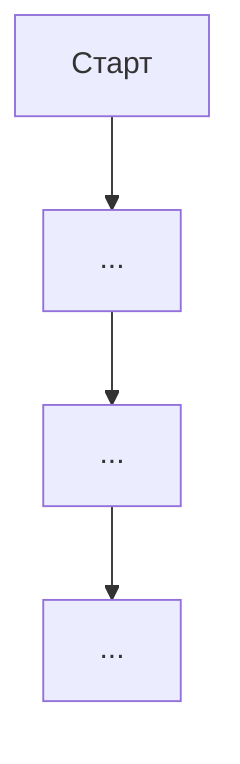

# Шаблон финального плана (расширенный, для высоких сложностей)

Этот шаблон модератор заполняет на этапе Синтеза для задач **высокой сложности** (6-7 ролей). Для средних задач используй `plan-template-compact.md`. Для лёгких — достаточно чат-вывода по `developer-output.md` без файла.

**Важно:** этот план **сохраняется в файл** `/home/z/my-project/download/plan-[task-name].md`. В чат идёт только выжимка по формату `developer-output.md`. Разработчик читает чат-выжимку (2-3 минуты), полный план в файле — для деталей и референса.

---

# План: [Название задачи]

**Дата составления:** [YYYY-MM-DD]
**Сложность:** [Лёгкая / Средняя / Высокая]
**Глубина проработки:** [N шагов вперёд]

## Executive Summary

[1 абзац, 3-5 предложений. Что делаем, ключевую архитектурную идею, главный trade-off. Это первое, что прочитает разработчик — должно за 30 секунд дать понимание решения. Если не получается уложить в 5 предложений — решение недостаточно ясное, вернись к синтезу.]

**Главное решение:** [1 предложение — ключевая архитектурная идея, с которой согласны все роли]

**Вариант на выбор:** [Вариант A (рекомендуемый) / Вариант B — см. раздел 3]

## Состав круглого стола

| Роль | Включена | Почему |
|------|----------|--------|
| Модератор | ✅ | Фасилитация |
| Архитектор | ✅/❌ | [обоснование] |
| Data Engineer | ✅/❌ | [обоснование] |
| Security | ✅/❌ | [обоснование] |
| Performance (backend) | ✅/❌ | [обоснование] |
| Frontend Performance | ✅/❌ | [обоснование] |
| DevOps/SRE | ✅/❌ | [обоснование] |
| SEO/SSR | ✅/❌ | [обоснование] |
| UI/UX | ✅/❌ | [обоснование] |
| Product-менеджер | ✅/❌ | [обоснование] |
| QA | ✅ | Качество и риски |

---

## 1. Цели и контекст

### 1.1 Постановка задачи
[Переформулировка модератором. 2-3 предложения.]

### 1.2 Почему это важно
[Бизнес/пользовательская мотивация.]

### 1.3 Метрики успеха
- **Primary metric:** [...] — target: [...]
- **Secondary metrics:** [...]
- **Counter-metrics:** [...]

### 1.4 Scope
- **Входит:** [...]
- **Вне:** [...]
- **Под вопросом:** [...]

### 1.5 Ограничения
- **Технологические:** [...]
- **Временные:** [...]
- **Ресурсные:** [...]

---

## 2. Пошаговый план

### Шаг 1: [Название]
- **Что делаем:** [...]
- **Зачем:** [...]
- **Что разблокирует:** [...]
- **Зависимости:** [...]
- **Ответственный:** [роль]
- **Effort:** [S/M/L]
- **Definition of Done:**
  - [ ] [критерий]
  - [ ] [критерий]

### Шаг 2: [Название]
[...по той же структуре...]

### Шаг 3: [Название]
[...]

### Шаг 4: [Название]
[...]

> **Глубина плана:** каждый шаг должен показывать, **что станет возможным после**.

---

## 3. Альтернативы

### 3.1 Основной подход (выбран)
[Описание]
- **Почему выбрали:** [...]
- **Что получаем:** [...]
- **Чем платим:** [...]

### 3.2 Альтернатива B
[Описание]
- **Что выигрываем:** [...]
- **Что теряем:** [...]
- **Когда выбрать:** [...]
- **Почему отвергаем:** [...]

### 3.3 Альтернатива C
[...]

> Минимум 2 альтернативы.

---

## 4. Риски и митигация

### 4.1 Топ-риски

| # | Риск | Вероятность | Влияние | Митигация | План Б |
|---|------|-------------|---------|-----------|--------|
| 1 | [...] | Н/С/В | Н/С/В | [...] | [...] |
| 2 | [...] | ... | ... | ... | ... |
| 3 | [...] | ... | ... | ... | ... |

### 4.2 Security-угрозы (STRIDE) — если был Security-раунд

| Компонент | Угроза | STRIDE-категория | Митигация |
|-----------|--------|------------------|-----------|
| [...] | [...] | Spoofing/Tampering/Repudiation/Info Disclosure/DoS/Elevation | [...] |

### 4.3 Риски регрессий
- **[Функция 1]:** [что может сломаться] → [проверка]
- **[Функция 2]:** [...]

### 4.4 Известные ограничения
- [Ограничение 1] — [почему]
- [Ограничение 2] — [почему]

---

## 5. UX-спецификации — если был UI/UX-раунд

### 5.1 User flow (Mermaid)



### 5.2 Ключевые экраны

#### Экран: [Название]
- **Цель:** [...]
- **Ключевые элементы:** [...]
- **Состояния:**
  - Empty: [...]
  - Loading: [...]
  - Error: [...]
  - Success: [...]
- **Микрокопирайтинг:** [...]
- **Accessibility:** [...]
- **Responsive:** [375/768/1280]

### 5.3 Состояния интерфейса
[Описание empty/loading/error/success/partial для каждого ключевого компонента]

---

## 6. Архитектурные детали — если был Архитектор-раунд

### 6.1 Компоненты и контракты
[Описание ключевых компонентов, API контрактов, паттернов]

### 6.2 Поток данных
[Как данные проходят через систему]

---

## 7. Схема данных — если был Data Engineer-раунд

### 7.1 Таблицы и constraints

```sql
-- [SQL с CREATE TABLE, индексами, constraints]
```

### 7.2 Миграционная стратегия
- **Тип:** [expand/contract / online / offline]
- **Шаги:**
  1. [...]
  2. [...]
  3. [...]
- **Rollback:** [...]

### 7.3 Data lifecycle
| Тип данных | Срок | Дальше |
|------------|------|--------|
| [...] | [...] | [...] |

---

## 8. Security checklist — если был Security-раунд

### 8.1 Authentication & Authorization
| Endpoint | Auth | Role | Rate limit | Notes |
|----------|------|------|------------|-------|
| [...] | [...] | [...] | [...] | [...] |

### 8.2 Защита данных
- **PII:** [что хранится, как защищено]
- **Секреты:** [где хранятся]
- **Шифрование:** [at rest / in transit / field-level]

### 8.3 Compliance
- [GDPR / PCI-DSS / 152-ФЗ / SOC2 — если применимо]

### 8.4 Блокеры релиза
- ❌ [...] (critical)
- ❌ [...] (critical)

---

## 9. Performance budgets — если был Performance-раунд(ы)

### 9.1 Backend latency

| Endpoint | P50 | P95 | P99 | Budget breakdown |
|----------|-----|-----|-----|------------------|
| [...] | [...] | [...] | [...] | [...] |

### 9.2 Frontend budgets (Core Web Vitals)
- **LCP:** <[X] сек
- **INP:** <[X] мс
- **CLS:** <[X]
- **Initial bundle:** <[X] KB gzipped
- **Per-route additional:** <[X] KB

### 9.3 Throughput
- **Текущая нагрузка:** [...]
- **Прогноз:** [...]
- **Узкие места:** [...]

---

## 10. DevOps requirements — если был DevOps-раунд

### 10.1 CI/CD pipeline
[Описание stages, что проверяется, что блокирует]

### 10.2 Deployment strategy
- **Способ:** [rolling / blue-green / canary / feature flag]
- **Rollback:** [...]

### 10.3 Observability
- **Логи:** [структура, centralization, PII policy]
- **Метрики:** [RED/USE, dashboards]
- **Трейсинг:** [OpenTelemetry, sampling]

### 10.4 SLO/SLI
- **Availability:** [target]
- **Latency:** [target]
- **Error rate:** [target]
- **Error budget:** [...]

### 10.5 Backup & DR
- **RTO:** [...]
- **RPO:** [...]
- **Стратегия:** [...]

---

## 11. SEO/SSR requirements — если был SEO-раунд

### 11.1 Rendering strategy по страницам
| Страница | Стратегия | Почему |
|----------|-----------|--------|
| [...] | SSG/SSR/CSR/ISR | [...] |

### 11.2 Metadata
[Title, description, OG, Twitter cards, canonical]

### 11.3 Structured data (JSON-LD)
[Schema.org для ключевых страниц]

### 11.4 Sitemap и robots.txt
[Структура, что индексируется, что нет]

---

## 12. Тест-стратегия

### 12.1 Уровни
- **Unit:** [что покрываем, цель покрытия]
- **Integration:** [какие взаимодействия]
- **E2E:** [ключевые сценарии]
- **Performance:** [метрики, пороги]
- **Security:** [tests на STRIDE-угрозы]
- **Manual:** [что требует ручной проверки]

### 12.2 Ключевые edge-cases
- [...] (от PM/UX)
- [...] (от QA)
- [...] (от Security — STRIDE)

### 12.3 Тест-данные
[Подготовка, cleanup, особенно для миграций]

---

## 13. Rollout и Rollback

### 13.1 Rollout-стратегия
- **Способ:** [feature flag / canary / big bang]
- **Сегмент:** [...]
- **Критерий расширения:** [...]
- **Критерий отката:** [...]

### 13.2 Rollback по шагам

| Шаг | Что | Как | Время | Данные |
|-----|-----|-----|-------|--------|
| 1 | [...] | [...] | [...] | [...] |
| 2 | [...] | [...] | [...] | [...] |

### 13.3 Мониторинг после релиза
- **Метрики:** [...]
- **Алерты:** [...]
- **Период повышенного внимания:** [N дней/недель]

---

## 14. Открытые вопросы

[Что осталось непрояснённым. Пустой раздел — отлично.]

- **[Вопрос 1]:** [почему важен, что блокирует]
- **[Вопрос 2]:** [...]

---

## 15. Trade-offs (явные компромиссы)

[Явная таблица: что выбрали, от чего отказались, почему. Это помогает разработчику понять логику и пересмотреть решение, если его контекст другой.]

| # | Aspect | Выбрали | Альтернатива | Почему выбрали это |
|---|--------|---------|--------------|-------------------|
| 1 | [aspect — например, модель данных] | [что выбрали] | [что отвергли] | [краткое обоснование] |
| 2 | [aspect — например, корзина UX] | [что выбрали] | [что отвергли] | [обоснование] |
| 3 | [aspect — например, webhook strategy] | [что выбрали] | [что отвергли] | [обоснование] |
| 4 | [aspect] | [что] | [что] | [обоснование] |
| 5 | [aspect] | [что] | [что] | [обоснование] |

**Принципы заполнения:**
- Каждый trade-off — это **явный выбор**, не «по умолчанию»
- Обоснование — 1-2 предложения, не длиннее
- Если альтернатива объективно хуже во всех сценариях — честно написать «отвергли, нет сценария когда лучше»
- Если альтернатива лучше в каком-то сценарии — явно указать в каком (разработчик может пересмотреть)

---

## 16. Резюме решений круглого стола

### Состав участников
[N] специалистов: [список ролей]. Обоснование состава — в шапке плана.

### Ключевые решения
1. **[Решение 1]** — [почему]
2. **[Решение 2]** — [почему]
3. **[Решение 3]** — [почему]

### Альтернативы, от которых отказались
- **[Альтернатива X]** — [почему]
- **[Альтернатива Y]** — [почему]

### Top-3 риска
1. **[Риск 1]** — митигация: [кратко]
2. **[Риск 2]** — митигация: [кратко]
3. **[Риск 3]** — митигация: [кратко]

### Блокеры релиза (критичные)
- ❌ [...] — должно быть закрыто до production
- ❌ [...] — должно быть закрыто до production

---

## 17. Запрос подтверждения

> **План составлен. Подтверди, чтобы я приступил к имплементации.**
>
> Если нужны корректировки:
> - По целям/scope → скажи, что изменить
> - По архитектуре (раздел 3) → рассмотри альтернативы
> - По приоритетам шагов → обсудим
> - По рискам → добавлю митигации
> - По составу ролей → могу добавить/убрать специалиста и пересобрать
> - По открытым вопросам (раздел 14) → ответь, чтобы закрыть
>
> Если всё ок — напиши «подтверждаю», и я начну с Шага 1.

---

## Заполнение шаблона — чек-лист модератора

Перед презентацией проверь:

### Обязательные разделы (всегда)
- [ ] Executive Summary (1 абзац, 30 сек чтения)
- [ ] Цели и контекст (раздел 1)
- [ ] Пошаговый план (раздел 2) с DoD для каждого шага
- [ ] Альтернативы (раздел 3) — минимум 2
- [ ] Риски и митигация (раздел 4) — минимум 3
- [ ] Тест-стратегия (раздел 12)
- [ ] Rollout и rollback (раздел 13)
- [ ] Trade-offs (раздел 15) — явная таблица компромиссов
- [ ] Резюме (раздел 16)
- [ ] Запрос подтверждения (раздел 17)

### Условные разделы (включать если роль участвовала)
- [ ] UX-спецификации (раздел 5) — если UI/UX
- [ ] Архитектурные детали (раздел 6) — если Архитектор
- [ ] Схема данных (раздел 7) — если Data Engineer
- [ ] Security checklist (раздел 8) — если Security
- [ ] Performance budgets (раздел 9) — если Performance роли
- [ ] DevOps requirements (раздел 10) — если DevOps
- [ ] SEO/SSR requirements (раздел 11) — если SEO

### Качественные критерии
- [ ] Каждый шаг имеет ответственного специалиста
- [ ] Каждый шаг имеет Definition of Done с конкретными критериями
- [ ] Все STRIDE-угрозы отражены в рисках или митигированы
- [ ] Все блокеры релиза явно помечены
- [ ] Глубина соответствует заявленной
- [ ] Конфликты между специалистами разрешены или вынесены в «Открытые вопросы»
- [ ] Edge-cases от QA/PM/UX отражены в плане
- [ ] Мониторинг после релиза описан

Если что-то пропущено — вернись к соответствующему специалисту. Не показывай пользователю план с дырами.
