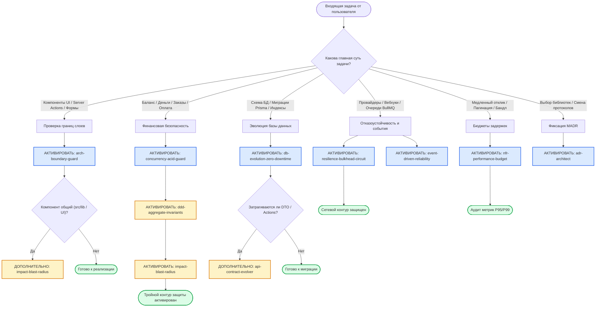

# OmniSMM Architectural Skills Suite — Единый Реестр и Каталог Скиллов

> **Версия реестра:** 1.0.0 (Производственный стандарт платформы OmniSMM 1.0)  
> **Целевой стек:** Next.js 16 (App Router, Standalone Webpack), React 19, Tailwind CSS 4, Prisma 5 (PostgreSQL), BullMQ, Redis 7+, TypeScript 5.7+ (Strict Mode), Vitest 4, Playwright.  
> **Обслуживаемые бренды и витрины:** SMMplan (`smmplan.pro` — Classic API) и SMMflux (`smmflux.ru` — Radiant Aurora), архитектура динамического масштабирования на $N$ тенантов.

---

## 1. Введение и Архитектурная Философия

Комплект архитектурных навыков (**OmniSMM Architectural Skills Suite**) — это нормативный кодекс инженерных практик, инвариантов надежности и шаблонов проектирования, предназначенный для ИИ-ассистентов (Cursor, Claude Code, Gemini, Antigravity) и инженеров платформы. 

Каждый навык регламентирует конкретную инженерную область, содержит пошаговое дерево решений (Decision Tree), премортем-моделирование отказов, жесткие запреты (Hard Invariants) и практические чеклисты верификации.

Платформа следует принципам:
1. **Zero-Defect Quality Gate:** запрет непроверенных гипотез, заглушек (`TODO`), прямого редактирования боевых контейнеров и нетипизированного кода.
2. **ACID & Ledger-First:** баланс является производной от неизменяемого журнала проводок; финансовые расчеты ведутся строго в копейках `BigInt` через `ExactMath` с банковским округлением (Half-Even).
3. **Resilience-by-Design:** изоляция сбоев сторонних провайдеров через распределенный Circuit Breaker, Bulkhead и сетевые таймауты (`AbortSignal.timeout`).
4. **Hexagonal Boundary Purity:** жесткое разделение UI, Application, Domain и Infrastructure слоев с возвратом типизированных контрактов `{ success, error, data }`.

---

## 2. Сводная Матрица Архитектурных Скиллов (Master Architecture Matrix)

| Навык (Skill) | Доменный Кластер | Ключевой Инвариант | Ключевые слова и Триггеры | Ключевые файлы в OmniSMM | Синергии |
| :--- | :--- | :--- | :--- | :--- | :--- |
| [**`arch-boundary-guard`**](./arch-boundary-guard/SKILL.md) | Кластер 1 (Domain & Boundary) | Чистота слоев Clean Architecture, запрет доступа к БД из UI, DTO без секретов, лимит компонентов $\le 200$ строк | Server Actions, `'use client'`, `'use server'`, рефакторинг UI, DTO, `createSafeAction`, утечка секретов | `src/actions/*`, `src/components/*`, `src/app/**/page.tsx`, `src/services/*` | `impact-blast-radius`, `api-contract-evolver`, `nfr-performance-budget` |
| [**`ddd-aggregate-invariants`**](./ddd-aggregate-invariants/SKILL.md) | Кластер 1 (Domain & Boundary) | «1 транзакция = 1 агрегат», Ledger-First, Drip-Feed Floor ($\lfloor Q/N \rfloor \ge \text{minQty}$), буфер Shadow Catalog в Redis | Агрегат, корень агрегата, смена статуса заказа, Drip-Feed, каталог провайдера, Transaction Escape, мутация баланса | `src/lib/wallet-ops.ts`, `src/services/order.service.ts`, `src/services/catalog.service.ts`, `prisma/schema.prisma` | `concurrency-acid-guard`, `event-driven-reliability`, `multi-tenant-isolation-arch` |
| [**`catalog-taxonomy-curator`**](./catalog-taxonomy-curator/SKILL.md) | Кластер 1 (Domain & Boundary) | Taxonomy-First: каноническое дерево категорий ($\le 9$ на сеть), запрет сырых категорий, извлечение тегов в features, слияние дублей | Категории, импорт услуг, таксономия, синк провайдеров, дубликаты категорий, токенизатор, нормализация каталога | `src/services/providers/smart-analyzer.logic.ts`, `src/services/admin/catalog.service.ts`, `src/services/providers/post-sync-rules.ts` | `arch-boundary-guard`, `ddd-aggregate-invariants`, `api-contract-evolver` |
| [**`provider-catalog-importer`**](./provider-catalog-importer/SKILL.md) | Кластер 1 (Domain & Boundary) | AI-мастер импорта провайдеров, каноническая таксономия ($\le 9$), Human-in-the-Loop при сомнениях, многофакторная сортировка | Импорт провайдера, авто-импорт, классификация услуг, HITL, сортировка каталога, генеративный AI, OpenRouter | `scripts/provider-ai-importer.ts`, `src/services/providers/ai-catalog-importer.ts`, `.agents/skills/provider-catalog-importer/*` | `catalog-taxonomy-curator`, `arch-boundary-guard`, `ddd-aggregate-invariants` |
| [**`adr-architect`**](./adr-architect/SKILL.md) | Кластер 1 (Domain & Boundary) | Документирование MADR 3.0, синхронизация с GraphRAG (`:8100`), защита золотого канона решений (`src/proxy.ts`, Tailscale) | Архитектурное решение, выбор библиотеки, ADR, MADR, регрессия, GraphRAG, смена протокола, аудит решений | `docs/architecture/ADR-*.md`, `scripts/memory-client.ts`, `src/proxy.ts` | `arch-boundary-guard`, `api-contract-evolver`, `db-evolution-zero-downtime` |
| [**`concurrency-acid-guard`**](./concurrency-acid-guard/SKILL.md) | Кластер 2 (Distributed & Concurrency) | Защита от TOCTOU, Lost Updates и Double-Spending; `BigInt` ExactMath, дедупликация `idempotencyKey` (P2002), Row-Level Locking | Баланс, списание, пополнение, `WalletOps`, `SELECT FOR UPDATE`, гонка, параллельные запросы, P2002, idempotency | `src/lib/wallet-ops.ts`, `src/lib/exact-math.ts`, `src/lib/financial/audit.ts`, `src/app/api/webhooks/*` | `ddd-aggregate-invariants`, `db-evolution-zero-downtime`, `event-driven-reliability` |
| [**`db-evolution-zero-downtime`**](./db-evolution-zero-downtime/SKILL.md) | Кластер 2 (Distributed & Concurrency) | Паттерн Expand/Contract, запрет In-Place Breaking DDL, `CREATE INDEX CONCURRENTLY`, лимиты `lock_timeout` ('2s') | Миграция БД, Prisma schema, `ALTER TABLE`, rename column, add index, блокировка таблицы, zero-downtime | `prisma/schema.prisma`, `prisma/migrations/*`, `scripts/migrate-safe.ts` | `concurrency-acid-guard`, `api-contract-evolver`, `nfr-performance-budget` |
| [**`event-driven-reliability`**](./event-driven-reliability/SKILL.md) | Кластер 2 (Distributed & Concurrency) | Защита от Dual-Write через Transactional Outbox, Exactly-Once доставка, BullMQ воркеры с Check-Then-Set, DLQ с бэкоффом | Очереди, BullMQ, воркер, Transactional Outbox, ProviderOutbox, Dual-Write, DLQ, потеря задач, graceful shutdown | `src/lib/queues/*`, `src/workers/*`, `src/services/provider-outbox.service.ts`, `src/lib/redis.ts` | `concurrency-acid-guard`, `ddd-aggregate-invariants`, `resilience-bulkhead-circuit` |
| [**`resilience-bulkhead-circuit`**](./resilience-bulkhead-circuit/SKILL.md) | Кластер 3 (Resilience & Multi-Tenant) | Распределенный Circuit Breaker в Redis (Closed/Open/Half-Open), изоляция отсеков Bulkhead, таймауты `AbortSignal.timeout` | Падение провайдера, таймаут API, Circuit Breaker, Bulkhead, HTTP 429, троттлинг, зависание внешних запросов, фейловер | `src/services/providers/*`, `src/lib/circuit-breaker.ts`, `src/lib/bulkhead.ts`, `src/lib/proxied-fetch.ts` | `event-driven-reliability`, `nfr-performance-budget`, `multi-tenant-isolation-arch` |
| [**`multi-tenant-isolation-arch`**](./multi-tenant-isolation-arch/SKILL.md) | Кластер 3 (Resilience & Multi-Tenant) | Строгая изоляция тенантов в БД (`where: { tenantId }`), tenant-aware кэширование, разделение касс 54-ФЗ и барьер ст. 54.1 НК РФ | Мульти-тенантность, SMMplan, SMMflux, tenantId, Brand Bleeding, 54-ФЗ, НДС 22%, ЮKassa per-tenant, GlobalSiteSwitcher | `src/proxy.ts`, `prisma/schema.prisma`, `src/lib/tenant.ts`, `src/components/ui/*`, `src/app/api/webhooks/payment/*` | `arch-boundary-guard`, `resilience-bulkhead-circuit`, `api-contract-evolver` |
| [**`api-contract-evolver`**](./api-contract-evolver/SKILL.md) | Кластер 4 (API, Blast Radius & NFR) | Contract-First на базе Zod, 100% обратная совместимость (Zero Breaking Changes), RFC 8594 Sunset/Deprecation, Dual-Read/Write | Изменение API, сигнатура Server Action, Zod схема, DTO, Breaking Changes, депрекация, мобильный визард, вебхук | `src/validators/*`, `src/actions/*`, `src/app/api/*`, `src/types/contracts/*` | `arch-boundary-guard`, `impact-blast-radius`, `db-evolution-zero-downtime` |
| [**`impact-blast-radius`**](./impact-blast-radius/SKILL.md) | Кластер 4 (API, Blast Radius & NFR) | Картирование радиуса поражения через `grep_search`, метрики сцепления Мартина ($C_a, C_e, I$), моделирование сбоя на 3 шага вперед | Радиус поражения, общая утиль, хелпер, рефакторинг ядра, pre-mortem, связанность, каскадный сбой | `src/lib/*`, `src/actions/*`, `src/proxy.ts`, `src/lib/wallet-ops.ts`, `src/components/ui/*` | `arch-boundary-guard`, `api-contract-evolver`, `nfr-performance-budget` |
| [**`nfr-performance-budget`**](./nfr-performance-budget/SKILL.md) | Кластер 4 (API, Blast Radius & NFR) | Контроль бюджетов задержек (Admin P95 < 200ms, DB Query < 30ms), запрет `OFFSET` (Keyset cursor), искоренение N+1, First Load JS < 150 Кб | Производительность, P95/P99, медленный запрос, курсорная пагинация, N+1, вес бандла, tree-shaking, connection_limit | `src/lib/db.ts`, `src/lib/pagination.ts`, `src/app/admin/*`, `next.config.mjs` | `db-evolution-zero-downtime`, `impact-blast-radius`, `resilience-bulkhead-circuit` |
| [**`production-readiness-guard`**](./production-readiness-guard/SKILL.md) | Кластер 4 (API, Blast Radius & NFR) | 10 Hard Invariants: O(1) RAM Streams, Zero Unbounded Cache, Deterministic Timeouts, RSC DTO Capping, Load Shedding | Производственный код, собеседование, OOM, утечка памяти, блокировка Event Loop, N+1, TOCTOU, Graceful Shutdown | `scripts/audit-production-readiness.ts`, `.agents/skills/production-readiness-guard/*` | `nfr-performance-budget`, `arch-boundary-guard`, `concurrency-acid-guard` |
| [**`maker-checker-protocol`**](./maker-checker-protocol/SKILL.md) | Кластер 5 (AI Governance & Quality Gates) | Разделение Создатель vs Ревизор, закон эпистемической изоляции, физический запрет записи (Zero-Write Sandbox), 5 векторов вето | Maker, Checker, эпистемическая изоляция, независимый аудит, ревьюер, Zero-Write, Handoff bundle | `scripts/maker-checker-harness.ts`, `.agents/skills/maker-checker-protocol/SKILL.md` | `multi-model-jury`, `arch-boundary-guard`, `concurrency-acid-guard` |
| [**`multi-model-jury`**](./multi-model-jury/SKILL.md) | Кластер 5 (AI Governance & Quality Gates) | Слепой консенсус 3 гетерогенных LLM (Claude, OpenAI, DeepSeek), право абсолютного вето при блокерах, Supermajority $\ge 2/3$ | Multi-Model Jury, коллегия присяжных, слепое ревью, cognitive blindspots, вето, OpenRouter, арбитраж моделей | `scripts/multi-model-jury.ts`, `docs/architecture/JURY_VERDICTS.md` | `maker-checker-protocol`, `arch-boundary-guard`, `impact-blast-radius` |
| [**`llm-mutation-testing`**](./llm-mutation-testing/SKILL.md) | Кластер 5 (AI Governance & Quality Gates) | Состязательный взлом кода (Adversarial Red Team), инъекция семантических мутаций в финансы и безопасность, Mutation Score $\ge 85\%$ | Мутационное тестирование, Mutation Score, Red Team, диверсант, выживший мутант, слепые зоны тестов, убить мутанта | `scripts/mutation-testing-redteam.ts`, `.planning/MUTATION_TEST_REPORT.md` | `concurrency-acid-guard`, `multi-tenant-isolation-arch`, `maker-checker-protocol` |
| [**`ephemeral-sandbox-visual-loop`**](./ephemeral-sandbox-visual-loop/SKILL.md) | Кластер 5 (AI Governance & Quality Gates) | Изоляция Blue-Green Stage (:3005), многоролевой Headless аудит в реальном браузере (Chromium), No Horizontal Scroll, откат за 5 секунд | Blue-Green, Stage 3005, визуальный аудит, скриншоты, Puppeteer, Playwright, горизонтальный скролл, Human Approval | `scripts/ephemeral-sandbox-visual-loop.ts`, `.planning/STAGE_VISUAL_AUDIT_REPORT.md` | `arch-boundary-guard`, `maker-checker-protocol`, `multi-model-jury` |
| [**`layout-overflow-sentry`**](./layout-overflow-sentry/SKILL.md) | Кластер 5 (AI Governance & Quality Gates) | Детекция поплывшей верстки, горизонтального скролла, сплющивания иконок (shrink-0), iOS Auto-Zoom (<16px), обрезания модалок и таблиц | Поплывшая верстка, горизонтальный скролл, overflow, shrink-0, iOS Auto-Zoom, dvh, Safe Area, обрезание колонок, Zero-Squash | `scripts/ui/layout-sentry.ts`, `src/components/*`, `src/app/globals.css` | `viewport-responsive-density`, `mobile-first-responsive-architect`, `ephemeral-sandbox-visual-loop` |
| [**`self-healing-ooda-loop`**](./self-healing-ooda-loop/SKILL.md) | Кластер 5 (AI Governance & Quality Gates) | Замкнутый цикл OODA (Observe-Orient-Decide-Act), маскирование PII, авто-тест репродукции (Red Phase), синтез хотфикса (Green Phase) | Self-Healing, OODA, инцидент, Sentry, авто-хотфикс, воспроизводящий тест, Red-Green, PII Redaction | `scripts/self-healing-ooda-loop.ts`, `.planning/SELF_HEALING_INCIDENT_REPORT.md` | `llm-mutation-testing`, `maker-checker-protocol`, `ephemeral-sandbox-visual-loop` |
| [**`docker-memory-ops`**](./docker-memory-ops/SKILL.md) | Кластер 6 (Infrastructure & Host Ops) | 4-фазный SRE-протокол (137 vs 143, cgroups v2, headroom, drop_caches, V8 heap dump, Golden Ratio RAM limits) | Docker, memory leak, OOM, exit 137, cgroups v2, memory.events, drop_caches, vmmem, WSL2, docker stats | `scripts/docker-mem-audit.ps1`, `docker-compose.yml`, `.agents/skills/docker-memory-ops/*` | `nfr-performance-budget`, `ephemeral-sandbox-visual-loop` |
| [**`clash-verge-atomics`**](./clash-verge-atomics/SKILL.md) | Кластер 6 (Infrastructure & Host Ops) | 3-уровневый Profile Enhancement (Merge/Script/Rules), Named Pipe IPC (`\\.\pipe\verge-mihomo`), фиксация `mode: rule`, прямой доступ в РФ | Clash Verge, Mihomo, Clash.Meta, rules, prepend, DIRECT, Named Pipe, TUN, gVisor, Fake-IP, .ru, smmtoolbox, happydesk | `.agents/skills/clash-verge-atomics/*`, `%APPDATA%/io.github.clash-verge-rev...` | `resilience-bulkhead-circuit`, `impact-blast-radius` |
| [**`docker-lean-build-ops`**](./docker-lean-build-ops/SKILL.md) | Кластер 6 (Infrastructure & Host Ops) | Бережливая сборка без зависания ПК (BelowNormal, CPU Affinity), учет нагрузок при старте, очистка .next/cache и Docker-мусора, защита WSL2 VHDX | Бережливая сборка, eco-build, зависание ПК, CPU affinity, BelowNormal, очистка старых сборок, prune, vhdx, sparseVhd, preflight | `scripts/lean-docker-build.ps1`, `scripts/docker-clean-bloat.ps1`, `scripts/preflight-container-sizing.ts` | `docker-memory-ops`, `nfr-performance-budget` |
| [**`competitor-threat-shield`**](./competitor-threat-shield/SKILL.md) | Кластер 7 (Security & Adversarial Defense) | Защита от гибридных атак конкурентов: дренаж провайдеров, Drip-Feed Floor, кардинг/чарджбэки, фискальный DDoS 54-ФЗ, РКН-подставы | Атаки конкурентов, threat model, кардинг, чарджбэк, токсичный таргет, РКН блокировка, спамтрапы, снайпинг каталога, fake чеки | `src/lib/wallet-ops.ts`, `src/app/api/webhooks/*`, `src/actions/order-checkout.actions.ts`, `src/lib/exact-math.ts` | `concurrency-acid-guard`, `resilience-bulkhead-circuit`, `llm-mutation-testing` |
| [**`owasp-asvs-sentinel`**](./owasp-asvs-sentinel/SKILL.md) | Кластер 7 (Security & Adversarial Defense) | Пентест-иммунитет OWASP Top 10:2025 и ASVS v4.0.3 L2, Guest-Proof IDOR, Timing-Safe HMAC, RateLimit RFC 9331, Strict-Dynamic Nonce | Безопасность, OWASP, пентест, ASVS, IDOR, CSP, Nonce, HMAC, Timing Attack, RFC 9331, RateLimit, RBAC, Grant Ceiling | `src/proxy.ts`, `src/actions/*`, `src/app/api/webhooks/*`, `src/lib/auth.ts` | `competitor-threat-shield`, `payment-gateway-fuzzer`, `arch-boundary-guard` |
| [**`local-pentest-orchestrator`**](./local-pentest-orchestrator/SKILL.md) | Кластер 7 (Security & Adversarial Defense) | Локальный статический и динамический пентест (SAST/DAST), фаззинг эндпоинтов, гонки баланса, субагенты и OpenRouter рой | Пентест, SAST, DAST, фаззинг, гонки, race condition, Double-Spend, субагенты, OpenRouter, CVSS, ASVS, уязвимости | `scripts/security/pentest-orchestrator.ts`, `src/actions/*`, `src/app/api/*` | `owasp-asvs-sentinel`, `payment-gateway-fuzzer`, `concurrency-acid-guard` |
| [**`payment-gateway-fuzzer`**](./payment-gateway-fuzzer/SKILL.md) | Кластер 2 (Distributed & Concurrency) | Фаззинг и стресс-тестирование шлюзов (ЮKassa, Robokassa, CryptoBot), гонки вебхуков, защита от Double-Crediting, idempotencyKey | Платежный шлюз, вебхук, гонка платежей, фаззинг, двойное зачисление, возврат, ЮKassa, Robokassa, CryptoBot, P2002 | `src/lib/wallet-ops.ts`, `src/app/api/webhooks/payment/*`, `src/services/billing/*` | `concurrency-acid-guard`, `compliance-54fz-auditor`, `owasp-asvs-sentinel` |
| [**`postgres-query-doctor`**](./postgres-query-doctor/SKILL.md) | Кластер 4 (API, Blast Radius & NFR) | Профилирование PostgreSQL и Prisma 5, Keyset-пагинация, искоренение N+1, Tenant-First составные индексы, connection_limit | Медленный запрос, N+1, Keyset, пагинация, Prisma findMany, EXPLAIN ANALYZE, composite index, lock_timeout, PgBouncer | `src/lib/db.ts`, `prisma/schema.prisma`, `src/services/*`, `src/app/admin/*` | `db-evolution-zero-downtime`, `nfr-performance-budget`, `production-readiness-guard` |
| [**`compliance-54fz-auditor`**](./compliance-54fz-auditor/SKILL.md) | Кластер 1 (Domain & Boundary) | Фискальный комплаенс 54-ФЗ, НДС 2026 (22% и лимит УСН 20 млн ₽), реквизиты ФФД 1.2 (advance vs service), разделение касс тенантов (ст. 54.1 НК РФ) | 54-ФЗ, онлайн-касса, чек, НДС 22%, УСН 20 млн, vat_code, ФФД 1.2, аванс, возврат прихода, ЮKassa чек, Robokassa чек | `src/services/fiscal/*`, `src/lib/exact-math.ts`, `src/app/api/webhooks/payment/*` | `payment-gateway-fuzzer`, `multi-tenant-isolation-arch`, `concurrency-acid-guard` |
| [**`compliance-legal-ecommerce-ru`**](./compliance-legal-ecommerce-ru/SKILL.md) | Кластер 1 (Domain & Boundary) | Brand-First & Deep Legal Privacy, 152-ФЗ защита PII ИП, ст. 9 ЗоЗПП, Постановление № 2463, Zero-Home-Address, санитизация оферты | Юридические реквизиты, оферта, ИП, ИНН, скрытие адреса, 152-ФЗ, конфиденциальность, футер, terms, refund, ЗоЗПП | `src/components/landing/*Footer.tsx`, `src/components/landing/LegalPageContent.tsx`, `src/lib/settings.ts`, `src/app/admin/settings/*` | `multi-tenant-isolation-arch`, `compliance-54fz-auditor`, `owasp-asvs-sentinel` |
| [**`speckit-suite`**](./speckit-specify/SKILL.md) | Кластер 8 (Spec-Driven Development) | 5-фазный цикл SDD (Specify → Clarify → Plan → Tasks → Implement → Converge), автономный баг-триаж и оценка идей | SDD, спецификация, spec-kit, speckit, user stories, tasks, clarify, bug triage, assess | `.specify/*`, `.agents/skills/speckit-*`, `specs/*` | `arch-boundary-guard`, `maker-checker-protocol`, `api-contract-evolver` |
| [**`ui-theme-architect`**](./ui-theme-architect/SKILL.md) | Кластер 5 (AI Governance & Quality Gates) | Архитектор тем оформления, HCT/OKLCH палитры, WCAG 2.2 AA / APCA контраст >= 4.5:1, Tailwind 4 @theme, аудит хардкода цветов | Темы, дизайн-система, контраст, WCAG, палитра, токены, Tailwind 4, raw hex, text-white, bg-black, Seed Color | `src/app/globals.css`, `scripts/ui/theme-harness.ts`, `src/components/*` | `layout-overflow-sentry`, `google-stitch-architect`, `heroui-v3-compound-guard` |
| [**`google-stitch-architect`**](./google-stitch-architect/SKILL.md) | Кластер 5 (AI Governance & Quality Gates) | Генератор интерфейсов Google Stitch / StitchMCP в React 19, защита от AI-клише (Zero-Slop), 6 дизайн-ДНК | Stitch, google stitch, генерация ui, zero-slop, клише, дизайн-днк, макет, дизайн-код | `scripts/harness/stitch-pipeline-bridge.ts`, `docs/specs/SPEC-2026-09-13-stitch-and-yandex-skills.md` | `wireframe-nanobanana-stitch`, `ui-theme-architect`, `arch-boundary-guard` |
| [**`wireframe-nanobanana-stitch`**](./wireframe-nanobanana-stitch/SKILL.md) | Кластер 5 (AI Governance & Quality Gates) | Сквозной конвейер: Идея -> Wireframe (HTML/Tailwind) -> Nano Banana (Gemini Flash Image) -> Google Stitch (React 19) | Wireframe, вайрфрейм, nanobanana, stitch, скетч, макет, generative-ui, design-to-code | `.agents/skills/wireframe-nanobanana-stitch/*`, `docs/specs/SPEC-2026-09-18-wireframe-nanobanana-stitch.md` | `google-stitch-architect`, `ui-theme-architect`, `viewport-responsive-density` |
| [**`foolproof-minimalist-ux`**](./foolproof-minimalist-ux/SKILL.md) | Кластер 5 (AI Governance & Quality Gates) | Auto-Folding FSM, ультра-компактность виджетов ($\le 220\text{px}$), Single Active Focus («интерфейс для дураков»), откат в 1 клик | Минимализм, экономия места, дураков, foolproof, прогрессивное схлопывание, auto-folding, компактный ui, zero-slop | `.agents/skills/foolproof-minimalist-ux/*`, `docs/specs/SPEC-2026-09-18-foolproof-minimalist-ux.md` | `wireframe-nanobanana-stitch`, `viewport-responsive-density`, `mobile-cro-interaction` |
| [**`yandex-seo-2026-hypergrowth`**](./yandex-seo-2026-hypergrowth/SKILL.md) | Кластер 1 (Domain & Boundary / Growth) | Стандарт 2026: Яндекс «Нейро» (AEO), IndexNow мгновенная индексация, КФ (1 шт в рублях, 54-ФЗ, 152-ФЗ), мульти-тенантная анти-мимикрия | SEO, яндекс, нейро, yati, indexnow, schema-org, aeo, коммерческие факторы, robots.txt, sitemap, canonical | `src/app/robots.ts`, `src/app/sitemap.ts`, `src/services/seo/*`, `src/components/seo/*`, `src/lib/seo-helpers.ts` | `multi-tenant-isolation-arch`, `compliance-54fz-auditor`, `compliance-legal-ecommerce-ru` |


---

## 3. Реестр Скиллов по Доменным Кластерам

### Кластер 1 — Доменные границы и системный дизайн (Domain & Boundary Cluster)

Кластер отвечает за чистоту архитектуры, предотвращение спагетти-зависимостей, защиту инвариантов бизнес-моделей и долгосрочную преемственность архитектурных решений.

```
┌────────────────────────────────────────────────────────────────────────────────────────┐
│                              КЛАСТЕР 1: ДОМЕННЫЕ ГРАНИЦЫ                               │
│                                                                                        │
│  ┌──────────────────────┐  ┌──────────────────────┐  ┌──────────────────────────────┐  │
│  │ arch-boundary-guard  │  │ddd-aggregate-invar...│  │  catalog-taxonomy-curator    │  │
│  │ Чистота слоев        │──│ Инварианты агрегатов │──│  Каноническая таксономия     │  │
│  │ Server/Client DTO    │  │ «1 tx = 1 aggregate» │  │  Нормализация импорта услуг  │  │
│  └──────────────────────┘  └──────────────────────┘  └──────────────────────────────┘  │
│                                      │                                                 │
│                                      ▼                                                 │
│                            ┌───────────────────┐                                       │
│                            │   adr-architect   │                                       │
│                            │   Решения MADR    │                                       │
│                            │   GraphRAG:8100   │                                       │
│                            └───────────────────┘                                       │
└────────────────────────────────────────────────────────────────────────────────────────┘
```

#### 1.1. [`arch-boundary-guard`](./arch-boundary-guard/SKILL.md)
* **Назначение и зона ответственности:**  
  Обеспечение чистоты слоев Clean/Hexagonal Architecture в Next.js 16 App Router. Разделяет Presentation (UI), Application (Server Actions / Route Handlers), Domain (бизнес-правила, ExactMath) и Infrastructure (Prisma, Redis, внешние API). Контролирует лимит строк компонентов ($\le 150\text{--}200$ строк) и изолирует клиентские бандлы от серверных секретов.
* **Триггерные фразы и интенты пользователя:**  
  - «Создай новую страницу или компонент для дашборда...»
  - «При изменении Server Action или добавлении роута API...»
  - «Проверь разделение Server и Client компонентов...»
  - «Рефакторинг слишком большого файла формы...»
  - «Убедись, что секреты и себестоимость не утекают на клиент...»
* **Сценарии применения в OmniSMM:**  
  - Реализация Server Actions в `src/actions/` с валидацией Zod и защитой через `requireStaffPermission`.
  - Запрет директивы `"use server"` внутри страниц `page.tsx` (предотвращает краш сборки).
  - Срезание полей `providerCost`, `apiKeyHash`, `adminNote` при маппинге доменных моделей в клиентские DTO.
  - Декомпозиция монструозных React-компонентов на атомарные части с использованием хуков React 19 (`useActionState`).
* **Синергии и кросс-ссылки:**  
  - [`impact-blast-radius`](./impact-blast-radius/SKILL.md): перед переносом общей бизнес-логики проверяется радиус поражения смежных вызовов.
  - [`api-contract-evolver`](./api-contract-evolver/SKILL.md): гарантирует, что возвращаемые структуры соответствуют строгому типу `{ success: boolean, error?: string, data?: T }`.
  - [`nfr-performance-budget`](./nfr-performance-budget/SKILL.md): динамический импорт тяжелых UI-библиотек (BlockNote, Recharts) в клиентских компонентах.
* **Предотвращаемые антипаттерны:**  
  - ❌ Импорт Prisma Client (`import { db } from '@/lib/db'`) в клиентском компоненте `'use client'`.
  - ❌ Необработанный `throw new Error(...)` в Server Action (маскируется Next.js в неинформативную ошибку 500).
  - ❌ Передача клиентскому интерфейсу сырой сущности базы данных с приватными данными поставщика.
  - ❌ Монолитные JSX-файлы объемом 500+ строк.

---

#### 1.2. [`ddd-aggregate-invariants`](./ddd-aggregate-invariants/SKILL.md)
* **Назначение и зона ответственности:**  
  Защита инвариантов доменных агрегатов и транзакционных границ Domain-Driven Design в экосистеме OmniSMM. Включает агрегаты `User & Wallet` (баланс, проводки леджера, `WalletOps`), `Order` (матрица переходов статусов, Drip-Feed Floor) и `Service & Provider` (буферизация Shadow Catalog в Redis).
* **Триггерные фразы и интенты пользователя:**  
  - «Нужно изменить логику списания баланса или создания заказа...»
  - «Настройка Drip-Feed заказов или Smart Drip...»
  - «Импорт или синхронизация услуг от внешнего SMM-поставщика...»
  - «При изменении жизненного цикла статусов заказа...»
  - «Проверь транзакционную границу агрегата...»
* **Сценарии применения в OmniSMM:**  
  - Обеспечение правила «1 транзакция = 1 агрегат»: списание баланса пользователя и создание заказа провайдеру связываются асинхронно через Transactional Outbox, исключая распределенные дедлоки.
  - Соблюдение Drip-Feed Floor Invariant: объем на запуск $\lfloor Q/N \rfloor \ge \text{service.minQty}$.
  - Защита Shadow Catalog: буферизация 5000+ услуг внешних поставщиков в Redis `provider:{id}:catalog` без засорения основной базы данных PostgreSQL.
* **Синергии и кросс-ссылки:**  
  - [`concurrency-acid-guard`](./concurrency-acid-guard/SKILL.md): реализация Ledger-First принципа внутри агрегата `User & Wallet`.
  - [`event-driven-reliability`](./event-driven-reliability/SKILL.md): асинхронная доставка событий между агрегатами через BullMQ.
  - [`multi-tenant-isolation-arch`](./multi-tenant-isolation-arch/SKILL.md): скоупинг инвариантов агрегата под конкретный `tenantId`.
* **Предотвращаемые антипаттерны:**  
  - ❌ Прямая мутация `User.balance` в обход создания `LedgerEntry`.
  - ❌ Мутация дочерней сущности (`TicketMessage`, `LedgerEntry`) в обход корня агрегата.
  - ❌ Выполнение синхронных HTTP-запросов к внешним поставщикам внутри открытой транзакции БД.
  - ❌ Оформление Drip-Feed с порциями меньше минимального лимита провайдера.

---

#### 1.3. [`catalog-taxonomy-curator`](./catalog-taxonomy-curator/SKILL.md)
* **Назначение и зона ответственности:**  
  Архитектурный скилл систематизации каталога, управления канонической таксономией и нормализации импорта услуг в платформе OmniSMM 1.0 (SMMplan / SMMflux). Регламентирует жесткое каноническое дерево категорий (до 6-9 понятных разделов на соцсеть), запрещает создание сырых мусорных категорий в БД, обеспечивает автоматическое извлечение технических тегов (`[Для закрытых каналов]`, `[Таргетинг]`, `[Tgstat]`, `[Россия]`) в структурированные атрибуты услуги (`features`/`badges`), предотвращает раздувание каталога и обеспечивает безопасное слияние дублей без поломки исторических заказов и SEO-ссылок.
* **Триггерные фразы и интенты пользователя:**  
  - «Много очень категорий, проблема с импортом услуг, нужно систематизировать...»
  - «Приведи каталог в порядок, категории дублируются...»
  - «Настрой нормализацию категорий при импорте от провайдеров...»
  - «Объедини дублирующиеся категории в соцсетях...»
  - «Убери мусорные теги провайдеров из названий в меню...»
* **Сценарии применения в OmniSMM:**  
  - Токенизация и очистка услуг в `SmartAnalyzerLogic` при получении каталога от SMM-панелей.
  - Консолидация и безопасное слияние категорий в БД через `scripts/catalog-taxonomy-consolidator.ts`.
  - Удержание инварианта $\le 9$ канонических категорий на одну социальную сеть.
  - Обогащение моделей `Service` метаданными (`isPrivate`, `geo`, `telemetr`, `speed`, `warranty`).
* **Синергии и кросс-ссылки:**  
  - [`arch-boundary-guard`](./arch-boundary-guard/SKILL.md): чистота доменных моделей и DTO каталога.
  - [`ddd-aggregate-invariants`](./ddd-aggregate-invariants/SKILL.md): изоляция агрегатов заказов от слияния категорий.
  - [`api-contract-evolver`](./api-contract-evolver/SKILL.md): сохранение стабильных URL и слагов категорий.
* **Предотвращаемые антипаттерны:**  
  - ❌ Создание сырых категорий провайдера (`Telegram Авто - Просмотры [Для закрытых каналов]`) прямо в базе данных.
  - ❌ Дублирование платформенных префиксов в именах категорий (`Instagram Лайки` рядом с `Лайки`).
  - ❌ Разрастание каталога до сотен категорий в сайдбаре витрины.
  - ❌ Потеря исторических заказов или поломка SEO-ссылок при реорганизации категорий.

---

#### 1.4. [`adr-architect`](./adr-architect/SKILL.md)
* **Назначение и зона ответственности:**  
  Формализация и управление архитектурными решениями по международному стандарту MADR 3.0 (Markdown Architectural Decision Records). Предотвращает «архитектурную амнезию» у сменяющихся AI-ассистентов и разработчиков. Синхронизирует принятые решения с локальной векторной базой знаний GraphRAG на `http://localhost:8100/api/decision`.
* **Триггерные фразы и интенты пользователя:**  
  - «Принимаем новое архитектурное решение по стеку...»
  - «Почему у нас используется src/proxy.ts, а не middleware.ts?...»
  - «Зафиксируй выбор библиотеки или протокола в ADR...»
  - «Проведи аудит архитектурных решений перед рефакторингом...»
  - «Синхронизируй решение с базой знаний GraphRAG...»
* **Сценарии применения в OmniSMM:**  
  - Защита принятых фундаментальных решений (Grand Decisions): официальный туннель Tailscale Funnel вместо заблокированного Cloudflare, отказ от `middleware.ts` в пользу `proxy.ts`, денежные расчеты в копейках `BigInt`.
  - Оформление решений в `docs/architecture/ADR-YYYY-NN-SLUG.md` с фиксацией контекста, отвергнутых альтернатив, компромиссов и стратегии валидации.
  - Автоматическая отправка метаданных решений в GraphRAG (`POST /api/decision`).
* **Синергии и кросс-ссылки:**  
  - [`arch-boundary-guard`](./arch-boundary-guard/SKILL.md): фиксация правил декомпозиции и расположения слоев.
  - [`api-contract-evolver`](./api-contract-evolver/SKILL.md): документирование изменений протоколов и этапов депрекации API.
  - [`db-evolution-zero-downtime`](./db-evolution-zero-downtime/SKILL.md): фиксация миграционных стратегий для крупных таблиц.
* **Предотвращаемые антипаттерны:**  
  - ❌ Попытка переименовать `src/proxy.ts` обратно в `src/middleware.ts` из-за незнания специфики Next.js 16.
  - ❌ Внедрение библиотек с плавающей точкой для денежных расчетов.
  - ❌ Принятие архитектурных решений без заполнения секций «Alternatives Considered» и «Consequences».
  - ❌ Потеря контекста при смене контекстного окна модели или передаче задачи другому субагенту.

---

#### 1.5. [`provider-catalog-importer`](./provider-catalog-importer/SKILL.md)
* **Назначение и зона ответственности:**  
  Аналитический и операционный скилл сквозного автоматического импорта, интеллектуальной классификации и многофакторной сортировки услуг от внешних SMM-провайдеров. Реализует генеративный AI-пайплайн (OpenRouter / Antigravity) для пакетного рерайтинга и нормализации услуг, жесткий Human-in-the-Loop шлюз при сомнениях ИИ, многофакторную сортировку (Соцсети $\to$ Категории $\to$ Услуги) и адаптивное ценообразование по формулам платформы.
* **Триггерные фразы и интенты пользователя:**  
  - «Импортируй услуги от нового провайдера...»
  - «Разбери и классифицируй каталог по соцсетям и категориям...»
  - «Запусти AI-мастер импорта услуг...»
  - «Сделай грамотную сортировку витрины услуг...»
  - «Спроси меня, если ИИ сомневается в категории...»
* **Сценарии применения в OmniSMM:**  
  - Интерактивный импорт услуг провайдеров через `scripts/provider-ai-importer.ts` (`npm run catalog:ai-import`).
  - Пакетная классификация сотен услуг через OpenRouter с автоматическим извлечением бейджей (гарантия, гео, скорость).
  - Human-in-the-Loop пауза при `confidence < 0.85` или редких услугах с уточнением у оператора.
  - Расчет розничных цен по адаптивной лестнице `applyPricingLadder` с защитным полом 3.0x и красивым округлением.
* **Синергии и кросс-ссылки:**  
  - [`catalog-taxonomy-curator`](./catalog-taxonomy-curator/SKILL.md): соблюдение канонической таксономии ($\le 9$ категорий на сеть).
  - [`arch-boundary-guard`](./arch-boundary-guard/SKILL.md): чистота доменных моделей и валидация Zod.
  - [`ddd-aggregate-invariants`](./ddd-aggregate-invariants/SKILL.md): сохранение инвариантов заказов и ценообразования.
* **Предотвращаемые антипаттерны:**  
  - ❌ Импорт «грязных» названий с рекламным мусором провайдеров.
  - ❌ Создание дубликатов категорий при наличии канонических аналогов.
  - ❌ Самовольное назначение галлюцинированных категорий без подтверждения оператора.
  - ❌ Занижение наценки ниже защитного порога 3.0x и продажа в убыток.

---

### Кластер 2 — Распределенные данные, транзакции и надежность (Distributed & Concurrency Cluster)

Кластер обеспечивает финансовую математическую строгость, устойчивость к состояниям гонки, неблокирующую эволюцию схемы базы данных и надежность асинхронной очереди задач.

```
┌─────────────────────────────────────────────────────────────────────────┐
│              КЛАСТЕР 2: РАСПРЕДЕЛЕННЫЕ ДАННЫЕ И ACID                    │
│                                                                         │
│  ┌──────────────────────┐  ┌──────────────────────┐  ┌───────────────┐  │
│  │concurrency-acid-guard│  │db-evolution-zero-... │  │event-driven...│  │
│  │ Защита от TOCTOU     │──│ Паттерн Expand/      │──│ Transactional │  │
│  │ BigInt / Ledger-First│  │ Contract PostgreSQL  │  │ Outbox BullMQ │  │
│  └──────────────────────┘  └──────────────────────┘  └───────────────┘  │
└─────────────────────────────────────────────────────────────────────────┘
```

#### 2.1. [`concurrency-acid-guard`](./concurrency-acid-guard/SKILL.md)
* **Назначение и зона ответственности:**  
  Защита от состояний гонки (Race Conditions, TOCTOU, Lost Updates, Double-Spending) и строгое обеспечение ACID-гарантий в финансовых транзакциях, списаниях квот и обработке заказов. Регламентирует использование `WalletOps`, Row-Level Locking (`SELECT FOR UPDATE`), банковского округления (Half-Even) и дедупликации через `idempotencyKey`.
* **Триггерные фразы и интенты пользователя:**  
  - «Списание или пополнение баланса пользователя...»
  - «Параллельные запросы на оплату приводят к двойному списанию...»
  - «Обработка вебхука платежной системы ЮKassa/Robokassa...»
  - «Ошибки P2002 при повторной отправке формы...»
  - «Проверь транзакцию на Transaction Escape...»
* **Сценарии применения в OmniSMM:**  
  - Проведение любых финансовых транзакций строго через методы `WalletOps.credit()`, `WalletOps.debit()`, `WalletOps.refund()` с записью в `LedgerEntry` ДО изменения баланса.
  - Применение защитного предиката при списании: `UPDATE "User" SET balance = balance - :cost WHERE id = :id AND balance >= :cost`.
  - Распределенные блокировки в Redis через `ioredis SET key token NX PX` с освобождением строго через Lua-скрипт с валидацией токена владельца.
  - Детекция Transaction Escape: запрет вызова глобального `db.*` внутри `tx: PrismaTx`.
* **Синергии и кросс-ссылки:**  
  - [`ddd-aggregate-invariants`](./ddd-aggregate-invariants/SKILL.md): корень агрегата `User & Wallet` инкапсулирует вызовы `WalletOps`.
  - [`db-evolution-zero-downtime`](./db-evolution-zero-downtime/SKILL.md): обеспечение уникальных индексов на `idempotencyKey` без блокировки таблицы.
  - [`event-driven-reliability`](./event-driven-reliability/SKILL.md): атомарная связка записи в леджер и публикации события в Outbox.
* **Предотвращаемые антипаттерны:**  
  - ❌ Двойная трата (Double-Spending) при двух одновременных кликах на кнопку «Оформить заказ».
  - ❌ Использование чисел с плавающей запятой (`Number`, `Float`) для хранения и вычисления денежных сумм.
  - ❌ Transaction Escape: обращение к внешнему экземпляру `db.ledgerEntry.create()` внутри колбэка `$transaction(async (tx) => ...)`.
  - ❌ Списание баланса без передачи уникального `idempotencyKey`.

---

#### 2.2. [`db-evolution-zero-downtime`](./db-evolution-zero-downtime/SKILL.md)
* **Назначение и зона ответственности:**  
  Безопасная эволюция схемы реляционной базы данных PostgreSQL с помощью Prisma 5 без простоя системы (Zero-Downtime Database Evolution). Внедряет двухфазный шаблон Expand/Contract, исключает эксклюзивные блокировки (`ACCESS EXCLUSIVE`), регламентирует создание индексов `CONCURRENTLY` и защищает от исчерпания пула соединений при миграциях.
* **Триггерные фразы и интенты пользователя:**  
  - «Нужно переименовать колонку в базе данных...»
  - «Добавление новой колонки NOT NULL в большую таблицу...»
  - «Создание индекса для ускорения поиска по заказам или проводкам...»
  - «Удаление устаревшей таблицы или поля...»
  - «Настройка lock_timeout для предотвращения очереди блокировок...»
* **Сценарии применения в OmniSMM:**  
  - 4-фазный цикл переименования полей: Expand (добавление новой nullable колонки) $\to$ Dual-Write в коде $\to$ Switch Read (переключение чтения) $\to$ Contract (удаление старого поля).
  - Создание индексов на таблицах `Order` и `LedgerEntry` строго через `CREATE INDEX CONCURRENTLY` с разделением на `--create-only` Prisma-миграции.
  - Применение превентивных лимитов во всех DDL-скриптах: `SET lock_timeout = '2s'; SET statement_timeout = '10s';`.
* **Синергии и кросс-ссылки:**  
  - [`concurrency-acid-guard`](./concurrency-acid-guard/SKILL.md): создание уникальных ограничений без блокировки транзакций списания.
  - [`api-contract-evolver`](./api-contract-evolver/SKILL.md): синхронизация схем БД с валидаторами Zod в рамках Dual-Read/Dual-Write.
  - [`nfr-performance-budget`](./nfr-performance-budget/SKILL.md): создание покрывающих B-Tree индексов для Keyset пагинации без деградации времени отклика.
* **Предотвращаемые антипаттерны:**  
  - ❌ Выполнение `ALTER TABLE ... RENAME COLUMN` в рабочей БД, приводящее к сбою старых контейнеров до завершения релиза.
  - ❌ Добавление колонки `NOT NULL` без дефолтного значения на миллионной таблице с блокировкой всей записи.
  - ❌ Запуск обычного `CREATE INDEX` внутри длинной транзакции Prisma migrate.
  - ❌ Отсутствие `lock_timeout`, приводящее к каскадному накоплению запросов (`Lock Queue Starvation`).

---

#### 2.3. [`event-driven-reliability`](./event-driven-reliability/SKILL.md)
* **Назначение и зона ответственности:**  
  Обеспечение надежности асинхронного взаимодействия, очередей фоновых задач и транзакционного обмена сообщениями. Ликвидирует уязвимость Dual-Write за счет паттерна Transactional Outbox (`ProviderOutbox`), гарантирует доставку Exactly-Once / At-Least-Once через очереди BullMQ, настраивает Dead-Letter Queue (DLQ) с экспоненциальным бэкоффом и обеспечивает корректное завершение (Graceful Shutdown) воркеров.
* **Триггерные фразы и интенты пользователя:**  
  - «Заказ создался в базе, но не ушел провайдеру...»
  - «Настройка очереди задач BullMQ для заказов или синхронизации...»
  - «Устранение уязвимости Dual-Write при публикации событий...»
  - «Повторная доставка задач вызывает дубликаты у поставщиков...»
  - «Обработка ядовитых сообщений (Poison Pills) и настройка DLQ...»
* **Сценарии применения в OmniSMM:**  
  - Атомарное сохранение намерения отправки заказа в таблицу `ProviderOutbox` в единой транзакции с заказом.
  - Фоновый Outbox Poller с использованием выборки `SELECT ... FOR UPDATE SKIP LOCKED` для бесконфликтной параллельной обработки несколькими воркерами.
  - Дедупликация задач в очередях BullMQ: `jobId = eventId / idempotencyKey`.
  - Захват распределенного замка выполнения (`lease lock`) в воркере для предотвращения одновременного исполнения одной задачи.
* **Синергии и кросс-ссылки:**  
  - [`concurrency-acid-guard`](./concurrency-acid-guard/SKILL.md): дедупликация задач на уровне БД при сохранении в Outbox.
  - [`ddd-aggregate-invariants`](./ddd-aggregate-invariants/SKILL.md): меж-агрегатная связь без длинных транзакций.
  - [`resilience-bulkhead-circuit`](./resilience-bulkhead-circuit/SKILL.md): маршрутизация сбойных задач провайдеров в очередь повторов с экспоненциальным бэкоффом и джиттером.
* **Предотвращаемые антипаттерны:**  
  - ❌ Прямой вызов `ordersQueue.add()` сразу после `tx.order.create()` (при сбое сети к Redis транзакция в БД фиксируется, а задача теряется навсегда).
  - ❌ Отсутствие уникального `jobId`, приводящее к многократной отправке одного и того же заказа провайдеру при сетевых сбоях.
  - ❌ Бесконечные повторы сбойных задач без тайм-аута и перемещения в Dead-Letter Queue.
  - ❌ Обрыв длительных воркеров по `SIGKILL` при деплое без ожидания завершения текущего шага (`graceful shutdown`).

---

### Кластер 3 — Отказоустойчивость, изоляция и мульти-тенантность (Resilience & Multi-Tenant Cluster)

Кластер обеспечивает изоляцию сбоев внешних провайдеров, защиту Node.js Event Loop от зависания и абсолютное разделение брендов SMMplan и SMMflux на уровне данных, кэша, UI и налогового законодательства.

```
┌─────────────────────────────────────────────────────────────────────────┐
│        КЛАСТЕР 3: ОТКАЗОУСТОЙЧИВОСТЬ И МУЛЬТИ-ТЕНАНТНОСТЬ               │
│                                                                         │
│  ┌──────────────────────────────┐    ┌───────────────────────────────┐  │
│  │  resilience-bulkhead-circuit │    │  multi-tenant-isolation-arch  │  │
│  │  Circuit Breaker в Redis     │────│  Изоляция тенантов в БД/кэше  │  │
│  │  Bulkhead + AbortSignal      │    │  Юридический барьер ст. 54.1  │  │
│  └──────────────────────────────┘    └───────────────────────────────┘  │
└─────────────────────────────────────────────────────────────────────────┘
```

#### 3.1. [`resilience-bulkhead-circuit`](./resilience-bulkhead-circuit/SKILL.md)
* **Назначение и зона ответственности:**  
  Предотвращение каскадных аварий при взаимодействии с внешними контрагентами (сторонние SMM-панели, платежные системы, фискальные шлюзы). Реализует распределенный Circuit Breaker на базе Redis (Closed, Open, Half-Open), изоляцию пулов запросов (Bulkhead), жесткие сетевые таймауты (`AbortSignal.timeout`) и мягкую деградацию (Graceful Degradation) с автоматическим переключением на резервные шлюзы (Smart Failover).
* **Триггерные фразы и интенты пользователя:**  
  - «Сторонний провайдер накрутки висит или отвечает 504 Gateway Timeout...»
  - «Падение одного провайдера вешает весь сервер Next.js...»
  - «Настройка Circuit Breaker для внешних API...»
  - «Изоляция пулов соединений и воркеров (Bulkhead)...»
  - «Обработка ошибки 429 Too Many Requests от поставщиков...»
* **Сценарии применения в OmniSMM:**  
  - Обертывание вызовов API провайдеров в `proxiedFetch` с обязательным `AbortSignal.timeout(3000..10000)`.
  - Моментальный сброс нагрузки при падении провайдера (Fail-Fast в состоянии Circuit Breaker `OPEN`) без зависания Node.js потоков.
  - Разделение лимитов параллельных вызовов: падение одного нестабильного провайдера с лимитом 5 одновременных запросов не затрагивает другие панели и платежи.
  - Возврат клиенту статуса `{ success: true, status: 'QUEUED' }` с отложенной диспетчеризацией вместо падения с 500 ошибкой.
* **Синергии и кросс-ссылки:**  
  - [`event-driven-reliability`](./event-driven-reliability/SKILL.md): сохранение недоставленных задач в BullMQ при открытом Circuit Breaker.
  - [`nfr-performance-budget`](./nfr-performance-budget/SKILL.md): защита общего пула соединений от зависших внешних HTTP-сокетов.
  - [`multi-tenant-isolation-arch`](./multi-tenant-isolation-arch/SKILL.md): применение независимых лимитов Bulkhead per-tenant.
* **Предотвращаемые антипаттерны:**  
  - ❌ Сетевые вызовы `fetch()` без указания явного таймаута через `AbortSignal.timeout` (приводит к вечному зависанию сокета).
  - ❌ Бомбардировка упавшего внешнего сервиса тысячами запросов в секунду вместо включения защитного состояния `OPEN`.
  - ❌ Общий недифференцированный пул соединений для всех внешних шлюзов, когда зависание одного блокирует всю платформу.
  - ❌ Жесткое падение пользовательского интерфейса (500 Internal Error) вместо отдачи кэшированных данных или постановки в очередь.

---

#### 3.2. [`multi-tenant-isolation-arch`](./multi-tenant-isolation-arch/SKILL.md)
* **Назначение и зона ответственности:**  
  Обеспечение мульти-тенантной архитектуры движка OmniSMM 1.0, обслуживающего бренды SMMplan (`smmplan.pro`) и SMMflux (`smmflux.ru`) с возможностью масштабирования на $N$ тенантов. Гарантирует изоляцию данных в PostgreSQL, tenant-aware кэширование, предотвращение утечек брендов (Brand Bleeding) и возведение строгого юридического барьера по ст. 54.1 НК РФ (разделение юрлиц, счетов, эквайринга, касс 54-ФЗ и ставок НДС 22% по 425-ФЗ).
* **Триггерные фразы и интенты пользователя:**  
  - «Настройка или разделение логики SMMplan и SMMflux...»
  - «Добавление поля tenantId в модель Prisma или фильтрацию запросов...»
  - «Пользователь одной витрины видит данные или стили другого бренда...»
  - «Разделение онлайн-касс, ЮKassa и чеков по 54-ФЗ между сайтами...»
  - «Настройка глобального переключателя сайтов GlobalSiteSwitcher...»
* **Сценарии применения в OmniSMM:**  
  - Обязательное условие `where: { tenantId }` и составные уникальные индексы `@@unique([slug, tenantId])` во всех моделях Prisma.
  - Определение тенанта в `src/proxy.ts` по заголовку `Host` (для публичных страниц) или сессионной куке `x_admin_tenant` (для операторов админки с правами `OWNER`).
  - Раздельные ключи кэша: `unstable_cache` с тегами `catalog-${tenantId}` и префиксы Redis `${tenantId}:*`.
  - Изоляция фискальных параметров: раздельные Shop ID ЮKassa, проверка лимита УСН 20 млн ₽ (ст. 145 НК РФ) и автоматическое переключение `vat_code: 1` (Без НДС) на `vat_code: 10` (НДС 22%).
* **Синергии и кросс-ссылки:**  
  - [`arch-boundary-guard`](./arch-boundary-guard/SKILL.md): использование UI-токенов строго соответствующего бренда (`<Plan*>` vs `<Flux*>`).
  - [`resilience-bulkhead-circuit`](./resilience-bulkhead-circuit/SKILL.md): изоляция квот пропускной способности и лимитов между тенантами.
  - [`api-contract-evolver`](./api-contract-evolver/SKILL.md): сохранение обратной совместимости API эндпоинтов с контекстом тенанта.
* **Предотвращаемые антипаттерны:**  
  - ❌ Запросы к базе данных без указания `tenantId` в `where` (приводит к критической уязвимости BOLA/IDOR).
  - ❌ Смешение общих ключей в кэше (`cache:catalog` вместо `cache:catalog:smmplan`), вызывающее Brand Bleeding.
  - ❌ Использование единого расчетного счета или общего Shop ID эквайринга для разных витрин (риск обвинения в «дроблении бизнеса» по ст. 54.1 НК РФ).
  - ❌ Хардкод доменных имен (`smmplan.pro`) в коде вместо вызова `getTenantHost(tenantId)`.

---

### Кластер 4 — Контракты API, аудит влияния и производительность (API, Blast Radius & NFR Cluster)

Кластер отвечает за предсказуемую эволюцию интерфейсов, математическую оценку рисков рефакторинга и соблюдение численных SLA по времени отклика и весу бандла.

```
┌─────────────────────────────────────────────────────────────────────────┐
│              КЛАСТЕР 4: КОНТРАКТЫ, РАДИУС И ПРОИЗВОДИТЕЛЬНОСТЬ          │
│                                                                         │
│  ┌──────────────────────┐  ┌──────────────────────┐  ┌───────────────┐  │
│  │ api-contract-evolver │  │ impact-blast-radius  │  │nfr-performance│  │
│  │ Zod / Zero Breaking  │──│ Grep / Ca, Ce metrics│──│ Keyset cursor │  │
│  │ RFC 8594 Deprecation │  │ Pre-Mortem 3-шага    │  │ N+1 / P95 SLA │  │
│  └──────────────────────┘  └──────────────────────┘  └───────────────┘  │
└─────────────────────────────────────────────────────────────────────────┘
```

#### 4.1. [`api-contract-evolver`](./api-contract-evolver/SKILL.md)
* **Назначение и зона ответственности:**  
  Управление эволюцией интерфейсов, схем валидации и контрактов данных без нарушения обратной совместимости (Zero Breaking Changes). Регламентирует Contract-First подход на базе библиотек Zod, выявление ломающих изменений до слияния в Git, протокол депрекации по RFC 8594 (`Deprecation` и `Sunset` заголовки) и двухфазные переходные адаптеры Dual-Read / Dual-Write.
* **Триггерные фразы и интенты пользователя:**  
  - «Нужно изменить параметры Server Action или аргументы API...»
  - «Обновление валидатора Zod для формы создания заказа...»
  - «Добавление или переименование полей в DTO ответа...»
  - «Удаление устаревшего эндпоинта /api/v1...»
  - «Проверь, не сломает ли эта правка мобильный визард или сторонние интеграции...»
* **Сценарии применения в OmniSMM:**  
  - Добавление новых полей в схемы валидации строго через `.optional()` с указанием `.default(val)`.
  - Реализация Dual-Read нормализаторов в Zod для поддержки одновременно старых и новых имен полей в переходный период.
  - Оповещение внешних клиентов и мобильных кэшей о депрекации эндпоинтов с установкой HTTP-заголовков `Deprecation: <date>` и `Sunset: <date>`.
  - Предотвращение «тихих сбоев» клиентских форм при обновлении серверного кода в рамках Blue-Green релизов.
* **Синергии и кросс-ссылки:**  
  - [`arch-boundary-guard`](./arch-boundary-guard/SKILL.md): валидация входных данных Server Actions через схему Zod до передачи в доменный слой.
  - [`impact-blast-radius`](./impact-blast-radius/SKILL.md): предварительный поиск всех потребителей контракта перед внесением изменений.
  - [`db-evolution-zero-downtime`](./db-evolution-zero-downtime/SKILL.md): согласованная эволюция DTO приложений и схемы PostgreSQL.
* **Предотвращаемые антипаттерны:**  
  - ❌ Добавление обязательного поля (`z.string()`) без значения по умолчанию в существующую форму.
  - ❌ Мгновенное удаление поля из DTO, вызывающее краш еще не обновившихся клиентских SPA-бандлов.
  - ❌ Сужение типов (например, изменение типа поля со `string` на закрытый `enum`) без переходного периода.
  - ❌ Изменение структуры контракта Server Action без сохранения возвращаемого формата `{ success: boolean }`.

---

#### 4.2. [`impact-blast-radius`](./impact-blast-radius/SKILL.md)
* **Назначение и зона ответственности:**  
  Оценка радиуса поражения изменений (Blast Radius Mapping), расчет архитектурной связанности по Роберту Мартину ($C_a, C_e, I$) и проведение состязательного моделирования сбоев на 3 шага вперед (Pre-Mortem Failure Simulation). Предотвращает инциденты класса «починил одно — сломал другое» при модификации общих модулей, утилит, прокси и финансовых сервисов.
* **Триггерные фразы и интенты пользователя:**  
  - «Нужно отредактировать общий хелпер в src/lib или src/utils...»
  - «Изменение общей функции форматирования или расчета...»
  - «Правка логики в src/proxy.ts или RBAC гардах...»
  - «Оцени радиус поражения перед внесением правок...»
  - «Смоделируй отказ на 3 шага вперед (Pre-Mortem)...»
* **Сценарии применения в OmniSMM:**  
  - Обязательный запуск `grep_search` по имени функции перед началом редактирования для выявления всех точек вызова.
  - Расчет показателя нестабильности $I = \frac{C_e}{C_a + C_e}$: если центростремительное сцепление $C_a \ge 3$, модуль признается критическим ядром (High Risk) и модифицируется строго через расширение.
  - Моделирование сценариев отказа на 3 шага вперед: проверка влияния сбоя на контуры Auth/Proxy, Ledger/Баланс и Кэш/Мульти-тенантность.
  - Внедрение превентивных защит (Fail-Closed guards, дефолтные fallback-значения) ДО применения основной правки.
* **Синергии и кросс-ссылки:**  
  - [`arch-boundary-guard`](./arch-boundary-guard/SKILL.md): проверка чистоты слоев при выделении общих утилит.
  - [`api-contract-evolver`](./api-contract-evolver/SKILL.md): обеспечение обратной совместимости сигнатур функций с высоким $C_a$.
  - [`nfr-performance-budget`](./nfr-performance-budget/SKILL.md): оценка влияния общих изменений на время выполнения смежных запросов.
* **Предотвращаемые антипаттерны:**  
  - ❌ Редактирование общего модуля без поиска мест его использования во всей кодовой базе.
  - ❌ «Починка» бага в одном интерфейсе, приводящая к скрытому падению трех других экранов или фоновых воркеров.
  - ❌ Замена возвращаемого типа общей функции без добавления fallback-обработчиков.
  - ❌ Сдача задачи без сквозного прогона всего регрессионного сьюта тестов (`npx vitest run`).

---

#### 4.3. [`nfr-performance-budget`](./nfr-performance-budget/SKILL.md)
* **Назначение и зона ответственности:**  
  Контроль нефункциональных требований (NFR), соблюдение бюджетов задержек (Latency Budgets P95/P99), оптимизация запросов Prisma (детекция и ликвидация $N+1$), внедрение курсорной пагинации (Keyset Pagination < 30ms), контроль веса бандла и Tree-shaking в Next.js 16 Webpack Standalone, а также управление лимитами пулов соединений PostgreSQL и Redis.
* **Триггерные фразы и интенты пользователя:**  
  - «Медленно открывается таблица заказов или пользователей в админке...»
  - «Оптимизируй пагинацию Keyset Cursor для большой таблицы...»
  - «Ликвидируй проблему N+1 запросов в Prisma...»
  - «Контроль размера бандла и времени загрузки First Load JS...»
  - «Настройка пула соединений Prisma connection_limit и PgBouncer...»
* **Сценарии применения в OmniSMM:**  
  - Замена тяжелых выборок с `OFFSET` на высокопроизводительную курсорную пагинацию: `cursor: { id, createdAt }`, обеспечивающую выполнение B-Tree Index Scan за $< 30\text{ ms}$ на миллионных объемах.
  - Ликвидация запросов $N+1$: запрет выполнения `db.*` внутри итераторов `.map()` / `.forEach()`, переход на жадную загрузку `include` или батч-выборки `where: { id: { in: ids } }`.
  - Динамический импорт тяжелых клиентских модулей (`dynamic(() => import(...), { ssr: false })`) для сохранения веса страницы $< 150\text{ Кб}$.
  - Тюнинг строки подключения к БД: `DATABASE_URL="...?connection_limit=15&pool_timeout=10"`.
* **Синергии и кросс-ссылки:**  
  - [`db-evolution-zero-downtime`](./db-evolution-zero-downtime/SKILL.md): проектирование составных B-Tree индексов для ускорения курсорных запросов.
  - [`impact-blast-radius`](./impact-blast-radius/SKILL.md): контроль влияния оптимизаций на смежные участки кода.
  - [`resilience-bulkhead-circuit`](./resilience-bulkhead-circuit/SKILL.md): предотвращение исчерпания пула соединений БД при всплесках трафика.
* **Предотвращаемые антипаттерны:**  
  - ❌ Использование `OFFSET 50000 LIMIT 50` в высоконагруженных таблицах админки.
  - ❌ Выполнение запросов к базе данных в цикле для каждой строки таблицы (классический антипаттерн $N+1$).
  - ❌ Импорт всей библиотеки иконок или тяжелого редактора без tree-shaking в главный клиентский бандл.
  - ❌ Неконтролируемый рост пула соединений Prisma до исчерпания лимитов PostgreSQL (`max_connections`).

---

#### 4.4. [`production-readiness-guard`](./production-readiness-guard/SKILL.md)
* **Назначение и зона ответственности:**  
  Стандарт производственной зрелости (Production-Grade Engineering) и предотвращение «лабораторного» кода. Ликвидирует пропасть между «работает на тестах» и «держит HighLoad в проде». Контролирует 10 железных инвариантов: потоковая обработка ($O(1)$ RAM), ограничение RSC Payload в Next.js 16, защита от скрытого $O(N^2)$ и блокировки Event Loop, обязательные таймауты `AbortSignal.timeout` на всех сетевых вызовах, искоренение N+1 и `OFFSET`, защита от TOCTOU через атомарные операции и `idempotencyKey`, сквозная трассировка через `AsyncLocalStorage` и Graceful Shutdown.
* **Триггерные фразы и интенты пользователя:**  
  - «Почему код не берут в продакшен / завалил техревью...»
  - «Оптимизируй алгоритм по памяти и потреблению кучи V8...»
  - «Проверь код на утечки памяти, зависшие сокеты и блокировку Event Loop...»
  - «Защити запросы от каскадных сбоев и долгого ожидания...»
  - «Запусти аудит готовности к проду `npm run audit:prod`...»
* **Сценарии применения в OmniSMM:**  
  - Замена `fs.readFile()` на `createReadStream` + `pipeline` при экспорте/импорте отчетов и CSV.
  - Защита серверно-клиентской границы Next.js 16: DTO Mapping со срезанием приватных полей и ограничением `take: 25..50`.
  - Внедрение формулы Full Jitter при повторах сетевых вызовов к внешним SMM-провайдерам.
  - Защита финансовых операций от двойных списаний через `idempotencyKey` и Row-Level Locks (`FOR UPDATE`).
  - Статический аудит кодовой базы через `scripts/audit-production-readiness.ts`.
* **Синергии и кросс-ссылки:**  
  - [`nfr-performance-budget`](./nfr-performance-budget/SKILL.md): контроль времени отклика и веса JS-бандла.
  - [`arch-boundary-guard`](./arch-boundary-guard/SKILL.md): чистота слоев DTO и Server Actions.
  - [`concurrency-acid-guard`](./concurrency-acid-guard/SKILL.md): транзакционные границы и защита от race conditions.
* **Предотвращаемые антипаттерны:**  
  - ❌ Чтение файлов $> 64$ Кб целиком в буфер памяти (вызывает OOM Exit 137).
  - ❌ Сетевые вызовы `fetch()` без явного таймаута (зависание сокетов на 2 часа).
  - ❌ Вложенные поиски `.find()`, `.includes()` внутри циклов (скрытый $O(N^2)$).
  - ❌ Тихое проглатывание ошибок через `catch {}` или `catch { return null; }`.
  - ❌ Отсутствие обработки `SIGTERM` (разрыв транзакций при rolling-update).

---

## 5. Операционные, Сборочные и QA-Скиллы Платформы

Помимо 11 архитектурных скиллов, в инфраструктуре платформы OmniSMM функционируют 7 операционных, сборочных и аудиторских навыков:

```
┌─────────────────────────────────────────────────────────────────────────┐
│                    ОПЕРАЦИОННЫЙ И QA АРСЕНАЛ                            │
│                                                                         │
│  ┌──────────────────┐  ┌──────────────────┐  ┌───────────────────────┐  │
│  │   antigravity    │  │docker-memory-ops │  │gsd-nextjs-16-manifest │  │
│  │ Безопасность БД  │  │ Память cgroups v2│  │ Standalone Webpack    │  │
│  └──────────────────┘  └──────────────────┘  └───────────────────────┘  │
│  ┌──────────────────┐  ┌──────────────────┐  ┌───────────────────────┐  │
│  │  gsd-qa-tester   │  │  gsd-round-table │  │  gsd-chunked-auditor  │  │
│  │ Playwright/Vitest│  │ Команда 9 экспертов│ Чанки для внешних LLM │  │
│  └──────────────────┘  └──────────────────┘  └───────────────────────┘  │
│  ┌───────────────────────────────────────────────────────────────────┐  │
│  │                      maker-checker-protocol                       │  │
│  │            Перекрестный аудит кода: Maker + QA Checker            │  │
│  └───────────────────────────────────────────────────────────────────┘  │
└─────────────────────────────────────────────────────────────────────────┘
```

| Скилл | Ссылка на спецификацию | Основное назначение | Ключевые команды и сценарии |
| :--- | :--- | :--- | :--- |
| **`antigravity`** | [`./antigravity/SKILL.md`](./antigravity/SKILL.md) | Комплексный аудит безопасности PostgreSQL, реверс-инжиниринг модели угроз, комплаенс PCI DSS / ФЗ-152, проверка `pg_hba.conf`, ролей, RLS и SCRAM | Аудит доступа к БД, анализ поверхности атаки, поиск CVE, проверка конфигураций СУБД |
| **`docker-memory-ops`** | [`./docker-memory-ops/SKILL.md`](./docker-memory-ops/SKILL.md) | Управление памятью контейнеров Docker, расследование OOM-инцидентов (Exit Code 137), метрики cgroups v2, тюнинг V8 Heap и WSL2 | Расследование падений контейнеров, устранение утечек памяти, диагностика `memory.events`, тюнинг `shared_buffers` |
| **`gsd-nextjs-16-manifest`** | [`./gsd-nextjs-16-manifest/SKILL.md`](./gsd-nextjs-16-manifest/SKILL.md) | Производственный манифест Next.js 16 для OmniSMM. Сборка Standalone Webpack, обход багов хэширования модулей Turbopack, миграция `src/proxy.ts` | Правила сборки `npm run build`, конфигурация `next.config.mjs`, контракты Server Actions |
| **`gsd-qa-tester`** | [`./gsd-qa-tester/SKILL.md`](./gsd-qa-tester/SKILL.md) | Автоматизированное тестирование: поддержка и написание E2E (Playwright на порту 3001) и Unit/Integration тестов (Vitest 4) | `npx vitest run`, `npm run test:e2e`, обновление визуальных скриншотов, сидинг тестовой БД |
| **`gsd-round-table`** | [`./gsd-round-table/SKILL.md`](./gsd-round-table/SKILL.md) | Оркестрация мультиагентной команды Native Round Table из 9 узкопрофильных экспертов (Architect, Security, DB, Frontend, Backend, DevOps, QA, Fintech, Performance) | Решение комплексных кросс-доменных архитектурных дилемм и состязательный аудит |
| **`gsd-chunked-auditor`** | [`./gsd-chunked-auditor/SKILL.md`](./gsd-chunked-auditor/SKILL.md) | Нарезка кодовой базы платформы на логические доменные чанки для передачи на ревью внешним LLM (Claude 3.5 Sonnet, GLM-5.2) | `npx tsx scripts/prepare-audit-chunks.ts --domain <domain>`, экспорт контекста |
| **`maker-checker-protocol`** | [`./maker-checker-protocol/SKILL.md`](./maker-checker-protocol/SKILL.md) | Протокол перекрестного контроля: разделение ролей между кодером (Maker) и независимым QA-ревьюером без прав на запись (Checker) | Аудит изменений перед коммитом, выявление скрытых багов, проверка соответствия AGENTS.md |

---

### Кластер 8 — Спецификационное проектирование и жизненный цикл фич (Spec-Driven Development Suite)

Кластер отвечает за реализацию обязательного протокола SDD-TDD 2026 (п. 0.11 `AGENTS.md`) на базе официального GitHub Spec Kit (`github/spec-kit`). Обеспечивает сквозной цикл разработки от формулирования гипотезы до подтвержденного схождения кода с требованиями.

```
┌─────────────────────────────────────────────────────────────────────────┐
│              КЛАСТЕР 8: SPEC-DRIVEN DEVELOPMENT (SPEC KIT)              │
├─────────────────────────────────────────────────────────────────────────┤
│  1. REQUIREMENTS        2. DESIGN & PLAN         3. IMPLEMENTATION      │
│  ┌──────────────────┐   ┌──────────────────┐     ┌───────────────────┐  │
│  │ speckit-specify  │──>│   speckit-plan   │────>│ speckit-implement │  │
│  │ speckit-clarify  │   │  speckit-tasks   │     │ speckit-converge  │  │
│  │ speckit-checklist│   │  speckit-analyze │     │speckit-tasktoissue│  │
│  └──────────────────┘   └──────────────────┘     └───────────────────┘  │
│  4. EXTENSIONS & WORKFLOWS                                              │
│  ┌───────────────────────────────────────────────────────────────────┐  │
│  │ Bug Triage: speckit-bug-assess → speckit-bug-fix → speckit-bug-test│  │
│  │ Idea Pipeline: intake → research → define → shape → decide        │  │
│  │ Git Automation: feature → validate → commit                       │  │
│  └───────────────────────────────────────────────────────────────────┘  │
└─────────────────────────────────────────────────────────────────────────┘
```

| Скилл | Ссылка на спецификацию | Основное назначение | Ключевые команды и сценарии |
| :--- | :--- | :--- | :--- |
| **`speckit-constitution`** | [`./speckit-constitution/SKILL.md`](./speckit-constitution/SKILL.md) | Создание и поддержание незыблемых архитектурных принципов и правил разработки проекта | `/speckit-constitution`, конституция проекта |
| **`speckit-specify`** | [`./speckit-specify/SKILL.md`](./speckit-specify/SKILL.md) | Создание структурированной спецификации фичи (требования, user stories, success criteria) | `/speckit-specify "<описание>"`, генерация `specs/<feature>/spec.md` |
| **`speckit-clarify`** | [`./speckit-clarify/SKILL.md`](./speckit-clarify/SKILL.md) | Интерактивное прояснение неоднозначностей и слепых зон до начала планирования | `/speckit-clarify`, де-рискинг архитектурных развилок |
| **`speckit-checklist`** | [`./speckit-checklist/SKILL.md`](./speckit-checklist/SKILL.md) | Генерация проверочных чек-листов полноты и непротиворечивости требований | `/speckit-checklist`, валидация качества английского/русского описания |
| **`speckit-plan`** | [`./speckit-plan/SKILL.md`](./speckit-plan/SKILL.md) | Формирование технического плана реализации с привязкой к стеку Next.js 16 / Prisma | `/speckit-plan`, генерация `specs/<feature>/plan.md` |
| **`speckit-tasks`** | [`./speckit-tasks/SKILL.md`](./speckit-tasks/SKILL.md) | Декомпозиция утвержденного плана на атомарные проверяемые задачи | `/speckit-tasks`, генерация `specs/<feature>/tasks.md` |
| **`speckit-analyze`** | [`./speckit-analyze/SKILL.md`](./speckit-analyze/SKILL.md) | Кросс-артефактный аудит согласованности спецификации, плана и списка задач | `/speckit-analyze`, проверка покрытия требований перед имплементацией |
| **`speckit-implement`** | [`./speckit-implement/SKILL.md`](./speckit-implement/SKILL.md) | Последовательное исполнение задач плана с соблюдением стандартов кодовой базы | `/speckit-implement`, выполнение задач из `tasks.md` |
| **`speckit-converge`** | [`./speckit-converge/SKILL.md`](./speckit-converge/SKILL.md) | Сверка итоговой реализации со спецификацией и фиксация оставшихся дельт | `/speckit-converge`, подтверждение схождения (Converged) |
| **`speckit-bug-*`** | [`./speckit-bug-assess/SKILL.md`](./speckit-bug-assess/SKILL.md) | 3-фазный пайплайн надежного устранения багов (assess → fix → test) | `/speckit-bug-assess`, `/speckit-bug-fix`, `/speckit-bug-test` |
| **`speckit-assess-*`** | [`./speckit-assess-intake/SKILL.md`](./speckit-assess-intake/SKILL.md) | 5-фазный конвейер валидации продуктовых идей (intake → research → define → shape → decide) | `/speckit-assess-intake`, `/speckit-assess-decide` |
| **`speckit-git-*`** | [`./speckit-git-feature/SKILL.md`](./speckit-git-feature/SKILL.md) | Автоматизация Git-ветвления, валидации именования и атомарных коммитов | `/speckit-git-feature`, `/speckit-git-commit` |

---

## 5. Руководство по Маршрутизации для ИИ-Ассистентов (AI Assistant Routing Guide)

При получении любого пользовательского запроса или инженерной задачи ИИ-ассистент **ОБЯЗАН** определить доменную область и активировать соответствующие архитектурные скиллы согласно следующему алгоритму:

### 5.1. Алгоритм выбора скилла (Decision Flowchart)



---

### 5.2. Практические Сценарии Маршрутизации

#### Сценарий А: Разработка Server Action для списания средств или оформления заказа
* **Необходимый набор скиллов:**  
  1. [`concurrency-acid-guard`](./concurrency-acid-guard/SKILL.md) — атомарное списание, `BigInt` ExactMath, `idempotencyKey`, блокировки строк.
  2. [`ddd-aggregate-invariants`](./ddd-aggregate-invariants/SKILL.md) — соблюдение Ledger-First (`LedgerEntry` создается ДО мутации баланса), Drip-Feed Floor.
  3. [`arch-boundary-guard`](./arch-boundary-guard/SKILL.md) — валидация входа через Zod, типизированный ответ `{ success, error, data }`, отсутствие `throw new Error`.
  4. [`impact-blast-radius`](./impact-blast-radius/SKILL.md) — pre-mortem моделирование последствий для баланса и смежных заказов.

#### Сценарий Б: Миграция схемы базы данных (добавление/переименование полей)
* **Необходимый набор скиллов:**  
  1. [`db-evolution-zero-downtime`](./db-evolution-zero-downtime/SKILL.md) — 4-фазный цикл Expand/Contract, `lock_timeout = '2s'`, `CREATE INDEX CONCURRENTLY`.
  2. [`api-contract-evolver`](./api-contract-evolver/SKILL.md) — Dual-Read в схемах Zod для сохранения работоспособности старых клиентов.
  3. [`multi-tenant-isolation-arch`](./multi-tenant-isolation-arch/SKILL.md) — проверка наличия `tenantId` и составных индексов `@@unique([..., tenantId])`.

#### Сценарий В: Интеграция нового внешнего SMM-поставщика или платежного шлюза
* **Необходимый набор скиллов:**  
  1. [`resilience-bulkhead-circuit`](./resilience-bulkhead-circuit/SKILL.md) — `proxiedFetch` с `AbortSignal.timeout`, Circuit Breaker в Redis, изоляция Bulkhead.
  2. [`event-driven-reliability`](./event-driven-reliability/SKILL.md) — асинхронная отправка задач через Transactional Outbox (`ProviderOutbox`) и BullMQ.
  3. [`ddd-aggregate-invariants`](./ddd-aggregate-invariants/SKILL.md) — буферизация каталога услуг в Redis (Shadow Catalog) без прямой записи тысяч строк в PostgreSQL.

#### Сценарий Г: Оптимизация медленной административной страницы или таблицы
* **Необходимый набор скиллов:**  
  1. [`nfr-performance-budget`](./nfr-performance-budget/SKILL.md) — внедрение Keyset пагинации (`cursor: { id, createdAt }`), ликвидация $N+1$ запросов.
  2. [`arch-boundary-guard`](./arch-boundary-guard/SKILL.md) — декомпозиция компонентов, проверка размера файлов ($\le 200$ строк).
  3. [`gsd-qa-tester`](./gsd-qa-tester/SKILL.md) — написание регрессионных тестов скорости и корректности курсорной выборки.

#### Сценарий Д: Доработка мульти-тенантного функционала (SMMplan / SMMflux)
* **Необходимый набор скиллов:**  
  1. [`multi-tenant-isolation-arch`](./multi-tenant-isolation-arch/SKILL.md) — строгий скоупинг `where: { tenantId }`, разрешение тенанта в `src/proxy.ts`, кассы 54-ФЗ.
  2. [`arch-boundary-guard`](./arch-boundary-guard/SKILL.md) — соблюдение разделения дизайн-токенов (`<Plan*>` для SMMplan, `<Flux*>` для SMMflux).
  3. [`adr-architect`](./adr-architect/SKILL.md) — фиксация юридических и инфраструктурных решений в каталоге `docs/architecture/`.

#### Сценарий Е: Сетевая инфраструктура, управление памятью хоста и маршрутизация (Clash Verge / Docker Ops)
* **Необходимый набор скиллов:**  
  1. [`clash-verge-atomics`](./clash-verge-atomics/SKILL.md) — атомарное управление ядром Mihomo, Named Pipe IPC, Profile Enhancement, защита от перезаписи подпиской, прямой доступ в РФ (`.ru`, `smmtoolbox`, `happydesk`).
  2. [`docker-memory-ops`](./docker-memory-ops/SKILL.md) — 4-фазный SRE-протокол управления памятью, устранение exit 137 / OOMKilled, cgroups v2, экстренный сброс кешей.

#### Сценарий Ж: Защита от гибридных атак конкурентов, фрода и диверсий (Competitor Attack Mitigation)
* **Необходимый набор скиллов:**  
  1. [`competitor-threat-shield`](./competitor-threat-shield/SKILL.md) — 5 векторов защиты, чек-лист атак, Zero-Manual-Credit, Toxic Target Screening.
  2. [`concurrency-acid-guard`](./concurrency-acid-guard/SKILL.md) — защита от Double-Spending и гонок на вебхуках, `idempotencyKey`.
  3. [`resilience-bulkhead-circuit`](./resilience-bulkhead-circuit/SKILL.md) — таймауты провайдеров (`AbortSignal.timeout`), изоляция очередей BullMQ, аварийное отключение сбойных сервисов.
  4. [`llm-mutation-testing`](./llm-mutation-testing/SKILL.md) — состязательное тестирование защитных инвариантов и устойчивости финансовой логики.

---

## 6. Чеклист Контроля Качества и Соответствия (Quality Gate)

Перед завершением любой инженерной задачи агент обязан подтвердить соблюдение реестра:

- [ ] **Идентификация скилла:** Определены и прочитаны спецификации применимых скиллов из директории `.agents/skills/`.
- [ ] **Проверка ссылок:** Все относительные ссылки на файлы `SKILL.md` валидны и ведут на существующие документы.
- [ ] **Отсутствие антипаттернов:** Проверено отсутствие специфических антипаттернов, описанных в разделе 2 каждого активированного скилла.
- [ ] **Zero Placeholders:** В коде отсутствуют заглушки `// TODO`, `// FIXME`, нетипизированный `any` без обоснования или подавления линтера.
- [ ] **Регрессионная верификация:** Выполнены `npx tsc --noEmit` (0 ошибок типизации) и `npx vitest run` (100% успешных тестов).
- [ ] **Синхронизация знаний:** При принятии новых архитектурных решений оформлен MADR в `docs/architecture/` и отправлен в GraphRAG (`:8100`).
