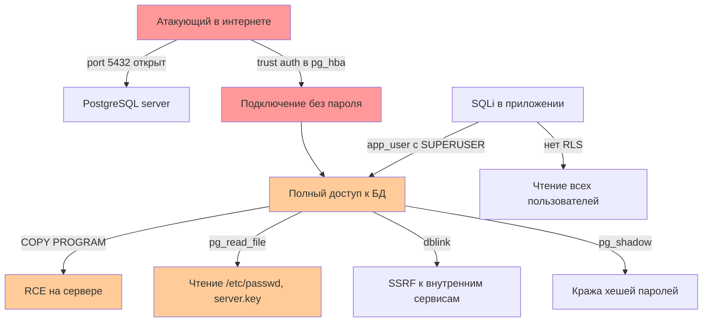

# Antigravity — Отчёт аудита безопасности PostgreSQL

<!--
ШАБЛОН ОТЧЁТА. Заполняется на основе вывода скриптов:
- sql_audit.sql → SQL-side находки
- bash_checks.sh → OS-side находки
- python_scanner.py → комплексный скан
- iac_linter.py → IaC находки

Используй этот шаблон для каждого аудита. Удаляй неиспользуемые секции,
дополняй своими находками.
-->

**Целевая система**: `<host>:<port>/<database>`
**Дата аудита**: YYYY-MM-DD
**Аудитор**: `<имя>`
**Версия PostgreSQL**: `<например, 15.4>`
**Среда**: on-prem / Docker / Kubernetes / managed (RDS/Cloud SQL/Azure)
**Тип аудита**: аудит / харденинг / расследование инцидента / проверка комплаенса

---

## 1. Executive Summary

<!-- 3-5 предложений для нетехнической аудитории (CISO, руководство).
Краткий ответ на вопрос: "Есть ли у нас проблемы с безопасностью БД, и насколько серьёзные?" -->

В ходе аудита PostgreSQL-инсталляции на `<host>` выявлено `<N>` критических и
`<M>` высоких уязвимостей. Основные проблемы: `<краткий список>`. Рекомендуем
применить критические патчи в течение 24 часов, остальные — в течение
текущего спринта. Совокупный риск — `<Critical/High/Medium>`.

---

## 2. Методология

Аудит проведён по методологии реверс-инжиниринга Antigravity (4 фазы):

1. **Реконструкция** — собраны артефакты:
   - `postgresql.conf`, `pg_hba.conf`, `pg_ident.conf`
   - `pg_roles`, `pg_authid`, `pg_extension`, `pg_stat_activity`
   - Логи PostgreSQL за последние 30 дней
   - Dockerfile / docker-compose.yml / Helm chart / Terraform manifest
   - Версия: `<SELECT version()>`

2. **Декомпозиция** — проверены компоненты:
   - Аутентификация (SCRAM, pg_hba)
   - Авторизация (роли, GRANT, RLS)
   - Сеть и TLS
   - Расширения
   - Файловая система
   - SQL-инъекции (статический анализ кода приложения)
   - Конфигурация postgresql.conf
   - Контейнерная безопасность

3. **Сопоставление с угрозами** — для каждой находки определены:
   - CWE / OWASP класс
   - CVE (если применимо)
   - Вектор атаки
   - CVSS
   - Связь с комплаенсом

4. **Патч и верификация** — для каждой находки выданы:
   - Конкретный патч
   - Анти-пример (как НЕ делать)
   - Команда верификации
   - Регресс-риски

Использованные инструменты:
- `scripts/sql_audit.sql` — 13 секций аудита через psql
- `scripts/bash_checks.sh` — 10 секций проверки ОС и конфигов
- `scripts/python_scanner.py` — 28 автоматических проверок
- `scripts/iac_linter.py` — линтер Terraform/K8s/Docker манифестов

---

## 3. Карта атаки

<!-- Mermaid-диаграмма векторов атаки. Пример: -->



---

## 4. Находки

### FIND-001: [Severity] Краткое название

**ID**: FIND-001
**Severity**: Critical / High / Medium / Low / Info
**CWE**: CWE-XXX
**CVE**: CVE-YYYY-NNNNN (если применимо)
**CVSS**: X.X
**Компонент**: Аутентификация / Авторизация / Сеть / ...

**Описание уязвимости**

<!-- Подробное описание. Что не так, почему это уязвимость. -->

В `pg_hba.conf` строка 5 содержит `host all all 0.0.0.0/0 trust`. Это
позволяет любому подключиться к PostgreSQL из любого IP без пароля.

**Доказательство**

```
# Вывод grep:
$ grep trust pg_hba.conf
host all all 0.0.0.0/0 trust

# Вывод SQL:
postgres=# SELECT rule_number, address, auth_method FROM pg_hba_file_rules WHERE auth_method = 'trust';
 rule_number | address  | auth_method
-------------+----------+-------------
           5 | 0.0.0.0  | trust
```

**Вектор атаки**

Атакующий сканирует интернет (Shodan, Censys), находит открытый порт 5432,
подключается `psql -h target.com -U postgres` без пароля, получает
суперпользователя.

**Уязвимый код или конфиг (анти-пример)**

```conf
# pg_hba.conf — НЕПРАВИЛЬНО:
host all all 0.0.0.0/0 trust
```

**Патч**

```conf
# pg_hba.conf — ПРАВИЛЬНО:
local all postgres peer
local all all peer
host all all 10.0.0.0/8 scram-sha-256
host all all ::/0 reject
```

```bash
# Применение:
sudo vim /etc/postgresql/15/main/pg_hba.conf
# (внести изменения)
sudo systemctl reload postgresql
```

**Верификация**

```bash
# Проверить, что trust отсутствует:
grep -n trust /etc/postgresql/15/main/pg_hba.conf
# Должно быть пусто

# Попробовать подключение без пароля снаружи:
psql -h target.com -U postgres -c "SELECT 1"
# Должно вернуть: password authentication failed
```

**Регресс-риски**

- Существующие приложения с `host=...` без пароля перестанут подключаться.
  Сменить пароль и обновить connection string.
- Скрипты, использующие `.pgpass`, продолжат работать, если `.pgpass`
  актуален.

**Комплаенс-нарушения**

- PCI DSS 8.3 — аутентификация всех пользователей
- ISO 27001 A.9.4.3 — управление паролями
- GDPR Art. 32 — безопасность обработки

---

### FIND-002: [Severity] ...

<!-- Скопировать шаблон выше для каждой находки -->

---

## 5. Дорожная карта исправлений

### Критические (сделать за 24 часа)

| FIND | Описание | Ответственный | Deadline |
|------|----------|---------------|----------|
| FIND-001 | trust в pg_hba | DBA | 2024-06-16 |
| FIND-003 | SUPERUSER у приложения | DBA + Dev | 2024-06-16 |

### Высокие (сделать за 1 неделю)

| FIND | Описание | Ответственный | Deadline |
|------|----------|---------------|----------|
| FIND-002 | MD5 password hashes | DBA | 2024-06-22 |
| FIND-004 | SSL disabled | DBA + Sec | 2024-06-22 |

### Средние (сделать за 1 месяц / спринт)

| FIND | Описание | Ответственный | Deadline |
|------|----------|---------------|----------|
| FIND-005 | RLS не включён | Dev team | 2024-07-15 |
| FIND-006 | pgAudit не установлен | DBA | 2024-07-15 |

### Низкие (запланировать)

| FIND | Описание | Ответственный | Deadline |
|------|----------|---------------|----------|
| FIND-007 | Password expiry не настроен | DBA | 2024-09-01 |

---

## 6. Compliance Matrix

<!-- Матрица соответствия комплаенс-требованиям. Заполнять по результатам аудита. -->

### PCI DSS

| Req | Требование | Status | Evidence |
|-----|------------|--------|----------|
| 1.3 | Network segmentation | ✅ Compliant | iptables rules restricted to 10.0.0.0/8 |
| 2.2.4 | No default passwords | ❌ Non-compliant | FIND-008: postgres role has default password |
| 3.4 | PAN unreadable | ⚠️ Partial | PAN encrypted with pgcrypto, but key in code (FIND-009) |
| 4.1 | TLS in transit | ✅ Compliant | ssl=on, TLSv1.2+, strong ciphers |
| 6.3.1 | Security patches | ❌ Non-compliant | FIND-010: version 15.3, latest is 15.8 |
| 8.2 | Unique IDs | ✅ Compliant | Each app has its own role |
| 8.3 | Authentication | ❌ Non-compliant | FIND-001: trust auth in pg_hba |
| 10.2 | Audit logs | ⚠️ Partial | log_statement=ddl, but pgAudit not installed |
| 10.7 | Log retention 1 year | ✅ Compliant | SIEM retention 18 months |
| 11.5 | File integrity | ❌ Non-compliant | No FIM tool installed |

### GDPR / ФЗ-152

| Article | Требование | Status | Evidence |
|---------|------------|--------|----------|
| Art. 5(1)(c) | Data minimization | ⚠️ Partial | FIND-011: passport_number хранится без обоснования |
| Art. 5(1)(f) | Integrity & confidentiality | ✅ Compliant | TLS + LUKS + pgcrypto |
| Art. 17 | Right to erasure | ⚠️ Partial | Procedure не задокументирована |
| Art. 25 | Privacy by design | ⚠️ Partial | RLS не на всех PII таблицах |
| Art. 32 | Security of processing | ✅ Compliant | Encryption + access control |
| Art. 33 | Breach notification 72h | ✅ Compliant | Incident response plan задокументирован |

### SOC 2 / ISO 27001

| Control | Требование | Status | Evidence |
|---------|------------|--------|----------|
| A.9.2.1 | User access management | ✅ Compliant | Quarterly access review |
| A.9.4.3 | Password management | ⚠️ Partial | No password policy enforced |
| A.12.3 | Information backup | ✅ Compliant | Daily backup + restore test |
| A.12.4 | Logging and monitoring | ⚠️ Partial | Logs collected, but no alerting on failed logins |
| A.12.6.1 | Vulnerability management | ❌ Non-compliant | FIND-010: patches outdated |

---

## 7. Приложения

### Приложение A: Полный вывод sql_audit.sql

```
[Вставить содержимое sql_audit_<date>.log]
```

### Приложение B: Полный вывод bash_checks.sh

```
[Вставить содержимое bash_checks_<date>.log]
```

### Приложение C: Полный вывод python_scanner.py

```json
[Вставить содержимое scan_<date>.json]
```

### Приложение D: Полный вывод iac_linter.py

```markdown
[Вставить содержимое iac_audit.md]
```

### Приложение E: Скриншоты / дополнительные материалы

[При необходимости]

---

## 8. Подписи

**Аудитор**: ____________________ / `<имя>` / `<дата>`

**Руководитель ИБ (CISO)**: ____________________ / `<имя>` / `<дата>`

**Владелец системы**: ____________________ / `<имя>` / `<дата>`

---

<!-- КОНЕЦ ОТЧЁТА. Не добавлять никаких маркеров завершения ниже. -->
