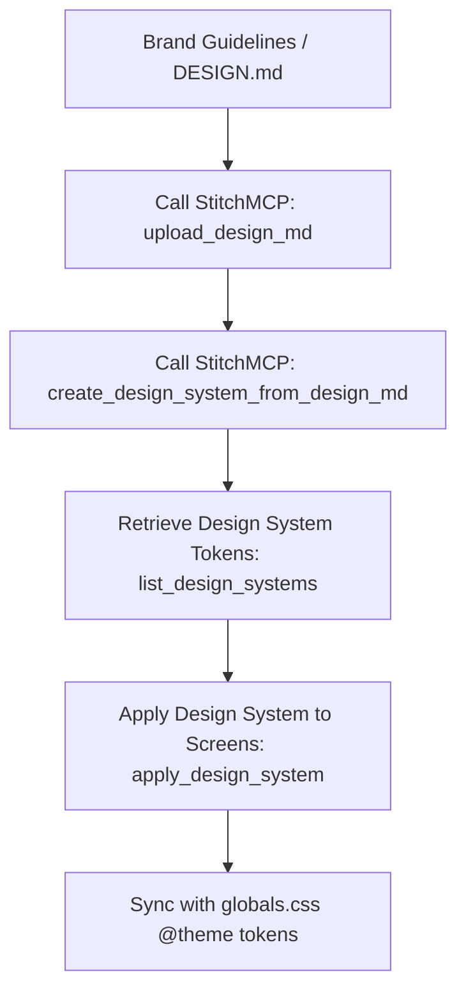

# Stitch Design System Manager Skill

This skill manages Design Systems and `DESIGN.md` token synchronization between **StitchMCP** and frontend codebases (Tailwind CSS 4 `@theme` and HeroUI v3 tokens).

---

## 1. Core Workflow



---

## 2. StitchMCP Tool Calling Reference

### 1. Uploading `DESIGN.md`:
```json
{
  "ServerName": "StitchMCP",
  "ToolName": "upload_design_md",
  "Arguments": {
    "projectId": "<PROJECT_ID>",
    "content": "# SMMflux Cyber Design System\n\n## Palette\n- Primary: #a855f7\n- Secondary: #ec4899\n- Background: #080b14\n\n## Typography\n- Font Family: Inter, system-ui\n- Headings: Bold tracking-tight"
  }
}
```

### 2. Creating / Updating Design Systems:
```json
{
  "ServerName": "StitchMCP",
  "ToolName": "create_design_system_from_design_md",
  "Arguments": {
    "projectId": "<PROJECT_ID>",
    "designSystemName": "FluxCyberTheme"
  }
}
```

### 3. Applying Design System to Generated Screens:
```json
{
  "ServerName": "StitchMCP",
  "ToolName": "apply_design_system",
  "Arguments": {
    "projectId": "<PROJECT_ID>",
    "screenId": "<SCREEN_ID>",
    "designSystemId": "<DESIGN_SYSTEM_ID>"
  }
}
```

---

## 3. Best Practices
* **Token Consistency:** Ensure colors match WCAG 2.2 AA standards ($\ge 4.5:1$ text contrast).
* **Multi-Tenant Presets:** Maintain separate Design System IDs for each tenant (e.g., `SmmplanClassic` vs `FluxCyber`).
* **Bidirectional Sync:** When updating `globals.css`, synchronize corresponding token changes back into Stitch.
