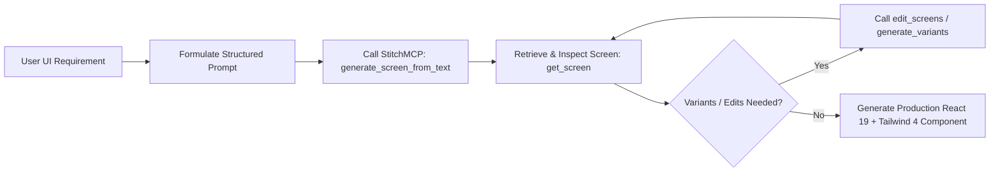

# Stitch UI Designer Skill (StitchMCP Integration)

This skill equips Antigravity with state-of-the-art capabilities to design, prototype, and refine user interfaces using the **StitchMCP** server tools (`generate_screen_from_text`, `edit_screens`, `generate_variants`, `get_screen`).

---

## 1. Core Workflow



---

## 2. StitchMCP Tool Calling Reference

### 1. Creating a Project & Generating Screens:
When initiating a new screen design:
1. Check existing projects with `call_mcp_tool(ServerName: 'StitchMCP', ToolName: 'list_projects', Arguments: {})`.
2. Create project if needed: `call_mcp_tool(ServerName: 'StitchMCP', ToolName: 'create_project', Arguments: { name: "..." })`.
3. Generate screen:
```json
{
  "ServerName": "StitchMCP",
  "ToolName": "generate_screen_from_text",
  "Arguments": {
    "projectId": "<PROJECT_ID>",
    "prompt": "Modern Glassmorphic B2B Dashboard for Telegram SMM Services with dark purple/cyan neon theme, linear navigation sidebar, metric cards with sparklines, and fluid order table."
  }
}
```

### 2. Iterative Editing (`edit_screens`):
To adjust specific elements without regenerating from scratch:
```json
{
  "ServerName": "StitchMCP",
  "ToolName": "edit_screens",
  "Arguments": {
    "projectId": "<PROJECT_ID>",
    "screenId": "<SCREEN_ID>",
    "instruction": "Replace top tabs with pill-shaped capsule segmented control with glowing border. Enlarge action button touch target to 48px."
  }
}
```

### 3. Generating Variants (`generate_variants`):
To explore layout or aesthetic alternatives:
```json
{
  "ServerName": "StitchMCP",
  "ToolName": "generate_variants",
  "Arguments": {
    "projectId": "<PROJECT_ID>",
    "screenId": "<SCREEN_ID>",
    "count": 3,
    "strategy": "explore_themes"
  }
}
```

---

## 3. Stitch Prompt Engineering Guidelines
When constructing prompts for Stitch:
* **Layout Structure:** Clearly define container geometry (e.g., *Left sidebar 240px, top HUD bar, 3-column card grid, floating bottom sheet drawer*).
* **Color & Tone:** Specify exact mood and tokens (*Deep obsidian #090d16, frosted glass backdrop blur 24px, subtle neon purple/pink accents, high WCAG 2.2 AA contrast*).
* **Information Density:** Outline data widgets (*Metric badges, sparkline graphs, tabular status chips with tabular-nums*).
* **Avoid Clichés:** No generic placeholder text; provide realistic domain data.

---

## 4. Code Generation Rules (React 19 & Tailwind 4)
When converting Stitch screen assets into application code:
1. Use semantic Tailwind 4 `@theme` variables (`bg-background`, `bg-card`, `text-foreground`, `text-primary`).
2. Implement WCAG 2.2 AA minimum touch targets ($\ge 44\text{px}$).
3. Separate presentation into clean subcomponents under 200 lines.
