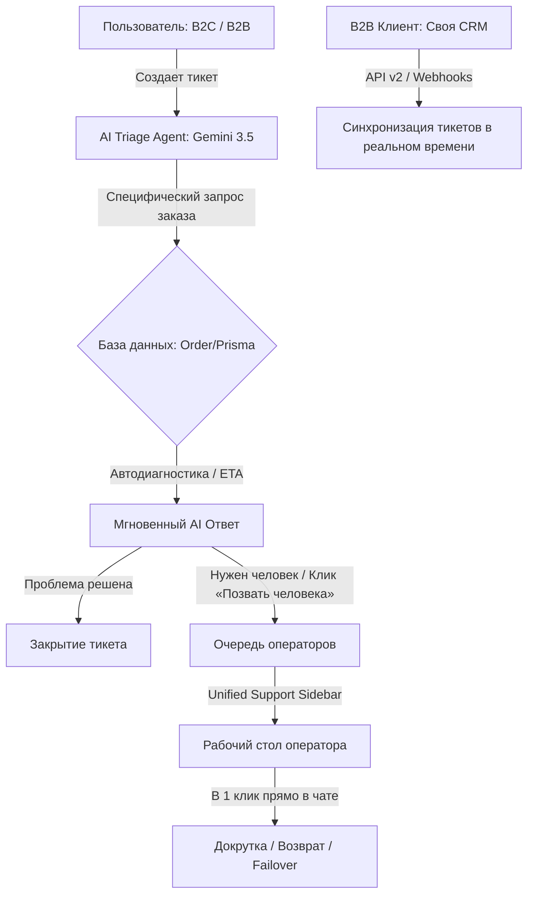

# 🚀 Стратегический манифест: Революция техподдержки Smmplan (B2C & B2B)

Этот манифест представляет собой дорожную карту и техническую спецификацию для превращения службы поддержки **Smmplan** в лучшую на рынке SMM-реселлинга. Мы объединили лучшие практики лидеров клиентского сервиса (**Stripe**, **Plain**, **Linear**, **Intercom**) и спроектировали решения как для розничных клиентов (B2C), так и для крупных оптовиков (B2B), управляющих тысячами заказов.

---

## 🗺️ Архитектурная карта поддержки Smmplan

---

## 💎 Столп 1: Conversational AI-First Triage для B2C (Мгновенное решение рутины)

### Проблема:
Розничные клиенты (B2C) заваливают поддержку одинаковыми вопросами: «Почему завис заказ?», «Когда начнется?», «Списались подписчики, сделайте докрут». Операторы тратят 80% времени на копипаст рутинных логов, выгорая к концу смены.

### Наше решение — Smart AI Copilot (Gemini 3.5 Flash):
1. **Первая линия обороны**: При отправке тикета пользователем, на него в ту же секунду отвечает специализированный ИИ-агент.
2. **Прямой доступ к телеметрии**: ИИ-агент имеет безопасный доступ к API заказов и базе данных. Он сам проверяет статус, смотрит последние логи провайдера, рассчитывает ETA (среднее время выполнения) по базе данных и выдает содержательный, успокаивающий ответ:
   > *«Здравствуйте! Я проверил ваш заказ #211 (Подписчики Telegram). На стороне Telegram обновились спам-фильтры, поэтому провайдер временно снизил скорость выдачи для защиты вашего канала от бана. Заказ выполнен на 450/1000. Среднее время завершения (ETA) для этой услуги сейчас составляет 34 минуты. Беспокоиться не о чем!»*
3. **Мгновенная эскалация (Human-in-the-Loop)**: Если ответ не помог, пользователь нажимает кнопку **«Позвать человека»**. Тикет моментально падает в очередь операторов с прикрепленной сводкой автодиагностики ИИ, экономя время живого сотрудника на погружение в проблему.

---

## 💎 Столп 2: Unified Support Context Sidebar для операторов (Работа без переключения вкладок)

### Проблема:
Чтобы помочь клиенту, оператору приходится:
1. Скопировать почту из тикета.
2. Открыть в новой вкладке `/admin/orders`.
3. Найти все заказы этого пользователя.
4. Открыть Drawer заказа, найти ID у провайдера, скопировать лог ошибки.
5. Зайти в панель провайдера или сделать частичный возврат.
Это занимает **3–5 минут** на один тикет.

### Наше решение — Сайдбар «Всё в одном»:
Интегрировать боковую панель **ClientProfileSidebar** и Drawer заказа **прямо внутрь интерфейса чата тикета** `/admin/tickets/[id]`.
*   При открытии чата справа автоматически загружается профиль клиента, его LTV, баланс, дневной лимит компенсаций и **список последних 10 заказов** с подсветкой проблемных (`ERROR`, `CANCELED`).
*   Оператор может кликнуть на заказ прямо в чате, и прямо там откроются быстрые кнопки действия:
    *   **«Сделать ручной докрут (Refill)»** (улетает в очередь BullMQ).
    *   **«Частичный возврат (Partial Refund)»** (оператор вводит остаток, бэкенд вычисляет сумму в *целых копейках* и мгновенно возвращает ее на баланс клиента).
    *   **«Failover (Сменить провайдера)»** (смена поставщика с расчетом новой маржи платформы прямо из чата!).
*   Время обработки тикета сокращается с 5 минут до **10 секунд (в 30 раз быстрее!)**.

---

## 💎 Столп 3: B2B-система массового прикрепления заказов (Для крупных реселлеров)

### Проблема:
B2B-клиенты, перепродающие наши услуги по API, имеют тысячи заказов в день. Если у них происходят списания по 30–50 заказам, они вынуждены писать один тикет и текстом перечислять ID: «211, 212, 215, 230... Сделайте по ним докрут». 
Оператор поддержки вынужден вручную копировать каждый ID, искать его в базе и кликать докрутку по 50 раз.

### Наше решение — Smart Bulk Parser & Attached Grid:
1. **Автоматическое распознавание (Regex-парсер)**:
   При отправке B2B-клиентом тикета, Smmplan сканирует текст сообщения регулярными выражениями. Все найденные ID заказов автоматически преобразуются в интерактивные карточки-вложения.
2. **Интерактивная таблица в чате**:
   Внутри тикета для оператора выводится компактная сетка (Attached Orders Grid) всех прикрепленных заказов с их статусами, провайдерами и кнопками действий.
3. **Пакетные операции в 1 клик**:
   Оператор ставит галочку «Выбрать все» прямо в чате тикета и нажимает одну кнопку:
   *   **«Запустить массовый докрут (Bulk Refill)»** — система создает 50 задач докрутки в BullMQ за полсекунды.
   *   **«Сделать массовый возврат (Bulk Refund)»** — система рассчитывает остатки по всем 50 заказам и одной безопасной Prisma-транзакцией возвращает копейки на баланс оптовика.

---

## 💎 Столп 4: Умные шаблоны ответов с динамической интерполяцией данных

### Проблема:
Стандартные шаблоны ответов («Мы сделали вам возврат», «Заказ задерживается») сухие, не персонализированы и требуют от оператора вручную вписывать суммы возвратов и номера заказов.

### Наше решение — Шаблоны-переменные (Database Interpolation):
Smmplan поддерживает умный шаблонизатор, который автоматически парсит переменные из контекста тикета и связанного заказа:
*   `{client_name}` — имя или почта клиента.
*   `{order_id}` — ID заказа.
*   `{refund_amount}` — точная сумма возврата в рублях (рассчитанная бэкендом на основе Remains).
*   `{provider_error}` — текст ошибки поставщика.

**Пример шаблона:**
> *«Здравствуйте, {client_name}! По вашему заказу #{order_id} произошло частичное списание. Мы провели аудит логов: {provider_error}. В качестве компенсации мы оформили частичный возврат в размере {refund_amount} ₽ на ваш баланс. Вы можете запустить заказ повторно через другого провайдера в личном кабинете. Приносим извинения за неудобства!»*

Оператор нажимает на шаблон, и клиент получает идеальный, персонализированный, профессиональный ответ с точными цифрами без ручного ввода!

---

## 💎 Столп 5: Синхронизация по API и Webhooks для B2B (Работа в своей панели)

### Проблема:
Крупные B2B-клиенты не хотят заходить на наш сайт и проверять тикеты в личном кабинете Smmplan. Они хотят общаться с нашей поддержкой прямо из своего корпоративного интерфейса (своей CRM-панели).

### Наше решение — API & Webhook поддержка:
1. **Support Webhooks**:
   В настройках API `/dashboard/settings/api` B2B-клиент может указать свой Webhook URL. При каждом ответе оператора или AI в тикете, Smmplan шлет вебхук `ticket.message_created` с текстом сообщения и вложениями.
2. **Полный API-контроль тикетов**:
   Предоставить B2B-клиентам API-методы:
   *   `GET /api/v2/tickets` — список обращений.
   *   `POST /api/v2/tickets/create` — создать тикет с привязкой конкретных заказов.
   *   `POST /api/v2/tickets/reply` — ответить на тикет.
   *   `POST /api/v2/tickets/close` — закрыть тикет.
   
Это позволяет B2B-оптовикам интегрировать нашу техподдержку прямо в свой софт! Они общаются с нами, не покидая свою админку, что делает Smmplan **лучшим и самым удобным B2B-поставщиком на рынке**.
