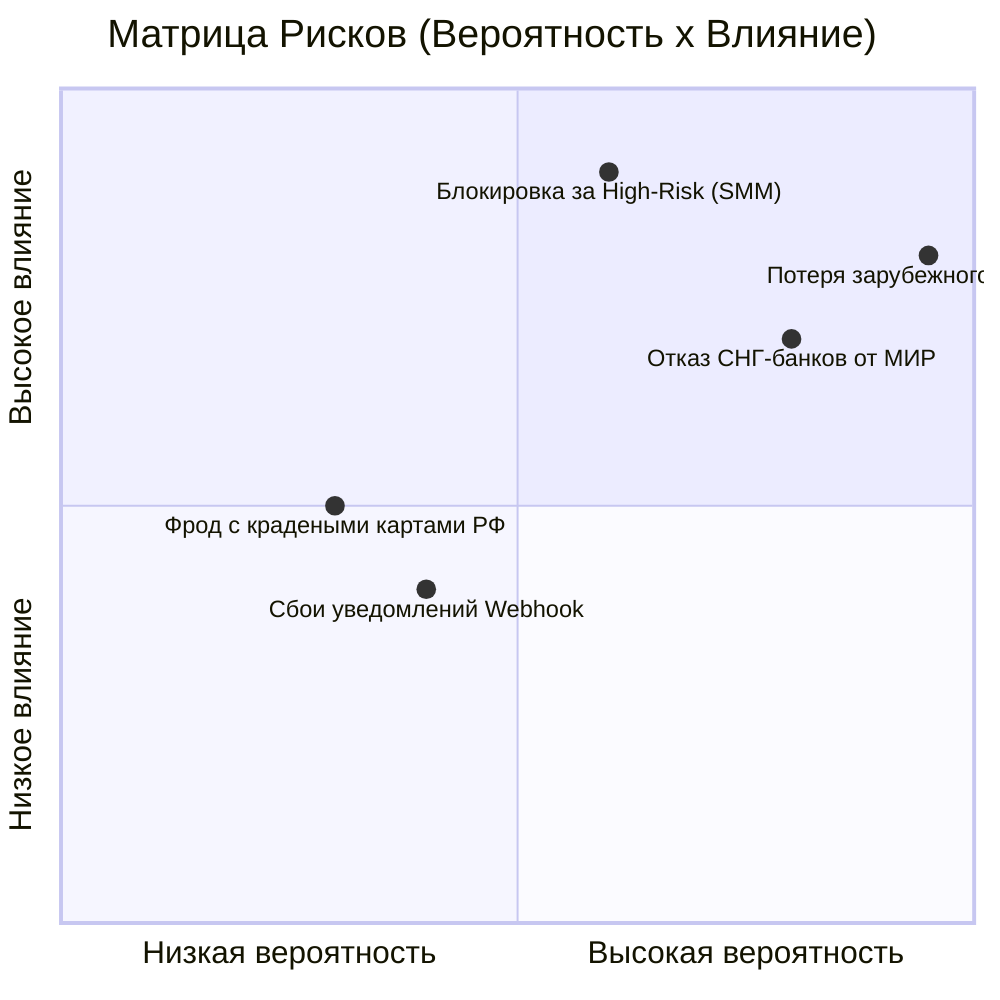

# 🔬 GSD RESEARCH AUTOPSY: ЮKassa Acquiring Ecosystem (May 2026)

Этот документ содержит результаты детального брутального исследования платежного шлюза **ЮKassa** (https://yookassa.ru/) для проекта **Smmplan**. Исследование проведено по протоколу `gsd-research-autopsy` с оценкой лимитов, географических ограничений, рисков чарджбэков и технических требований на май 2026 года.

---

## 🗺 Evidence Map (Карта источников)

1. **[Official]** [Официальный сайт ЮKassa — Способы оплаты и лимиты](https://yookassa.ru/help/merchant/payments/payment-methods/bank-cards/details.html) (Справочник по лимитам карт, СБП и кошельков).
2. **[Official]** [Официальный сайт ЮKassa — Подключение для нерезидентов](https://yookassa.ru/contacts/) (Условия и валюты зачисления для иностранных юрлиц).
3. **[Official]** [Официальный сайт ЮKassa — Инструкция по спорным платежам (чарджбэкам)](https://yookassa.ru/help/merchant/payments/refunds-disputes.html) (Правила оспаривания и ведения диспутов в ЛК).
4. **[Community / Analytical]** [Тинькофф Журнал — Как принимать платежи из-за рубежа](https://journal.tinkoff.ru/) (Анализ ограничений Visa/Mastercard и трансграничных переводов в 2025-2026 гг).
5. **[Community / Security]** [Robokassa / Cleverence — Обзоры платежных шлюзов в РФ](https://www.cleverence.ru/) (Сравнение рисков блокировок High-Risk мерчантов).

---

## 🌍 Географический охват и поддерживаемые карты

### 1. Резиденты РФ (Мерчант зарегистрирован в РФ как ООО/ИП/Самозанятый)
При стандартном подключении на юрлицо/ИП РФ действуют жесткие ограничения на трансграничный эквайринг:

*   **Банковские карты РФ (100% поддержка):**
    *   Принимаются абсолютно все карты, выпущенные банками РФ платежных систем **МИР, Visa, Mastercard, Maestro, JCB, UnionPay**.
    *   Обработка идет локально через АО «НСПК» (Национальная система платежных карт), санкции на эти транзакции никак не влияют.
*   **Карты СНГ и локальные платежные системы:**
    *   Интеграция идет через кобейджинг и партнерские соглашения НСПК «Мир».
    *   **Поддерживаются:**
        *   **БЕЛКАРТ** (Беларусь) — принимаются стабильно.
        *   **Корти Милли** / **Express Pay** (Таджикистан) — принимаются стабильно.
        *   **АПРА** (Абхазия) — принимаются стабильно.
    *   *Важное примечание:* Иностранные карты **МИР** (выпущенные банками Казахстана, Армении, Кыргызстана, Вьетнама, Южной Кореи) работают **крайне нестабильно или полностью заблокированы** на стороне зарубежных банков-эмитентов с 2024-2026 годов из-за угрозы вторичных санкций США против НСПК.
*   **Иностранные Visa / Mastercard (ЕС, США, Азия):**
    *   **ПОЛНЫЙ БЛОК.** Карты Visa, Mastercard, Maestro, выпущенные любыми банками за пределами РФ, **технически не принимаются** ЮKassa для российских мерчантов. Транзакции отклоняются на уровне международных платежных систем.
*   **Иностранные карты UnionPay:**
    *   Карты UnionPay, выпущенные зарубежными банками (не РФ), работают в ЮKassa нестабильно. Транзакции проходят выборочно в зависимости от банка-эмитента и его комплаенс-политики.

### 2. Нерезиденты РФ (Иностранное юрлицо)
Если мерчант зарегистрирован вне РФ (например, Казахстан, ОАЭ, Кипр):
*   ЮKassa позволяет подключить трансграничный прием платежей.
*   Доступен прием иностранных карт **Visa и Mastercard** с зачислением средств в валютах: **USD, EUR, CNY, KZT, BYN** и др.
*   Требуется прохождение жесткого комплаенса безопасности, предоставление нотариально заверенных переводов документов компании и одобрение службы безопасности ЮKassa.

---

## 📊 Таблица лимитов ЮKassa (на одну транзакцию)

| Платежный метод | Минимальный лимит | Максимальный лимит (по умолчанию) | Возможность увеличения | Особенности и ограничения |
| :--- | :--- | :--- | :--- | :--- |
| **Банковские карты (РФ / СНГ)** | 1 ₽ | 350 000 ₽ | По запросу у менеджера | Лимит до 700 000 ₽ в месяц по одной карте покупателя. |
| **СБП (Система быстрых платежей)** | 1 ₽ | 700 000 ₽ | До 1 000 000 ₽ | Самый надежный и дешевый способ (минимальная комиссия). |
| **SberPay** | 1 ₽ | 700 000 ₽ | По запросу | Суточный лимит на одного покупателя — 1 000 000 ₽. |
| **T-Pay (бывш. Tinkoff Pay)** | 1 ₽ | 700 000 ₽ | По запросу | Быстрая оплата в один клик для клиентов Т-Банка. |
| **Alfa-Pay** | 1 ₽ | 700 000 ₽ | По запросу | Быстрая оплата для клиентов Альфа-Банка. |
| **ЮMoney (Анонимный кошелек)** | 1 ₽ | 15 000 ₽ | Нет (ограничение закона РФ) | Баланс кошелька покупателя также ограничен 15 000 ₽. |
| **ЮMoney (Именной кошелек)** | 1 ₽ | 100 000 ₽ | Нет | Баланс кошелька ограничен 100 000 ₽. |
| **ЮMoney (Идентифицированный)** | 1 ₽ | 250 000 ₽ | Нет | Суточный лимит 600 000 ₽, месячный лимит 3 000 000 ₽. |

---

## 🛡️ Чарджбэки (Диспуты) и Безопасность в ЮKassa

Сфера SMM-панелей (накрутка соцсетей) является высокорисковой (**High-Risk**). Пользователи могут инициировать процедуру принудительного возврата средств (**chargeback**) через свои банки.

### Регламент ЮKassa по диспутам:
1. **Уведомление:** При инициации чарджбэка в личном кабинете ЮKassa в разделе «История платежей» появляется вкладка **«Спорные»**, а на email продавца приходит запрос доказательств.
2. **Заморозка средств:** Сумма спора временно холдируется (блокируется) на балансе мерчанта. Сделать обычный возврат по этой операции через API или ЛК становится невозможно.
3. **Штрафные санкции:** За рассмотрение каждого диспута банк-эквайер списывает фиксированную комиссию (около 50 ₽ за спор) независимо от того, выигран спор или проигран.
4. **Сроки ответа:** ЮKassa устанавливает жесткие сроки предоставления доказательств (обычно **от 3 до 7 рабочих дней**). Если документы не предоставлены вовремя, спор автоматически выигрывает покупатель.
5. **Риск блокировки:** Если показатель диспутов (Chargeback Rate) превышает **1%** от общего числа транзакций за месяц, ЮKassa имеет право **в одностороннем порядке заблокировать аккаунт** мерчанта и удержать резервный фонд (до 10% от оборота на срок до 180 дней).

---

## ⚡ Devil's Advocate & Risk Matrix (P×I)

### Матрица рисков для Smmplan при работе с ЮKassa



1. **Риск: Полная потеря зарубежных платящих пользователей (США, Европа, Азия)**
   * **Вероятность (P):** 5/5 (Иностранные карты Visa/Mastercard гарантированно отклоняются для РФ-юрлиц).
   * **Влияние (I):** 4/5 (Ограничивает масштабирование Smmplan локальным рынком РФ и лояльными странами СНГ).
   * **Программная защита:** На уровне ядра Smmplan внедрить модульную систему платежных шлюзов. Если валюта пользователя отлична от RUB или IP находится вне РФ/СНГ, интерфейс должен автоматически предлагать альтернативные шлюзы (криптопроцессинг: Cryptocloud, Cryptomus; или зарубежный Stripe при наличии оффшорной компании).

2. **Риск: Блокировка аккаунта ЮKassa за High-Risk нишу (SMM/Накрутка)**
   * **Вероятность (P):** 3/5 (Служба безопасности ЮKassa регулярно проверяет сайты мерчантов. Прямое упоминание "накрутки" или жалобы на невыполнение услуг ведут к бану).
   * **Влияние (I):** 5/5 (Полная остановка приема платежей на основном шлюзе, заморозка оборотных средств).
   * **Программная защита:**
     * *Брендинг и терминология:* В UI и публичной оферте использовать белые термины: *"SMM-продвижение"*, *"Маркетинговые услуги в социальных сетях"*, *"Консалтинг"*. Избегать агрессивных слов вроде *"Накрутка"*, *"Боты"*.
     * *Сбор цифровых улик:* Автоматическая генерация отчетов о выполнении заказов. При чарджбэке система должна уметь в один клик выгрузить PDF-документ с логами: время клика по чекбоксу согласия с офертой, IP-адрес плательщика, User-Agent, статус выполнения API-запроса накрутки у внешнего провайдера (с подтверждающим ID транзакции провайдера).

3. **Риск: Отказ СНГ карт (БЕЛКАРТ, Корти Милли) в процессе оплаты**
   * **Вероятность (P):** 3/5 (Технические сбои на стыке НСПК и национальных систем СНГ происходят регулярно).
   * **Влияние (I):** 3/5 (Частичная потеря конверсии платежей из Беларуси и Таджикистана).
   * **Программная защита:** Внедрение резервных кнопок оплаты и вывод четких инструкций на странице оплаты: *"Если ваша карта Белкарт/Мир отклонена, пожалуйста, воспользуйтесь Системой быстрых платежей (СБП) через мобильный банк или обратитесь в нашу поддержку"*.

---

## 🔧 Actionable Plan (План внедрения для Smmplan)

### Шаг 1: Оптимизация публичной оферты и позиционирования (P0)
*   **Изменение текстов:** Заменить на страницах `/` и `/dashboard` любые упоминания слова "накрутка" на "продвижение" и "маркетинговые SMM услуги".
*   **Чекбокс согласия:** Заставить пользователя при пополнении баланса и оформлении заказа в обязательном порядке соглашаться с `Публичной офертой и правилами возврата средств`. Чекбокс должен логировать в БД дату, время, IP и User-Agent пользователя.

### Шаг 2: Создание модуля генерации цифровых доказательств для ЮKassa (P1)
*   Разработать Server Action или внутренний роут в админ-панели Smmplan, который по ID транзакции ЮKassa (`payment_id`) собирает воедино:
    1. Идентификатор пользователя, его email, IP и User-Agent на момент оплаты.
    2. Хеш согласия с офертой (время и IP фиксации клика чекбокса).
    3. Связанные заказы, оформленные на эти средства, и логи их успешного выполнения от провайдеров (например, ответ API JustAnotherPanel со статусом `Completed` и начальным/конечным счетчиком просмотров/подписчиков).
    4. Экспорт этих данных в презентабельный PDF-файл, готовый для отправки менеджеру ЮKassa при открытии диспута.

### Шаг 3: Модульный Payment Switcher на фронтенде (P1)
*   В компоненте выбора платежного метода в `src/components/orders/SmartOrderForm.tsx` и форме пополнения баланса динамически фильтровать доступные шлюзы:
    *   Если выбран шлюз **ЮKassa**: выводить плашки **СБП**, **Карты РФ и СНГ (Белкарт/Мир)**, **SberPay**, **T-Pay**. Добавить сноску: *"Принимаются карты банков РФ, а также Белкарт (Беларусь), Корти Милли (Таджикистан) и АПРА (Абхазия)"*.
    *   Предусмотреть интеграцию крипто-шлюза (например, **Cryptomus**) для пользователей из других стран (США, ЕС, Украина и т.д.) с пометкой *"Для оплаты картами иностранных банков (Visa/Mastercard) или криптовалютой"* с автоматической конвертацией USD/RUB.

### Шаг 4: Обработка Idempotency-Key в API-интеграции (P1)
*   Убедиться, что при создании сессии платежа через SDK ЮKassa в NodeJS, в заголовках передается уникальный UUID транзакции:
    ```typescript
    const payment = await yooKassa.createPayment({
      amount: { value: amount.toFixed(2), currency: 'RUB' },
      payment_method_data: { type: 'bank_card' },
      confirmation: { type: 'redirect', return_url: 'https://smmplan.ru/success' }
    }, {
      idempotencyKey: `order_topup_${transactionId}` // Защита от двойных списаний!
    });
    ```

### Шаг 5: Фоновый воркер сверки статусов (P2)
*   Написать BullMQ или Cron воркер `src/workers/payment-sync.ts`, который раз в 15 минут делает запрос к API ЮKassa (`GET /payments/{id}`) для всех транзакций, находящихся в БД в статусе `PENDING` более 10 минут, чтобы предотвратить зависание балансов пользователей при сбое вебхуков.
