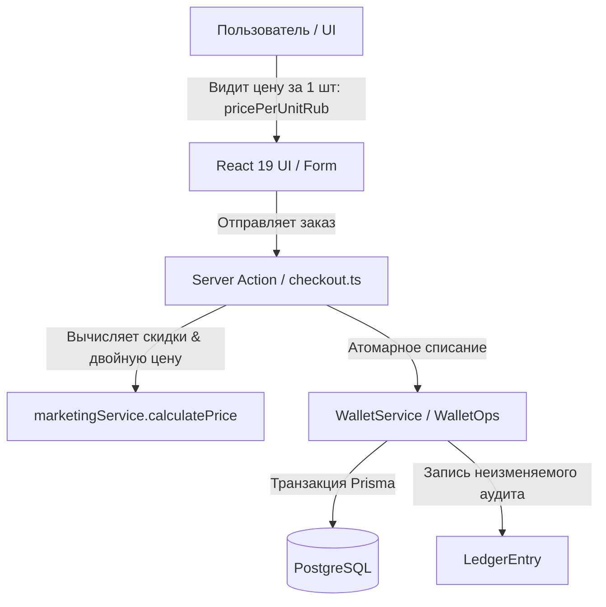

# 🗺️ SMMplan Interactive Project Knowledge & Architecture Map (v2.2.0)

Единый источник правды, контрактов и архитектурных правил для AI-ассистентов и разработчиков проекта **SMMplan**.

---

## 🏗️ 1. Технологический стек и контракты (Tech Stack)

| Компонент | Стек | Правило / Контракт |
| --- | --- | --- |
| **Framework** | Next.js 16 (App Router) | Только App Router. Никаких Pages Router. |
| **UI Library** | React 19 | Server Components по умолчанию. `'use client'` только для хуков. |
| **Styling** | Tailwind CSS 4 | `@theme` директива в `globals.css`. **Запрещены inline-цвета** (`text-white`, `bg-[#1a1a1a]`). |
| **Components** | HeroUI v3 | Строго dot-notation API (`<Table.Header>`, `<Modal.Content>`). |
| **Forms / Dropdowns**| Base UI (`@base-ui/react`) | Обязательны children-функции для `SelectValue` при CUID-значениях. |
| **ORM** | Prisma 5 | PostgreSQL 16. Только атомарные вызовы и batch-транзакции. |
| **AI Memory** | GraphRAG (Port 8100) | Авто-синхронизация решений на `http://localhost:8100/api/decision`. |

---

## 💰 2. Финансовые контракты (FinOps Invariants)

1. **Monetary Cents Precision (`BigInt`)**: Все деньги хранятся и рассчитываются в целых копейках (`BigInt`). Использование float для денег **ЗАПРЕЩЕНО**. Для форматирования использовать `formatCents()`.
2. **Dual Pricing Contract**: `pricePer1kRub` используется **только** для внутренних расчётов за 1000 шт. В UI пользователь видит **исключительно `pricePerUnitRub`** (цена за 1 шт) с подписью `₽ / шт`.
3. **Ledger Immutability & Invariant**: Записи `LedgerEntry` **неизменяемы (Append-Only)**. Всегда соблюдается инвариант: `User.balance == SUM(LedgerEntry.amount)`.
4. **Unified Payment Gateway**: Все платежные операции проходят строго через `UnifiedPaymentService.createPayment()`.

---

## 🎨 3. Фронтенд & UX контракты (UI Rules)

1. **Active Submit Button Policy**: Главные кнопки формы (Submit, "Оплатить") **НИКОГДА не бывают `disabled`**. При невалидной форме клик перехватывается, вызывает анимацию (shake) и плавно скроллит к полю с ошибкой.
2. **HeroUI v3 Dot-Notation**: Использование устаревших импортов (например `import { ModalContent }`) **ЗАПРЕЩЕНО**. Использовать строго `<Modal.Content>`.
3. **Form Error Placement**: Ошибки валидации выводятся под полем ввода, а глобальные ошибки сервера — **непосредственно над кнопкой Submit**.

---

## 🛡️ 4. Инварианты безопасности (Security Boundaries)

1. **Multi-Tenant Scoping**: Все запросы к БД от администраторов и пользователей **ОБЯЗАНЫ** содержать явную фильтрацию по `tenantId`.
2. **RBAC Guard**: Проверка прав администраторов выполняется строго через `requireStaffPermission()` с явной проверкой битов прав и тенанта.
3. **Shadow Catalog (Anti-Mass-Sync)**: Сырые каталоги провайдеров (5000+ услуг) хранятся **только в Redis** (`provider:{id}:catalog`). В PostgreSQL `Service` попадают только услуги, выбранные админом вручную.

---

## 🤖 5. Инструкция для AI-агентов (Anti-Hallucination Protocol)

Перед началом выполнения любой архитектурной задачи:
1. Выполните запрос к GraphRAG памяти: `POST http://localhost:8100/api/search`.
2. Проверьте `ARCHITECTURE_MAP.json` на наличие существующих функций и контрактов.
3. После завершения изменений отправьте принятое решение в память: `POST http://localhost:8100/api/decision`.
