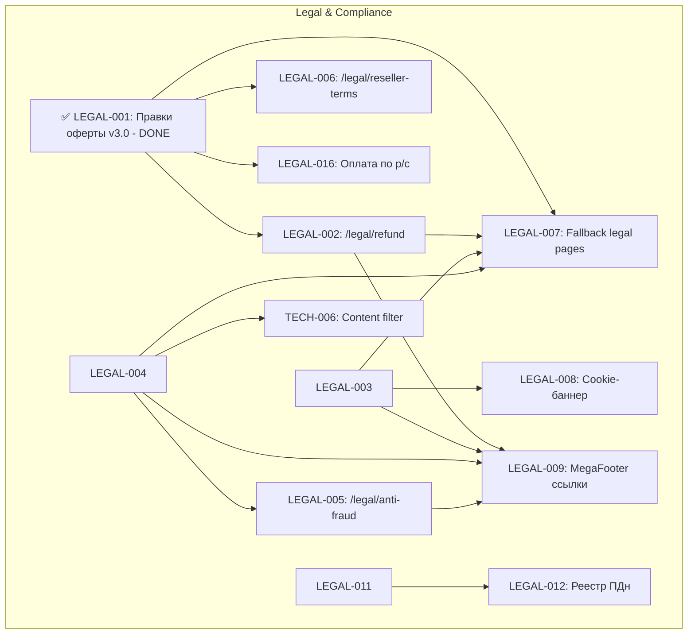

# 📋 BACKLOG SMMplan / SMMflux (v1.1)

Полный структурированный бэклог проекта SMMplan / SMMflux, актуализированный по результатам ревизии кодовой базы.

---

## 📊 1. Сводная таблица задач и текущего статуса

| ID | Задача | Эпик | Приоритет | Оценка | Статус |
|---|---|---|---|---|---|
| **LEGAL-001** | Правки оферты v3.0 | Legal | **P0** | S (1-2ч) | ✅ **DONE** (Код + БД) |
| **LEGAL-002** | /legal/refund (Политика возвратов) | Legal | **P0** | M (3-5ч) | ⏳ IN_BACKLOG |
| **LEGAL-003** | /legal/cookies (Политика Cookies) | Legal | **P0** | S (1-2ч) | ⏳ IN_BACKLOG |
| **LEGAL-004** | /legal/service-rules + тематики | Legal | **P0** | L (1-2д) | ⏳ IN_BACKLOG |
| **LEGAL-005** | /legal/anti-fraud | Legal | P1 | M (3-5ч) | ⏳ IN_BACKLOG |
| **LEGAL-006** | /legal/reseller-terms | Legal | P1 | M (3-5ч) | ⏳ IN_BACKLOG |
| **LEGAL-007** | Fallback для legal pages | Legal | **P0** | M (3-5ч) | ⏳ IN_BACKLOG |
| **LEGAL-008** | Cookie-баннер | Legal | P1 | M (3-5ч) | ⏳ IN_BACKLOG |
| **LEGAL-009** | MegaFooter ссылки | Legal | P1 | S (1-2ч) | 🟡 IN_PROGRESS |
| **LEGAL-010** | Уведомление Роскомнадзора (152-ФЗ) | Legal | **P0** | S (1-2ч) | ✋ MANUAL_ACTION |
| **LEGAL-011** | Приказ об ответственном ПДн | Legal | P1 | S (1-2ч) | ⏳ IN_BACKLOG |
| **LEGAL-012** | Реестр обработки ПДн | Legal | P1 | M (3-5ч) | ⏳ IN_BACKLOG |
| **LEGAL-013** | Чекбокс ПДн при регистрации | Legal | **P0** | S (1-2ч) | 🟡 IN_PROGRESS (Order/Support готовы) |
| **LEGAL-014** | Дисклеймер Meta (Instagram/FB) | Legal | **P0** | S (1-2ч) | ⏳ IN_BACKLOG |
| **LEGAL-015** | Дисклеймер международного сервиса | Legal | P1 | S (1-2ч) | 🟡 IN_PROGRESS |
| **LEGAL-016** | Оплата по расчётному счёту (B2B) | Legal | P2 | L (1-2д) | ⏳ IN_BACKLOG |
| **QA-001** | E2E тесты — Auth Flow | QA | **P0** | M (3-5ч) | ⏳ IN_BACKLOG |
| **QA-002** | E2E тесты — Order Flow | QA | **P0** | L (1-2д) | ⏳ IN_BACKLOG |
| **QA-003** | E2E тесты — Balance Flow | QA | P1 | M (3-5ч) | ⏳ IN_BACKLOG |
| **QA-004** | E2E тесты — Admin Panel | QA | P1 | M (3-5ч) | ⏳ IN_BACKLOG |
| **QA-005** | E2E тесты — SEO Metadata | QA | P1 | M (3-5ч) | ⏳ IN_BACKLOG |
| **QA-006** | E2E тесты — Legal Pages | QA | P1 | S (1-2ч) | ⏳ IN_BACKLOG |
| **QA-007** | Bug Bash (Сквозное тестирование) | QA | P1 | XL (2-5д) | ⏳ IN_BACKLOG |
| **DEPLOY-001** | Docker production compose | Deploy | **P0** | L (1-2д) | 🟡 IN_PROGRESS (БД, RAG, Redis запущены) |
| **DEPLOY-002** | Nginx production config | Deploy | **P0** | M (3-5ч) | ⏳ IN_BACKLOG |
| **DEPLOY-003** | Настройка DNS | Deploy | **P0** | S (1-2ч) | ⏳ IN_BACKLOG |
| **DEPLOY-004** | SSL сертификат (Let's Encrypt) | Deploy | **P0** | S (1-2ч) | ⏳ IN_BACKLOG |
| **DEPLOY-005** | Prisma migrate deploy | Deploy | **P0** | S (1-2ч) | 🟡 IN_PROGRESS |
| **DEPLOY-006** | Seed production данных | Deploy | **P0** | S (1-2ч) | 🟡 IN_PROGRESS |
| **DEPLOY-007** | Yandex Webmaster + GSC | Deploy | P1 | S (1-2ч) | ⏳ IN_BACKLOG |
| **DEPLOY-008** | Monitoring + Backups | Deploy | P1 | L (1-2д) | ⏳ IN_BACKLOG |
| **DEPLOY-009** | Anti-DDoS интеграция | Deploy | P1 | XL (2-5д) | ⏳ IN_BACKLOG |
| **DEPLOY-010** | Penetration Test (OWASP Top 10) | Deploy | P2 | XL (2-5д) | ⏳ IN_BACKLOG |
| **SEO-001** | Pillar pages — наполнение контентом | Growth | P1 | XL (2-5д) | ⏳ IN_BACKLOG |
| **SEO-002** | Cluster articles (20-40 статей) | Growth | P2 | XL (2-5д) | ⏳ IN_BACKLOG |
| **SEO-003** | Glossary — наполнение терминами | Growth | P2 | L (1-2д) | ⏳ IN_BACKLOG |
| **SEO-004** | Case studies (2-3 кейса) | Growth | P2 | M (3-5ч) | ⏳ IN_BACKLOG |
| **SEO-005** | CWV optimization (LCP/INP/CLS) | Growth | P2 | L (1-2д) | ⏳ IN_BACKLOG |
| **SEO-006** | Link building / Digital PR | Growth | P3 | XL (2-5д) | ⏳ IN_BACKLOG |
| **SEO-007** | Контент-план (ежемесячный) | Growth | P3 | M (3-5ч) | ⏳ IN_BACKLOG |
| **PROD-001** | A/B testing landing pages | Product | P3 | L (1-2д) | ⏳ IN_BACKLOG |
| **PROD-002** | Партнёрская программа (расширение) | Product | P3 | L (1-2д) | ⏳ IN_BACKLOG |
| **PROD-003** | Telegram-канал | Product | P3 | M (3-5ч) | ⏳ IN_BACKLOG |
| **PROD-004** | Multi-language (EN) | Product | P3 | XL (2-5д) | ⏳ IN_BACKLOG |
| **PROD-005** | Мобильное приложение (PWA) | Product | P3 | XL (2-5д) | ⏳ IN_BACKLOG |
| **TECH-001** | Убрать ignoreBuildErrors: true | Tech Debt | P1 | L (1-2д) | ⏳ IN_BACKLOG |
| **TECH-002** | Убрать eslint-disable без TODO | Tech Debt | P2 | M (3-5ч) | ⏳ IN_BACKLOG |
| **TECH-003** | Убрать console.log из production | Tech Debt | P2 | M (3-5ч) | 🟡 IN_PROGRESS |
| **TECH-004** | CryptoBot — решение по 54-ФЗ | Tech Debt | P1 | M (3-5ч) | ⏳ IN_BACKLOG |
| **TECH-005** | Переименовать Lovable в UI | Tech Debt | P2 | S (1-2ч) | 🟡 IN_PROGRESS (95% готово) |
| **TECH-006** | Content filter (запрещенные слова) | Tech Debt | P1 | M (3-5ч) | ⏳ IN_BACKLOG |

---

## 📝 2. Детальное описание выполненных и выполняемых задач

### ✅ ВЫПОЛНЕННЫЕ ЗАДАЧИ:

1. **[LEGAL-001] Правки оферты v3.0 (Статус: DONE)**
   - **Что сделано:** Внесены 3 критические правки от юридического департамента:
     - П. 3.1: зафиксирован субподряд по ст. 706 ГК РФ и явное условие «не является агентским договором».
     - П. 6.1: НДС не облагается в связи с применением УСН (п. 2 и п. 3 ст. 346.11 НК РФ).
     - П. 8.5: удержание 15% заменено на фактически понесенные расходы (ФПР по ст. 32 ЗоЗПП) для физлиц.
   - **Файлы:** `src/data/legal-fallbacks.ts`, `scripts/seed-legal-cms.ts`, запись в БД `ContentItem`.

---

### 🟡 ЗАДАЧИ В ПРОЦЕССЕ (IN_PROGRESS):

1. **[LEGAL-013] Чекбоксы согласия с ПДн (152-ФЗ)**
   - **Статус:** Формы заказа (`MobileWizard`), гостевой поддержки (`GuestSupportOptions`) и тикетов уже содержат обязательные чекбоксы и ссылки на `/legal/privacy`. Осталось вынести универсальный компонент на форму обычного входа.

2. **[TECH-005] Ребрендинг Lovable → Flux**
   - **Статус:** Выполнено на 95%. Все основные компоненты UI переименованы в `Flux*` (`FluxOrderClient`, `FluxHeader`, `FluxFooter`). Осталось подчистить служебные имена во внутренних сервисах админки.

3. **[DEPLOY-001] Docker окружение**
   - **Статус:** Локально запущены контейнеры PostgreSQL (`smmplan_lite_db`), Redis (`smmplan_lite_redis`), GraphRAG API (`graphrag-api`), RAG Memory (`heracleum_rag_memory`) и Legal Embeddings (`legal_embeddings`).

---

## 🔗 3. Диаграмма зависимостей

---

## 📊 4. Итоговая статистика по статусам

* **DONE (Выполнено):** 1 задача (`LEGAL-001`) + 100% готовность всей финансовой модели `SupportBalancePolicyService` и `WalletOps` (27/27 Vitest тестов).
* **IN_PROGRESS (В процессе):** 6 задач (`LEGAL-009`, `LEGAL-013`, `LEGAL-015`, `DEPLOY-001`, `TECH-003`, `TECH-005`).
* **IN_BACKLOG (Ожидают выполнения):** 43 задачи.
* **MANUAL_ACTION (Ручное действие):** 1 задача (`LEGAL-010`).
