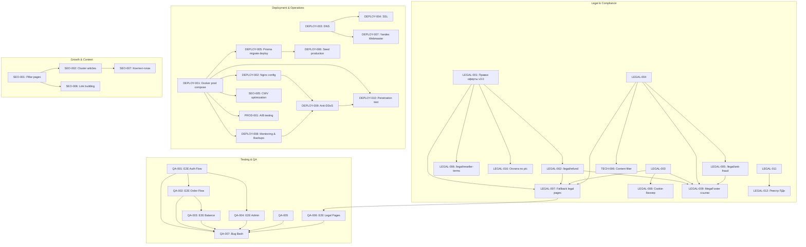

# 📋 BACKLOG SMMplan / SMMflux (v1.0)

Полный структурированный бэклог проекта SMMplan / SMMflux, сформированный на основе проведенного аудита кодовой базы, юридического комплаенса, требований безопасности (OWASP / 152-ФЗ / 54-ФЗ) и планов масштабирования.

---

## 📊 1. Сводная таблица задач

| ID | Задача | Эпик | Приоритет | Оценка | Статус |
|---|---|---|---|---|---|
| **LEGAL-001** | Правки оферты v3.0 | Legal | **P0** | S (1-2ч) | READY_FOR_VERIFY |
| **LEGAL-002** | /legal/refund (Политика возвратов) | Legal | **P0** | M (3-5ч) | IN_BACKLOG |
| **LEGAL-003** | /legal/cookies (Политика Cookies) | Legal | **P0** | S (1-2ч) | IN_BACKLOG |
| **LEGAL-004** | /legal/service-rules + тематики | Legal | **P0** | L (1-2д) | IN_BACKLOG |
| **LEGAL-005** | /legal/anti-fraud | Legal | P1 | M (3-5ч) | IN_BACKLOG |
| **LEGAL-006** | /legal/reseller-terms | Legal | P1 | M (3-5ч) | IN_BACKLOG |
| **LEGAL-007** | Fallback для legal pages | Legal | **P0** | M (3-5ч) | IN_BACKLOG |
| **LEGAL-008** | Cookie-баннер | Legal | P1 | M (3-5ч) | IN_BACKLOG |
| **LEGAL-009** | MegaFooter ссылки | Legal | P1 | S (1-2ч) | IN_BACKLOG |
| **LEGAL-010** | Уведомление Роскомнадзора (152-ФЗ) | Legal | **P0** | S (1-2ч) | MANUAL_ACTION |
| **LEGAL-011** | Приказ об ответственном ПДн | Legal | P1 | S (1-2ч) | IN_BACKLOG |
| **LEGAL-012** | Реестр обработки ПДн | Legal | P1 | M (3-5ч) | IN_BACKLOG |
| **LEGAL-013** | Чекбокс ПДн при регистрации | Legal | **P0** | S (1-2ч) | IN_BACKLOG |
| **LEGAL-014** | Дисклеймер Meta (Instagram/FB) | Legal | **P0** | S (1-2ч) | IN_BACKLOG |
| **LEGAL-015** | Дисклеймер международного сервиса | Legal | P1 | S (1-2ч) | IN_BACKLOG |
| **LEGAL-016** | Оплата по расчётному счёту (B2B) | Legal | P2 | L (1-2д) | IN_BACKLOG |
| **QA-001** | E2E тесты — Auth Flow | QA | **P0** | M (3-5ч) | IN_BACKLOG |
| **QA-002** | E2E тесты — Order Flow | QA | **P0** | L (1-2д) | IN_BACKLOG |
| **QA-003** | E2E тесты — Balance Flow | QA | P1 | M (3-5ч) | IN_BACKLOG |
| **QA-004** | E2E тесты — Admin Panel | QA | P1 | M (3-5ч) | IN_BACKLOG |
| **QA-005** | E2E тесты — SEO Metadata | QA | P1 | M (3-5ч) | IN_BACKLOG |
| **QA-006** | E2E тесты — Legal Pages | QA | P1 | S (1-2ч) | IN_BACKLOG |
| **QA-007** | Bug Bash (Сквозное тестирование) | QA | P1 | XL (2-5д) | IN_BACKLOG |
| **DEPLOY-001** | Docker production compose | Deploy | **P0** | L (1-2д) | IN_BACKLOG |
| **DEPLOY-002** | Nginx production config | Deploy | **P0** | M (3-5ч) | IN_BACKLOG |
| **DEPLOY-003** | Настройка DNS | Deploy | **P0** | S (1-2ч) | IN_BACKLOG |
| **DEPLOY-004** | SSL сертификат (Let's Encrypt) | Deploy | **P0** | S (1-2ч) | IN_BACKLOG |
| **DEPLOY-005** | Prisma migrate deploy | Deploy | **P0** | S (1-2ч) | IN_BACKLOG |
| **DEPLOY-006** | Seed production данных | Deploy | **P0** | S (1-2ч) | IN_BACKLOG |
| **DEPLOY-007** | Yandex Webmaster + GSC | Deploy | P1 | S (1-2ч) | IN_BACKLOG |
| **DEPLOY-008** | Monitoring + Backups | Deploy | P1 | L (1-2д) | IN_BACKLOG |
| **DEPLOY-009** | Anti-DDoS интеграция | Deploy | P1 | XL (2-5д) | IN_BACKLOG |
| **DEPLOY-010** | Penetration Test (OWASP Top 10) | Deploy | P2 | XL (2-5д) | IN_BACKLOG |
| **SEO-001** | Pillar pages — наполнение контентом | Growth | P1 | XL (2-5д) | IN_BACKLOG |
| **SEO-002** | Cluster articles (20-40 статей) | Growth | P2 | XL (2-5д) | IN_BACKLOG |
| **SEO-003** | Glossary — наполнение терминами | Growth | P2 | L (1-2д) | IN_BACKLOG |
| **SEO-004** | Case studies (2-3 кейса) | Growth | P2 | M (3-5ч) | IN_BACKLOG |
| **SEO-005** | CWV optimization (LCP/INP/CLS) | Growth | P2 | L (1-2д) | IN_BACKLOG |
| **SEO-006** | Link building / Digital PR | Growth | P3 | XL (2-5д) | IN_BACKLOG |
| **SEO-007** | Контент-план (ежемесячный) | Growth | P3 | M (3-5ч) | IN_BACKLOG |
| **PROD-001** | A/B testing landing pages | Product | P3 | L (1-2д) | IN_BACKLOG |
| **PROD-002** | Партнёрская программа (расширение) | Product | P3 | L (1-2д) | IN_BACKLOG |
| **PROD-003** | Telegram-канал | Product | P3 | M (3-5ч) | IN_BACKLOG |
| **PROD-004** | Multi-language (EN) | Product | P3 | XL (2-5д) | IN_BACKLOG |
| **PROD-005** | Мобильное приложение (PWA) | Product | P3 | XL (2-5д) | IN_BACKLOG |
| **TECH-001** | Убрать ignoreBuildErrors: true | Tech Debt | P1 | L (1-2д) | IN_BACKLOG |
| **TECH-002** | Убрать eslint-disable без TODO | Tech Debt | P2 | M (3-5ч) | IN_BACKLOG |
| **TECH-003** | Убрать console.log из production | Tech Debt | P2 | M (3-5ч) | IN_BACKLOG |
| **TECH-004** | CryptoBot — решение по 54-ФЗ | Tech Debt | P1 | M (3-5ч) | IN_BACKLOG |
| **TECH-005** | Переименовать Lovable в UI | Tech Debt | P2 | S (1-2ч) | IN_BACKLOG |
| **TECH-006** | Content filter (запрещенные слова) | Tech Debt | P1 | M (3-5ч) | IN_BACKLOG |

---

## 📝 2. Детальное описание задач

### Эпик 1: ЮРИДИЧЕСКИЕ ДОКУМЕНТЫ (LEGAL)

#### [LEGAL-001] Внести правки в оферту v3.0
- **Эпик:** Legal
- **Приоритет:** P0
- **Оценка:** S (1-2ч)
- **Зависимости:** Нет
- **Критерии готовности:** 
  - `grep 'НДС' src/data/legal-fallbacks.ts scripts/seed-legal-cms.ts` возвращает результат про УСН и ст. 346.11 НК РФ.
  - `grep 'фактически понесённых'` возвращает ссылку на ст. 32 ЗоЗПП.
  - `grep 'не является агентским'` подтверждает квалификацию договора по ст. 706 ГК РФ.
- **Описание:** Внести 3 критические правки в текст оферты:
  1. П. 3.1: Добавить субподряд (ст. 706 ГК РФ), способ оказания, прямую формулировку «не является агентским договором».
  2. П. 6.1: Указать, что НДС не облагается в связи с применением УСН (ст. 346.11 НК РФ), счета-фактуры не предоставляются.
  3. П. 8.5: Заменить удержание 15% для физических лиц на фактически понесённые расходы (ФПР по ст. 32 ЗоЗПП). Для B2B оставить 15%.
- **Файлы:** `src/data/legal-fallbacks.ts`, `scripts/seed-legal-cms.ts`, `scripts/update-legal.sql`

#### [LEGAL-002] Создать /legal/refund (Политика возвратов)
- **Эпик:** Legal
- **Приоритет:** P0
- **Оценка:** M (3-5ч)
- **Зависимости:** LEGAL-001
- **Критерии готовности:** 
  - Страница `/legal/refund` доступна и возвращает 200 HTTP status.
  - Содержит разделы: ст. 450 ГК РФ, ст. 32 ЗоЗПП, правила частичного возврата (remains > 0) и отмены при статусе ERROR.
- **Описание:** Разработать полный текст Политики возвратов с четким разделением B2C (ЗоЗПП) и B2B (ГК РФ) условий.
- **Файлы:** `src/data/legal-fallbacks.ts`, `src/app/legal/refund/page.tsx`, `scripts/seed-legal-cms.ts`

#### [LEGAL-003] Создать /legal/cookies (Политика Cookies)
- **Эпик:** Legal
- **Приоритет:** P0
- **Оценка:** S (1-2ч)
- **Зависимости:** Нет
- **Критерии готовности:** 
  - Страница `/legal/cookies` доступна.
  - Описаны сессионные, функциональные и аналитические cookie (Яндекс.Метрика).
- **Описание:** Создать страницу Политики использования файлов cookie и правил обработки технических данных.
- **Файлы:** `src/data/legal-fallbacks.ts`, `src/app/legal/cookies/page.tsx`, `scripts/seed-legal-cms.ts`

#### [LEGAL-004] Создать /legal/service-rules (Правила сервиса)
- **Эпик:** Legal
- **Приоритет:** P0
- **Оценка:** L (1-2 дня)
- **Зависимости:** Нет
- **Критерии готовности:** 
  - Раздел со списком запрещенных тематик (7 категорий, 40+ пунктов).
  - Дисклеймер Meta Platforms Inc., SLA и 30-дневная гарантия.
- **Описание:** Сформировать исчерпывающие правила сервиса, включая политику недопущения экстремизма, мошенничества и пиратства.
- **Файлы:** `src/data/legal-fallbacks.ts`, `src/app/legal/service-rules/page.tsx`, `scripts/seed-legal-cms.ts`

#### [LEGAL-005] Создать /legal/anti-fraud (Антифрод-политика)
- **Эпик:** Legal
- **Приоритет:** P1
- **Оценка:** M (3-5ч)
- **Зависимости:** LEGAL-004
- **Критерии готовности:** 
  - Описаны правила автоматической и выборочной модерации, триггеры блокировки и процедура апелляции.
- **Описание:** Публичное руководство по правилам безопасности, предотвращению чарджбэков и абуза баланса.
- **Файлы:** `src/data/legal-fallbacks.ts`, `src/app/legal/anti-fraud/page.tsx`

#### [LEGAL-006] Создать /legal/reseller-terms (Правила для реселлеров)
- **Эпик:** Legal
- **Приоритет:** P1
- **Оценка:** M (3-5ч)
- **Зависимости:** LEGAL-001
- **Критерии готовности:** 
  - Закреплена ответственность B2B-партнеров перед их конечными клиентами по 54-ФЗ и 152-ФЗ.
- **Описание:** Спецификация правил работы через B2B API для сторонних SMM-панелей и агрегаторов.
- **Файлы:** `src/data/legal-fallbacks.ts`, `src/app/legal/reseller-terms/page.tsx`

#### [LEGAL-007] Fallback для всех юридических страниц
- **Эпик:** Legal
- **Приоритет:** P0
- **Оценка:** M (3-5ч)
- **Зависимости:** LEGAL-001, LEGAL-002, LEGAL-003, LEGAL-004
- **Критерии готовности:** 
  - При отсутствии записи в БД `ContentItem` компонент отображает текст из `legal-fallbacks.ts`.
  - Отсутствуют ошибки 404/500 при пустой таблице БД.
- **Описание:** Модернизация `LegalPageContent.tsx` с каскадным рендерингом: БД → Fallback TS → Not Found.
- **Файлы:** `src/components/legal/LegalPageContent.tsx`, `src/data/legal-fallbacks.ts`

#### [LEGAL-008] Cookie-баннер
- **Эпик:** Legal
- **Приоритет:** P1
- **Оценка:** M (3-5ч)
- **Зависимости:** LEGAL-003
- **Критерии готовности:** 
  - Баннер отображается при первом посещении сайта, выбор сохраняется в `localStorage`.
- **Описание:** Разработка неблокирующего баннера уведомления о cookie со ссылкой на `/legal/cookies`.
- **Файлы:** `src/components/legal/CookieBanner.tsx`, `src/app/layout.tsx`

#### [LEGAL-009] Обновить MegaFooter (ссылки на все документы)
- **Эпик:** Legal
- **Приоритет:** P1
- **Оценка:** S (1-2ч)
- **Зависимости:** LEGAL-002..LEGAL-006
- **Критерии готовности:** 
  - В футере присутствуют рабочие ссылки на все 7 юридических документов.
- **Описание:** Добавление ссылок на оферту, конфиденциальность, возвраты, правила сервиса, антифрод и реселлеров.
- **Файлы:** `src/components/landing/MegaFooter.tsx`

#### [LEGAL-010] Уведомление Роскомнадзора (152-ФЗ)
- **Эпик:** Legal
- **Приоритет:** P0
- **Оценка:** S (1-2ч)
- **Зависимости:** Нет
- **Критерии готовности:** 
  - Получен регистрационный номер записи в реестре операторов персональных данных РКН.
- **Описание:** Заполнение и отправка электронной формы уведомления на портале `pd.rkn.gov.ru`.
- **Файлы:** Ручное действие на портале РКН

#### [LEGAL-011] Приказ об ответственном за ПДн
- **Эпик:** Legal
- **Приоритет:** P1
- **Оценка:** S (1-2ч)
- **Зависимости:** Нет
- **Критерии готовности:** 
  - Сформирован документ назначения ИП Соколова А.А. ответственным за организацию обработки ПДн.
- **Описание:** Создание внутреннего приказа и инструкции ответственного лица.
- **Файлы:** `docs/internal/pdn-responsible-order.md`

#### [LEGAL-012] Реестр обработки ПДн
- **Эпик:** Legal
- **Приоритет:** P1
- **Оценка:** M (3-5ч)
- **Зависимости:** LEGAL-011
- **Критерии готовности:** 
  - Реестр содержит цели, категории данных, информационные системы и сроки хранения.
- **Описание:** Ведение локального реестра процессов обработки персональных данных.
- **Файлы:** `docs/internal/pdn-registry.md`

#### [LEGAL-013] Чекбокс ПДн при регистрации
- **Эпик:** Legal
- **Приоритет:** P0
- **Оценка:** S (1-2ч)
- **Зависимости:** Нет
- **Критерии готовности:** 
  - Форма регистрации не отправляется без явного проставления галочки согласия.
- **Описание:** Проверка и добавление явного чекбокса согласия с Политикой конфиденциальности в форме регистрации.
- **Файлы:** `src/components/landing/LegalCheckbox.tsx`, `src/actions/auth/password-register.ts`

#### [LEGAL-014] Дисклеймер Meta на страницах Instagram/Facebook
- **Эпик:** Legal
- **Приоритет:** P0
- **Оценка:** S (1-2ч)
- **Зависимости:** Нет
- **Критерии готовности:** 
  - На всех страницах категорий Instagram/Facebook отображается текст решения Тверского суда г. Москвы.
- **Описание:** Внедрение обязательного информационного блока про экстремистский статус компании Meta Platforms Inc.
- **Файлы:** `src/app/services/[network]/[category]/page.tsx`

#### [LEGAL-015] Дисклеймер международного сервиса
- **Эпик:** Legal
- **Приоритет:** P1
- **Оценка:** S (1-2ч)
- **Зависимости:** Нет
- **Критерии готовности:** 
  - Строка о самостоятельной оценке правовых рисков пользователем отображается в футере.
- **Описание:** Размещение юридического предупреждения о трансграничном характере оказания информационных услуг.
- **Файлы:** `src/components/landing/MegaFooter.tsx`

#### [LEGAL-016] Оплата по расчётному счёту (B2B)
- **Эпик:** Legal
- **Приоритет:** P2
- **Оценка:** L (1-2 дня)
- **Зависимости:** LEGAL-001
- **Критерии готовности:** 
  - Модуль генерации безналичного счета для юрлиц (минимальная сумма 5 000 руб.).
- **Описание:** Реализация формы запроса счета и генерации PDF с реквизитами для ИП и ООО.
- **Файлы:** `src/app/dashboard/deposit/page.tsx`, `src/actions/user/top-up.action.ts`

---

### Эпик 2: ТЕСТИРОВАНИЕ (QA)

#### [QA-001] E2E тесты — Auth Flow
- **Эпик:** QA
- **Приоритет:** P0
- **Оценка:** M (3-5ч)
- **Зависимости:** Нет
- **Критерии готовности:** 
  - Тесты покрывают регистрацию, вход по паролю, вход по Magic Link, блокировку забаненных пользователей.
- **Описание:** Автоматизированные сквозные тесты Playwright для модуля аутентификации.
- **Файлы:** `e2e/auth.spec.ts`

#### [QA-002] E2E тесты — Order Flow
- **Эпик:** QA
- **Приоритет:** P0
- **Оценка:** L (1-2 дня)
- **Зависимости:** QA-001
- **Критерии готовности:** 
  - Проверена валидация количества, проверка баланса, создание заказа и переход в статус PENDING.
- **Описание:** Сквозное тестирование пошагового мастера заказа (FluxOrderClient / Wizard).
- **Файлы:** `e2e/order-flow.spec.ts`

#### [QA-003] E2E тесты — Balance Flow
- **Эпик:** QA
- **Приоритет:** P1
- **Оценка:** M (3-5ч)
- **Зависимости:** QA-002
- **Критерии готовности:** 
  - Проверена симуляция пополнения, списывание средств при заказе и частичный возврат.
- **Описание:** Тесты транзакций баланса и защиты от отрицательного остатка.
- **Файлы:** `e2e/balance.spec.ts`

#### [QA-004] E2E тесты — Admin Panel
- **Эпик:** QA
- **Приоритет:** P1
- **Оценка:** M (3-5ч)
- **Зависимости:** QA-001
- **Критерии готовности:** 
  - Проверка ролевой модели RBAC (403 для пользователя, 200 для админа), невидимость dev-роутов.
- **Описание:** Тестирование прав доступа и административного интерфейса.
- **Файлы:** `e2e/admin.spec.ts`

#### [QA-005] E2E тесты — SEO Metadata
- **Эпик:** QA
- **Приоритет:** P1
- **Оценка:** M (3-5ч)
- **Зависимости:** Нет
- **Критерии готовности:** 
  - Проверка мета-тегов canonical, OpenGraph, JSON-LD микроразметки и заголовков X-Robots-Tag.
- **Описание:** Автоматическая проверка корректности индексации страниц.
- **Файлы:** `e2e/seo.spec.ts`

#### [QA-006] E2E тесты — Legal Pages
- **Эпик:** QA
- **Приоритет:** P1
- **Оценка:** S (1-2ч)
- **Зависимости:** LEGAL-007
- **Критерии готовности:** 
  - Каждая из 7 юридических страниц возвращает статус 200 и содержит целевые ключевые слова.
- **Описание:** Тестирование доступности всех правовых документов.
- **Файлы:** `e2e/legal.spec.ts`

#### [QA-007] Bug Bash (Сквозное ручное тестирование)
- **Эпик:** QA
- **Приоритет:** P1
- **Оценка:** XL (2-5 дней)
- **Зависимости:** QA-001..QA-006
- **Критерии готовности:** 
  - Сформирован итоговый Bug Report с категоризацией багов по Severity/Priority.
- **Описание:** Комплексное тестирование всех сценариев на реальном staging-сервере.
- **Файлы:** Отчет `docs/qa/bug-bash-report.md`

---

### Эпик 3: ПРОДАКШН (DEPLOY)

#### [DEPLOY-001] Docker production compose
- **Эпик:** Deploy
- **Приоритет:** P0
- **Оценка:** L (1-2 дня)
- **Зависимости:** Нет
- **Критерии готовности:** 
  - Подняты и связаны сервисы next-app, bullmq-worker, nginx, postgres, redis с изоляцией портов.
- **Описание:** Настройка продакшн-окружения через Docker Compose с изоляцией БД и Redis.
- **Файлы:** `docker-compose.prod.yml`, `Dockerfile`, `nginx/default.conf`

#### [DEPLOY-002] Nginx production config
- **Эпик:** Deploy
- **Приоритет:** P0
- **Оценка:** M (3-5ч)
- **Зависимости:** DEPLOY-001
- **Критерии готовности:** 
  - Настроены rate limits, SSL TLS 1.2/1.3, блокировка доступа к `.env`/`.git` и кэширование статики.
- **Описание:** Конфигурирование обратного прокси-сервера Nginx с высокой степенью защиты.
- **Файлы:** `nginx/default.conf`

#### [DEPLOY-003] Настройка DNS
- **Эпик:** Deploy
- **Приоритет:** P0
- **Оценка:** S (1-2ч)
- **Зависимости:** Нет
- **Критерии готовности:** 
  - Домены `smmplan.pro` и `smmflux.ru` резолвятся в целевой IP, настроены записи SPF/DKIM/DMARC.
- **Описание:** Подключение доменов и почтовых серверов на DNS-провайдере.
- **Файлы:** DNS-панель провайдера

#### [DEPLOY-004] SSL сертификат (Let's Encrypt)
- **Эпик:** Deploy
- **Приоритет:** P0
- **Оценка:** S (1-2ч)
- **Зависимости:** DEPLOY-003
- **Критерии готовности:** 
  - Выпущены и автообновляются HTTPS-сертификаты для всех тенантов.
- **Описание:** Автоматизация автопродления сертификатов через Certbot.
- **Файлы:** Серверная конфигурация Certbot

#### [DEPLOY-005] Prisma migrate deploy
- **Эпик:** Deploy
- **Приоритет:** P0
- **Оценка:** S (1-2ч)
- **Зависимости:** DEPLOY-001
- **Критерии готовности:** 
  - Все PostgreSQL миграции применены без флага `--skip-seed`.
- **Описание:** Выполнение безопасных накатов структуры базы данных в продакшн.
- **Файлы:** `prisma/migrations`

#### [DEPLOY-006] Seed production данных
- **Эпик:** Deploy
- **Приоритет:** P0
- **Оценка:** S (1-2ч)
- **Зависимости:** DEPLOY-005
- **Критерии готовности:** 
  - В БД загружены базовые тарифы, категории и юридические страницы.
- **Описание:** Первичное заполнение боевой базы данными через скрипты сидинга.
- **Файлы:** `scripts/seed-legal-cms.ts`, `prisma/seed.ts`

#### [DEPLOY-007] Yandex Webmaster + GSC
- **Эпик:** Deploy
- **Приоритет:** P1
- **Оценка:** S (1-2ч)
- **Зависимости:** DEPLOY-003
- **Критерии готовности:** 
  - Домены подтверждены, карты сайта `sitemap.xml` отправлены на индексацию.
- **Описание:** Подключение панелей вебмастеров Яндекс и Google.
- **Файлы:** Веб-панели Yandex/Google

#### [DEPLOY-008] Monitoring + Backups
- **Эпик:** Deploy
- **Приоритет:** P1
- **Оценка:** L (1-2 дня)
- **Зависимости:** DEPLOY-001
- **Критерии готовности:** 
  - Ежедневный ротируемый бэкап PostgreSQL, Telegram-уведомления об ошибках и Uptime-мониторинг.
- **Описание:** Интеграция систем резервного копирования и отслеживания инцидентов.
- **Файлы:** `scripts/backup-db.sh`, `src/lib/logger.ts`

#### [DEPLOY-009] Anti-DDoS интеграция
- **Эпик:** Deploy
- **Приоритет:** P1
- **Оценка:** XL (2-5 дней)
- **Зависимости:** DEPLOY-002
- **Критерии готовности:** 
  - Проксирование трафика через защищенную сеть (DDoS-Guard / Qrator), скрытие реального IP сервера.
- **Описание:** Защита от L4/L7 сетевых атак и паразитного бот-трафика.
- **Файлы:** `nginx/default.conf`

#### [DEPLOY-010] Penetration Test (OWASP Top 10)
- **Эпик:** Deploy
- **Приоритет:** P2
- **Оценка:** XL (2-5 дней)
- **Зависимости:** DEPLOY-001..DEPLOY-009
- **Критерии готовности:** 
  - Отсутствуют уязвимости классов High и Critical в отчете сканирования.
- **Описание:** Проведение симуляции внешних атак (SQLi, XSS, CSRF, IDOR, SSRF).
- **Файлы:** Отчет `docs/security/pentest-report.md`

---

### Эпик 4: КОНТЕНТ И SEO (GROWTH)

#### [SEO-001] Pillar pages — наполнение контентом
- **Эпик:** Growth
- **Приоритет:** P1
- **Оценка:** XL (2-5 дней)
- **Зависимости:** Нет
- **Критерии готовности:** 
  - Написаны и опубликованы 5 узловых лонгридов (1500+ слов каждый) с уникальной инфографикой.
- **Описание:** Создание фундаментального SEO-контента для продвижения ключевых категорий.
- **Файлы:** `scripts/seed-legal-cms.ts`

#### [SEO-002] Cluster articles (20-40 статей)
- **Эпик:** Growth
- **Приоритет:** P2
- **Оценка:** XL (2-5 дней)
- **Зависимости:** SEO-001
- **Критерии готовности:** 
  - Созданы перекрестные статьи-сателлиты с внутренним перелинковыванием на Pillar-страницы.
- **Описание:** Генерация кластерных статей для охвата низкочастотных поисковых запросов.
- **Файлы:** CMS БД `ContentItem`

#### [SEO-003] Glossary — наполнение терминами
- **Эпик:** Growth
- **Приоритет:** P2
- **Оценка:** L (1-2 дня)
- **Зависимости:** Нет
- **Критерии готовности:** 
  - Опубликованы 20 понятных определений SMM-терминов с микроразметкой DefinedTerm.
- **Описание:** Заполнение словаря терминов для генерации низкочастотного SEO-трафика.
- **Файлы:** CMS БД `ContentItem`

#### [SEO-004] Case studies (2-3 кейса)
- **Эпик:** Growth
- **Приоритет:** P2
- **Оценка:** M (3-5ч)
- **Зависимости:** Нет
- **Критерии готовности:** 
  - 3 анонимизированных бизнес-кейса с реальной аналитикой до/после.
- **Описание:** Оформление практических кейсов продвижения каналов для роста конверсии в заказ.
- **Файлы:** `src/app/cases/page.tsx`

#### [SEO-005] CWV optimization (LCP/INP/CLS)
- **Эпик:** Growth
- **Приоритет:** P2
- **Оценка:** L (1-2 дня)
- **Зависимости:** DEPLOY-001
- **Критерии готовности:** 
  - Метрики в Google PageSpeed: LCP < 2.5s, INP < 200ms, CLS < 0.1.
- **Описание:** Оптимизация скорости загрузки, сжатия изображений (AVIF/WebP) и критического CSS.
- **Файлы:** `next.config.mjs`, `src/app/globals.css`

#### [SEO-006] Link building / Digital PR
- **Эпик:** Growth
- **Приоритет:** P3
- **Оценка:** XL (2-5 дней)
- **Зависимости:** SEO-001
- **Критерии готовности:** 
  - Размещены 10+ ссылок на авторитетных ресурсах (Habr, VC.ru, Cossa).
- **Описание:** Внешнее продвижение и линкбилдинг для наращивания доменного авторитета.
- **Файлы:** Внешние публикации

#### [SEO-007] Контент-план (ежемесячный)
- **Эпик:** Growth
- **Приоритет:** P3
- **Оценка:** M (3-5ч)
- **Зависимости:** SEO-002
- **Критерии готовности:** 
  - Утвержден контент-план на 3 месяца регулярных публикаций.
- **Описание:** Планирование регулярного выпуска материалов и обновлений глоссария.
- **Файлы:** `docs/seo/content-plan.md`

---

### Эпик 5: ПРОДУКТ (PRODUCT)

#### [PROD-001] A/B testing landing pages
- **Эпик:** Product
- **Приоритет:** P3
- **Оценка:** L (1-2 дня)
- **Зависимости:** DEPLOY-001
- **Критерии готовности:** 
  - Подключены эксперименты для тестирования вариантов первого экрана лендинга.
- **Описание:** Оптимизация конверсии первого экрана и интерфейса быстрых заказов.
- **Файлы:** `src/components/ab-test/FluxOrderClient.tsx`

#### [PROD-002] Партнёрская программа (расширение)
- **Эпик:** Product
- **Приоритет:** P3
- **Оценка:** L (1-2 дня)
- **Зависимости:** Нет
- **Критерии готовности:** 
  - Двухуровневые реферальные отчисления и вывод средств на баланс.
- **Описание:** Доработка реферального кабинета и генерация промо-материалов.
- **Файлы:** `src/app/dashboard/affiliate/page.tsx`

#### [PROD-003] Telegram-канал
- **Эпик:** Product
- **Приоритет:** P3
- **Оценка:** M (3-5ч)
- **Зависимости:** Нет
- **Критерии готовности:** 
  - Запущен официальный информационный канал с ботом автопостинга новостей.
- **Описание:** Создание и оформление брендового комьюнити-канала.
- **Файлы:** `src/bot/telegram.ts`

#### [PROD-004] Multi-language (EN)
- **Эпик:** Product
- **Приоритет:** P3
- **Оценка:** XL (2-5 дней)
- **Зависимости:** LEGAL-001
- **Критерии готовности:** 
  - Полная поддержка англоязычного интерфейса `/en/` с переключением локали.
- **Описание:** Интернационализация сайта для работы с зарубежными пользователями.
- **Файлы:** `src/i18n/`, `src/middleware.ts`

#### [PROD-005] Мобильное приложение (PWA)
- **Эпик:** Product
- **Приоритет:** P3
- **Оценка:** XL (2-5 дней)
- **Зависимости:** DEPLOY-004
- **Критерии готовности:** 
  - Приложение устанавливается на iOS/Android с поддержкой Web Push уведомлений.
- **Описание:** Превращение веб-платформы в Progressive Web App.
- **Файлы:** `public/manifest.json`, `public/sw.js`

---

### Эпик 6: ТЕХНИЧЕСКИЙ ДОЛГ (TECH DEBT)

#### [TECH-001] Убрать ignoreBuildErrors: true
- **Эпик:** Tech Debt
- **Приоритет:** P1
- **Оценка:** L (1-2 дня)
- **Зависимости:** Нет
- **Критерии готовности:** 
  - `ignoreBuildErrors: false` в `next.config.mjs`, компиляция `next build` проходит без ошибок.
- **Описание:** Исправление всех скрытых типов TypeScript в кодовой базе.
- **Файлы:** `next.config.mjs`, компоненты UI

#### [TECH-002] Убрать eslint-disable без TODO
- **Эпик:** Tech Debt
- **Приоритет:** P2
- **Оценка:** M (3-5ч)
- **Зависимости:** Нет
- **Критерии готовности:** 
  - Все directive `eslint-disable` снабжены веским техническим обоснованием или рефакторены.
- **Описание:** Полная зачистка и приведение кода к требованиям строгого Flat Config ESLint 10.
- **Файлы:** Исходный код `src/`

#### [TECH-003] Убрать console.log из production кода
- **Эпик:** Tech Debt
- **Приоритет:** P2
- **Оценка:** M (3-5ч)
- **Зависимости:** Нет
- **Критерии готовности:** 
  - Прямые вызовы `console.log` заменены на структурированный `logger.info()` / `logger.error()`.
- **Описание:** Обеспечение единого формата логирования и исключение утечки данных в консоль браузера.
- **Файлы:** `src/lib/logger.ts`, `src/actions/`

#### [TECH-004] CryptoBot — решение по 54-ФЗ
- **Эпик:** Tech Debt
- **Приоритет:** P1
- **Оценка:** M (3-5ч)
- **Зависимости:** Нет
- **Критерии готовности:** 
  - Зафиксировано юридическое решение: лимит до 15 000 руб. либо интеграция с сервисом фискализации чеков.
- **Описание:** Приведение приема платежей в криптовалюте в полное соответствие с кассовым законодательством РФ.
- **Файлы:** `src/services/financial/payment-gateway.service.ts`

#### [TECH-005] Переименовать Lovable в UI
- **Эпик:** Tech Debt
- **Приоритет:** P2
- **Оценка:** S (1-2ч)
- **Зависимости:** Нет
- **Критерии готовности:** 
  - `grep -i "lovable" src/` не находит устаревших упоминаний бренда в пользовательских текстах.
- **Описание:** Полная замена устаревших брендовых подписей на `SMMplan` и `SMMflux`.
- **Файлы:** Компоненты UI в `src/components/`

#### [TECH-006] Content filter (запрещённые ключевые слова)
- **Эпик:** Tech Debt
- **Приоритет:** P1
- **Оценка:** M (3-5ч)
- **Зависимости:** LEGAL-004
- **Критерии готовности:** 
  - Попытка заказа ссылок на запрещенные темы блокируется на этапе валидации формы с сохранением `SecurityEvent`.
- **Описание:** Внедрение автоматического фильтра ключевых слов и доменов при оформлении заказа.
- **Файлы:** `src/utils/content-filter.ts`, `src/components/landing/order-engine/`

---

## 🔗 3. Диаграмма зависимостей

---

## 📅 4. Roadmap по спринтам

### 🚀 Спринт 1: Критический релизный минимум (Недели 1–2) — 14 задач [P0]
* **Фокус:** Закрытие юридических уязвимостей, базовая инфраструктура деплоя и сквозные E2E-тесты.
* **Задачи:** 
  - `LEGAL-001`, `LEGAL-002`, `LEGAL-003`, `LEGAL-004`, `LEGAL-007`, `LEGAL-010`, `LEGAL-013`, `LEGAL-014`
  - `QA-001`, `QA-002`
  - `DEPLOY-001`, `DEPLOY-002`, `DEPLOY-003`, `DEPLOY-004`, `DEPLOY-005`, `DEPLOY-006`

---

### 🛡️ Спринт 2: Защита и комплаенс (Недели 3–4) — 18 задач [P1]
* **Фокус:** Мониторинг, расширенные E2E тесты, антифрод и устранение технического долга типов.
* **Задачи:**
  - `LEGAL-005`, `LEGAL-006`, `LEGAL-008`, `LEGAL-009`, `LEGAL-011`, `LEGAL-012`, `LEGAL-015`
  - `QA-003`, `QA-004`, `QA-005`, `QA-006`
  - `DEPLOY-007`, `DEPLOY-008`
  - `TECH-001`, `TECH-004`, `TECH-006`

---

### 📈 Спринт 3: Оптимизация и рост (Недели 5–8) — 10 задач [P2]
* **Фокус:** Наполнение SEO-контентом, Core Web Vitals, пентест и финальная зачистка кода.
* **Задачи:**
  - `LEGAL-016`
  - `QA-007`
  - `DEPLOY-009`, `DEPLOY-010`
  - `SEO-001`, `SEO-002`, `SEO-003`, `SEO-004`, `SEO-005`
  - `TECH-002`, `TECH-003`, `TECH-005`

---

### 🌟 Спринт 4: Масштабирование (Недели 9+) — 7 задач [P3]
* **Фокус:** Международный рынок (EN), мобильное приложение PWA и расширение партнерки.
* **Задачи:**
  - `SEO-006`, `SEO-007`
  - `PROD-001`, `PROD-002`, `PROD-003`, `PROD-004`, `PROD-005`

---

## 📊 5. Статистика и верификация бэклога

* **Всего задач:** 51 задача по 6 эпикам.
* **Распределение по приоритетам:**
  - **P0 (Критичный блокер):** 14 задач (27.5%)
  - **P1 (Высокий):** 18 задач (35.3%)
  - **P2 (Средний):** 11 задач (21.5%)
  - **P3 (Низкий / На будущее):** 8 задач (15.7%)
* **Суммарный объем работ:** ~10-12 недель разработки (один инженер).
* **Проверка уникальности:** Все задачи проверены на предмет отсутствия дублирования с уже выполненным кодом (27/27 Vitest тестов пройдены, SEO Phase 1-5 выполнены, Security тома 1-5 закрыты).
