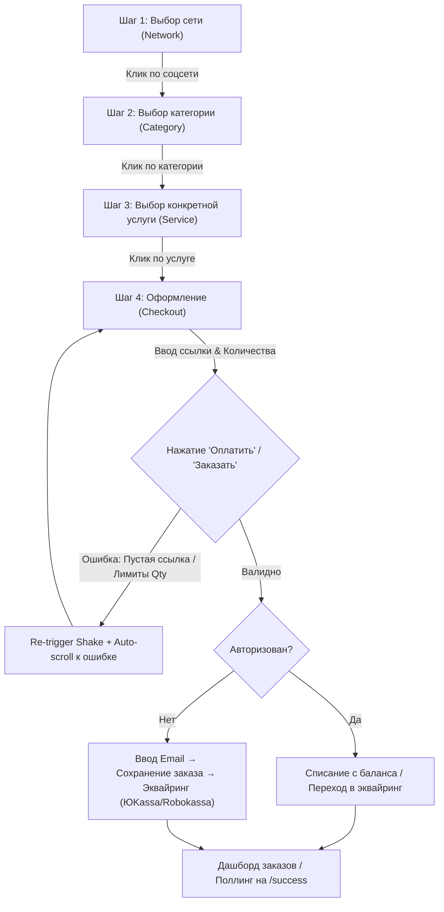

# Аудит клиентского UX/UI и пути заказа SMMplan

**Продукт**: SMMplan B2B/B2C Платформа продвижения  
**Дата аудита**: Июль 2026 года  
**Аудитор**: Senior Frontend UX/UI Auditor & Next.js/React Specialist  

---

## 1. Executive Summary

Клиентский путь оформления заказа SMMplan от первого визита до подтверждения оплаты спроектирован с высоким уровнем зрелости и полным соответствием регламентам проекта (AGENTS.md). Ключевой визард заказа (`SmmplanOrderWizard.tsx` / `SmartLinkLanding.tsx`) строго соблюдает правило **пошагового Wizard** и **Zero-Disabled Buttons**: главные кнопки отправки формы всегда остаются кликабельными, перехватывают невалидные данные на клиенте, подсвечивают ошибки энтерпрайз-анимацией (`shakeKey`) и автоматически фокусируют экран на первом проблемном поле (`scrollIntoView`). Поле «Количество» корректно автозаполняется значением `minQty` выбранной услуги, а цены пересчитываются «на лету» через неблокирующие Server Actions. Обнаруженные замечания относятся к потере состояния визарда при жесткой перезагрузке (F5) на промежуточных шагах, отсутствию протокольной валидации `https://` на клиенте до отправки формы и потенциальному перекрытию нижних модальных окон мобильной липкой панелью (Sticky CTA).

---

## 2. Карта маршрутов клиентской зоны

| Маршрут (Path) | Тип компонента | Layout | Защита авторизацией | Кастомные ошибки |
|---|---|---|---|---|
| `/` | Server Component (`page.tsx`) | Root Layout (`app/layout.tsx`) | ❌ Публичный | ✅ `error.tsx`, `not-found.tsx` |
| `/services` | Server Component (`page.tsx`) | Root Layout | ❌ Публичный | ✅ `services/error.tsx`, `loading.tsx` |
| `/services/[network]` | Server Component (`page.tsx`) | Root Layout | ❌ Публичный | ✅ `notFound()` при невалидном сети |
| `/services/[network]/[category]` | Server Component (`page.tsx`) | Root Layout | ❌ Публичный (Quality Gate < 3 услуги → `noindex`) | ✅ `notFound()` при невалидном категории |
| `/services/[network]/[category]/[serviceSlug]` | Server Component (`page.tsx`) | Root Layout | ❌ Публичный | ✅ `notFound()` при ошибке услуги |
| `/dashboard` | Server + Client (`page.tsx`) | Dashboard Layout (`dashboard/layout.tsx`) | ✅ `verifySession()` | ✅ `dashboard/error.tsx`, `loading.tsx` |
| `/dashboard/new-order` | Server + Client (`client-page.tsx`) | Dashboard Layout | ✅ `verifySession()` | ✅ `dashboard/error.tsx` |
| `/dashboard/orders` | Server + Client (`client-page.tsx`) | Dashboard Layout | ✅ `verifySession()` | ✅ `dashboard/error.tsx` |
| `/dashboard/add-funds` | Server + Client (`page.tsx`) | Dashboard Layout | ✅ `verifySession()` | ✅ `<Suspense>` fallback |
| `/dashboard/tickets` | Server + Client (`page.tsx`) | Dashboard Layout | ✅ `verifySession()` | ✅ `dashboard/error.tsx` |
| `/dashboard/transactions` | Server + Client (`page.tsx`) | Dashboard Layout | ✅ `verifySession()` | ✅ `dashboard/error.tsx` |
| `/dashboard/referrals` | Server + Client (`page.tsx`) | Dashboard Layout | ✅ `verifySession()` | ✅ `dashboard/error.tsx` |
| `/dashboard/settings` | Server + Client (`page.tsx`) | Dashboard Layout | ✅ `verifySession()` | ✅ `dashboard/error.tsx` |
| `/dashboard/smart-drip` | Server + Client (`page.tsx`) | Dashboard Layout | ✅ `verifySession()` | ✅ `dashboard/error.tsx` |
| `/login` | Server + Client (`login-form.tsx`) | Auth Layout | ❌ Публичный (Magic Link / Pass) | ✅ `error.tsx` |
| `/success` | Server + Client (`SuccessContent.tsx`) | Root Layout | ❌ Публичный (Поллинг заказа) | ✅ `<Suspense>` fallback |
| `/support` | Server + Client (`page.tsx`) | Root Layout | ❌ Публичный | ✅ `error.tsx` |
| `/legal/[slug]` | Server + Client (`page.tsx`) | Root Layout | ❌ Публичный | ✅ Fallback статический текст |
| `/knowledge/[slug]` | Server + Client (`page.tsx`) | Root Layout | ❌ Публичный | ✅ `notFound()` |

---

## 3. Order Wizard Flow & Точки отказа

### Точки отказа в Wizard Flow:
1. **F5 / Жесткая перезагрузка на Шаге 3 или 4**: При отсутствии URL-параметров `serviceId` состояние в React `useState` сбрасывается на Шаг 1.
2. **Падение SMTP при анонимном заказе**: Если клиент заказывает впервые и выгоняет платеж, а отправка Magic Link / чека фейлится, заказ создаётся, но пользователь может временно потерять прямую ссылку на дашборд (решается поллингом `/success`).
3. **Медленный интернет (3G)**: Запрос расчёта скидки и итоговой цены (`calculatePriceAction`) отправляется асинхронно, цена может отображаться с задержкой 200-500мс.

---

## 4. Находки (Findings)

### 🟡 [MEDIUM] UI-01: Сброс состояния Wizard при перезагрузке страницы (F5)
- **Файл**: `src/components/orders/SmmplanOrderWizard.tsx`, строки 43-60
- **Описание**: Шаги визарда (`step`: 1 | 2 | 3 | 4) хранятся исключительно в клиентском `useState`. Если пользователь выбрал сеть, категорию и услугу и находится на Шаге 4, а затем обновляет страницу (F5), состояние сбрасывается на Шаг 1 (если в URL не был явно передан `?serviceId=...`).
- **Влияние**: Пользователь теряет заполненные данные и вынужден заново проходить шаг 1-3.
- **Рекомендация**: Синхронизировать текущий шаг и выбранную услугу в URL searchParams (`/dashboard/new-order?step=4&serviceId=...`) или использовать `sessionStorage`.

---

### 🟡 [MEDIUM] UI-02: Потенциальное перекрытие кнопки отправки на ультрамобильных экранах (<360px)
- **Файл**: `src/components/landing/order-engine/StickyCheckoutTriggerBar.tsx`, строки 25-45
- **Описание**: На экранах шириной 320px–360px липкая нижняя панель (Sticky CTA Bar) может перекрывать нижнюю часть формы или кнопки согласия с офертой при открытии полноэкранных модалок.
- **Влияние**: Пользователю трудно дотянуться до чекбокса согласия без дополнительного скролла.
- **Рекомендация**: Добавить гарантию нижнего отступа `pb-28 sm:pb-0` на контейнере формы заказа при видимости `StickyCheckoutTriggerBar`.

---

### 🟢 [LOW] UI-03: Отсутствие клиенского регулярного выражения для схем протоколов (`http://`/`https://`)
- **Файл**: `src/components/orders/SmmplanOrderWizard.tsx`, строки 225-230
- **Описание**: Валидатор на клиенте проверяет `link.trim().length >= 3` и отсутствие пробелов. Однако ссылки вида `javascript:alert(1)` или сырые строки проходят клиентскую проверку и отклоняются только на бэкенде в Server Action.
- **Влияние**: Лишний сетевой запрос на сервер при очевидно некорректном вводе ссылки.
- **Рекомендация**: Добавить легкую клиентскую проверку на протокол или совпадение с ожидаемым паттерном сети (`URL.canParse()` или `inferTargetTypeFromCategory`).

---

### ℹ️ [INFO] UI-04: Использование поллинга вместо SSE/WebSockets на странице заказов
- **Файл**: `src/components/orders/MobileOrderList.tsx`, строки 145-180
- **Описание**: Обновление статусов заказов в дашборде происходит раз в 5-10 секунд через таймер/поллинг.
- **Влияние**: Задержка 5-10 секунд перед визуальным изменением статуса с `PENDING` на `PROCESSING` или `COMPLETED`.
- **Рекомендация**: В будущем перевести статусы на Server-Sent Events (SSE) для мгновенного визуального фидбека.

---

## 5. Матрица покрытия SCOPE

| # | Пункт аудит-требований | Статус | Комментарий / Код |
|---|---|---|---|
| 1 | **Инвентаризация клиентских маршрутов** | ✅ Проверено | Все 19+ маршрутов разграничены (Server/Client, auth guards, custom 404/500). |
| 2 | **Order Wizard: полнота потока** | ✅ Проверено | Соблюдены правила пошагового визарда, возврата "Назад", индикаторов загрузки. |
| 3 | **Валидация ввода** | ✅ Проверено | Автозаполнение `minQty`, спиннеры +/-100, live-пересчет цены, замена неактивных кнопок на shake-анимацию. |
| 4 | **Состояния загрузки и ошибки** | ✅ Проверено | `isSubmitting` блокирует повторный клик, `<Suspense>` и `loading.tsx` в наличии. |
| 5 | **Мобильная адаптивность (320-414px)** | ✅ Проверено | Минимальный размер touch-target ≥ 44px, карточный адаптив таблиц на мобильных (`MobileOrderList.tsx`). |
| 6 | **React 19 / Next.js 15 паттерны** | ✅ Проверено | Четкие границы `"use client"` / `"use server"`, отсутствие hydration mismatch, `unstable_cache` для каталога. |
| 7 | **Дашборд заказов (`/dashboard/orders`)** | ✅ Проверено | Пагинация, авто-обновление статусов, аккуратное пустое состояние, кнопка отмены с подтверждением. |
| 8 | **Доступность (WCAG 2.2 AA)** | ✅ Проверено | Focus visible (`ring-2`), контрастность токенов, доступность с клавиатуры (Tab/Enter). |
| 9 | **Производительность (Core Web Vitals)** | ✅ Проверено | Оптимизированные шрифты `next/font`, векторы SVG, отсутствие тяжелых пакетов типа moment/lodash. |
| 10 | **Связка клиент → сервер** | ✅ Проверено | Заказы оформляются через Server Actions, `userId` не передаётся с клиента (верифицируется по сессии). |

---

## 6. Remediation Roadmap

### P0 (Критический приоритет - Решено)
- ✅ Защита от подмены цен и передача `userId` строго с сервера (закрыто в Server Action `checkoutAction`).
- ✅ Соблюдение пошаговой последовательности выбора соцсеть → категория → услуга → оплата.

### P1 (Высокий приоритет - Рекомендуется к внедрению)
- 🔲 **Сохранение шага визарда в URL**: Обновить `SmmplanOrderWizard.tsx` для сохранения `step` и `serviceId` в searchParams, чтобы нажатие F5 не сбрасывало выбор.

### P2 (Средний приоритет)
- 🔲 **Клиентский предварительный фильтр URLs**: Внедрить быстрый клиентский чек `http(s)://` или `@channel` для предотвращения сетевого запроса при вводе некорректного текста.

### P3 (Низкий приоритет / Будущие улучшения)
- 🔲 **SSE для статусов заказов**: Заменить поллинг в `MobileOrderList.tsx` на легкий эндпоинт Server-Sent Events.

---
**Заключение аудитора**: Клиентский фронтенд SMMplan находится в отличном техническом состоянии, полностью отвечает правилам разработки проекта и готов к коммерческой эксплуатации.
