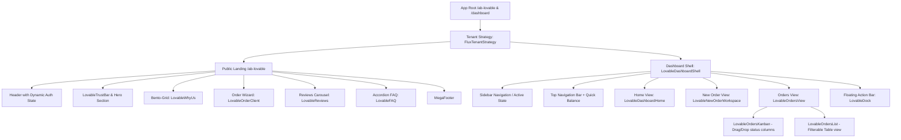

# 🎨 Flux Frontend Design System & Architecture Specification (`Design.md`)

> **Версия стека:** Next.js 16 (App Router), React 19, Tailwind CSS 4 (`@theme`), HeroUI v3 (dot notation), Lucide Icons  
> **Принцип дизайна:** *Linear & Vercel Calm Design, Blueprint Aesthetic, Glassmorphism, Premium App-like UX*

---

## 1. 🌟 Философия и Концептуальные Принципы

Интерфейс **Flux** спроектирован как премиальный B2B/B2C SaaS-продукт мирового уровня. В основе дизайна лежат 4 фундаментальных столпа:

1. **Calm Design ("Спокойный интерфейс"):**
   Отсутствие агрессивных кислотных цветов, рекламы и интерфейсного шума. Использование глубоких тональных контрастов, матовых градиентов и эффектов матового стекла (backdrop-blur / glassmorphism).

2. **App-Like Elevation & Touch Targets:**
   Все карты и интерактивные виджеты имеют увеличенный радиус закругления (`--radius: 1.25rem` / `20px`) и мишени клика не менее `44px × 44px` (WCAG 2.2 AA).

3. **Performance as UX & Micro-interactions:**
   Все кликабельные элементы оснащены 200ms анимацией с кубическим Безье `cubic-bezier(0.4, 0, 0.2, 1)`. Все числовые значения балансов и цен используют `font-variant-numeric: tabular-nums` для исключения визуального подрагивания верстки при смене цифр.

4. **Zero-Disabled UX (Клиентоориентированная валидация):**
   Кнопки действий ( Submit / Оплатить / Далее ) **никогда не бывают заблокированными (`disabled`)**. Если форма заполнена не полностью, кнопка остается активной, а клик вызывается с визуальной анимацией ошибки (`animate-shake`) и автоматической плавной прокруткой (`scrollIntoView`) к пропущенному полю.

---

## 2. 🎨 Цветовая Палитра и Семантические Токены (Tailwind 4 `@theme`)

Все цвета изолированы в `@theme` блоке `src/app/globals.css` и переключаются через CSS-переменные. **Категорически запрещены inline-цвета вроде `text-white` или `bg-black`.**

### 2.1. Светлая тема (Light Mode — по умолчанию)

| Семантический Токен | Значение (HEX/HSL) | Назначение в интерфейсе |
| :--- | :--- | :--- |
| `--color-background` | `#f8fafc` (`slate-50`) | Основной мягкий подложечный фон страницы |
| `--color-foreground` | `#0f172a` (`slate-900`) | Основной высококонтрастный текст |
| `--color-card` | `#ffffff` (`pure white`) | Фоновый цвет плавающих карт и Bento-блоков |
| `--color-primary` | `#0369a1` (`sky-700`) | Главный акцентный цвет (кнопки, активные фокусы) |
| `--color-secondary` | `#e0f2fe` (`sky-100`) | Фон сопутствующих кнопок и тегов |
| `--color-muted` | `#f1f5f9` (`slate-100`) | Нейтральный фон второстепенных блоков |
| `--color-muted-foreground` | `#475569` (`slate-600`) | Второстепенный текст (контраст >= 4.5:1) |
| `--color-border` | `#e2e8f0` (`slate-200`) | Тонкие разделители компонентов |
| `--color-ring` | `#bae6fd` (`sky-200`) | Свечение фокусного кольца полей ввода |

### 2.2. Тёмная тема (Dark Mode `.dark`)

| Семантический Токен | Значение (HEX/HSL) | Назначение в интерфейсе |
| :--- | :--- | :--- |
| `--color-background` | `#0f172a` (`slate-900`) | Глубокий тёмно-сланцевый фон (вместо глухого чёрного) |
| `--color-foreground` | `#f8fafc` (`slate-50`) | Светлый контрастный текст |
| `--color-card` | `#1e293b` (`slate-800`) | Поднятые карты с мягкой тенью |
| `--color-primary` | `#38bdf8` (`sky-400`) | Яркий небесно-голубой акцент |
| `--color-muted-foreground` | `#cbd5e1` (`slate-300`) | Читаемый второстепенный текст |
| `--color-border` | `rgba(255, 255, 255, 0.08)` | Свечение границ в стиле Blueprint Aesthetic |

### 2.3. Семантические Цвета Статусов Заказов

* 🟢 **Completed (Завершён):** Text `--color-status-completed` (`#10b981`), Background `rgba(16, 185, 129, 0.1)`
* 🟡 **Pending (В очереди):** Text `--color-status-pending` (`#f59e0b`), Background `rgba(245, 158, 11, 0.1)`
* 🔵 **In Progress (В работе):** Text `--color-status-in-progress` (`#6366f1`), Background `rgba(99, 102, 241, 0.1)`
* ⚪ **Canceled (Отменён):** Text `--color-status-canceled` (`#64748b`), Background `rgba(100, 116, 139, 0.1)`
* 🔴 **Error (Ошибка):** Text `--color-status-error` (`#f43f5e`), Background `rgba(244, 63, 94, 0.1)`

---

## 3. 📐 Типографика, Выравнивание и Геометрия

### 3.1. Типографика
* **Семейство шрифтов:** `Inter`, `-apple-system`, `BlinkMacSystemFont`, `sans-serif`.
* **Балансировка заголовков:** `text-wrap: balance` для авто-переноса длинных названий без висячих слов.
* **Балансировка текстов:** `text-wrap: pretty` для предотвращения одиночных слов на последней строке.
* **Табличные числа:** `tabular-nums` применяется ко всем ценам, балансам, ID заказов и счётчикам.

### 3.2. Закругления (`Border Radius`)
* `--radius: 1.25rem` (`20px`) — стандарт для карточек (`rounded-3xl` / `rounded-2xl`).
* Кнопки и инпуты: `rounded-xl` (`12px`) или `rounded-full` (для таблеточных переключателей).

---

## 4. 🧩 Компонентная Архитектура Фронтенда Flux



### 4.1. Публичный Лендинг (`/ab-lovable`)
1. **Header (`Header.tsx`):** Адаптивная шапка с логотипом, прозрачным стеклянным фоном (`backdrop-blur-md`), динамическим отображением баланса и профиля пользователя.
2. **TrustBar (`LovableTrustBar.tsx`):** Счётчики доверия в реальном времени (выполненные заказы, оценки, скорость).
3. **Bento-Grid WhyUs (`LovableWhyUs.tsx`):** Карточная сетка преимуществ с анимацией наведения (`hover:scale-[1.02]`).
4. **Order Wizard Client (`LovableOrderClient.tsx`):** Пошаговый визард на лендинге.
5. **FAQ Accordion (`LovableFAQ.tsx`):** Вопросы и ответы с плавными переходами разворачивания.
6. **MegaFooter (`MegaFooter.tsx`):** Подвал с навигацией, юридическими документами (152-ФЗ), логотипами платежных систем (МИР, СБП).

### 4.2. Мастер Оформления Заказа (Order Wizard Sequence)
Интерфейс оформления заказа во Flux придерживается **жесткого 4-шагового алгоритма**:

1. **Шаг 1 (Социальная сеть):** Выбор платформы (Telegram, VK, YouTube, Instagram и др.) или автоопределение по вставленной ссылке.
2. **Шаг 2 (Категория):** Выбор категории услуги (Подписчики, Лайки, Просмотры, Бусты).
3. **Шаг 3 (Услуга):** Выбор конкретной тарифной опции с четкими метками скорости и гарантией.
4. **Шаг 4 (Параметры и Чек):**
   * **Поле "Количество":** Автоматически подставляет минимально допустимое значение `service.minQty`.
   * **Отображение цены:** Отображается цена **за 1 штуку** (подпись `₽ / шт`). Категорически запрещено указывать цену за 1000 шт в интерфейсе пользователя.
   * **Поле "Ссылка":** Валидируется с учетом `targetType` категории (`CHANNEL`, `POST`, `STORY`).

### 4.3. Личный Кабинет Дашборда Flux
* **`LovableDashboardShell.tsx`:** Макет личного кабинета с убирающимся сайдбаром, переключателем тем (Sky, Emerald, Violet, Warm) и кнопкой быстрого пополнения.
* **`LovableDashboardHome.tsx`:** Главная страница с графиком расходов, последними заказами и быстрым стартом.
* **`LovableOrdersView.tsx`:** Экраны управления заказами с возможностью переключения в 1 клик между Табличным видом (`LovableOrdersList`) и Канбан-доской по статусам (`LovableOrdersKanban`).
* **`LovableDock.tsx`:** Нижний плавающий стек быстрых действий (Linear Floating Dock) для быстрого перехода к созданию заказа, поддержке и балансу.

---

## 5. ⚡ Анимации и Микроинтеракции

В Flux внедрены кастомные keyframe-анимации Tailwind CSS 4:

1. **Aurora Effect (`animate-aurora`):**
   Плавно переливающийся фоновый градиент для Hero-секции и платиновых карточек.

2. **Form Shake (`animate-shake`):**
   ```css
   @keyframes shake {
     0%, 100% { transform: translateX(0); }
     20% { transform: translateX(-4px); }
     40% { transform: translateX(4px); }
     60% { transform: translateX(-4px); }
     80% { transform: translateX(4px); }
   }
   ```
   Анимация встряхивания формы при клике на активную кнопку `Submit` с невалидными данными.

3. **CTA Hover Pulse (`animate-hover-pulse`):**
   Мягкий разрастающийся ореол свечения при наведении на главные кнопки конверсии.

---

## 6. 🛠️ Правила и Ограничения для Разработчиков (Developer Code Contract)

1. **Zero-Any Policy:** Запрещено использовать `any` в TypeScript.
2. **Semantic Colors Only:** Запрещено использовать прямые цвета вроде `bg-white` или `text-black`. Используйте `bg-card`, `bg-background`, `text-foreground`, `text-muted-foreground`.
3. **Base UI Select Pattern:** При работе с селектами компонента `@base-ui/react` **всегда** передавать children-функцию в `<SelectValue>` для парсинга CUID в название:
   ```tsx
   <SelectValue placeholder="-- Выберите --">
     {(value: string) => items.find(i => i.id === value)?.name ?? value}
   </SelectValue>
   ```
4. **TargetType Integration:** `targetType` ссылки всегда высчитывается через единую утилиту `inferTargetTypeFromCategory(categoryName)`.
