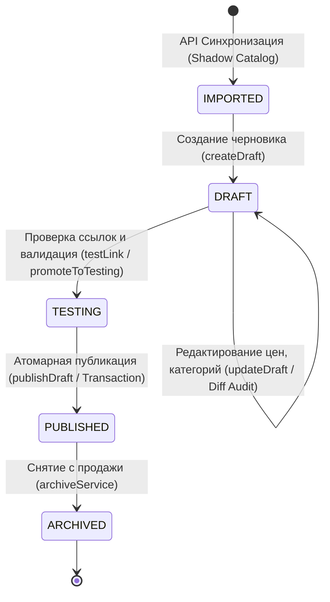

# 🔄 Services Lifecycle Management Specification (Enterprise Edition)

> **Статус:** Реализовано и верифицировано  
> **Ветка:** `feature/services-lifecycle-management`  
> **Стек:** Next.js 16 (App Router), Prisma 5 (PostgreSQL), Redis (ioredis / BullMQ), TypeScript 5.7+

---

## 1. Архитектурный обзор (Workflow)

Жизненный цикл услуги в SMMplan проходит 4 строгих этапа с защитой от человеческого фактора:



### 1.1 `IMPORTED` (Теневой буфер)
- Каталоги поставщиков загружаются в теневую таблицу `ShadowService` и Redis.
- Происходит автоматическая нормализация названий (`SmartAnalyzerLogic`), извлечение ГЕО, гарантии, скорости и фильтрация аномалий цен.
- Витрина магазина остаётся чистой (клиенты не видят невалидные или нерусифицированные позиции).

### 1.2 `DRAFT` (Черновик)
- Модель: `ServiceDraft`.
- Настройка наценок (с автоматическим контролем нулевого деления и отрицательной маржи).
- Все изменения полей (`name`, `procurementRate`, `markup`, `retailPriceRub`, `categoryId`) фиксируются с историей `oldValue` → `newValue` в таблице `ServiceEditHistory`.

### 1.3 `TESTING` (Тестирование и матчинг ссылок)
- Модель: `ServiceLinkCheck`.
- Автоматическая проверка типов целей (`TargetType`: `POST`, `CHANNEL`, `PROFILE`, `STORY`, `POLL`).
- Network Link Checker выполняет безопасный HEAD-запрос с `AbortController` (таймаут 4000мс) и защитой от SSRF (`assertSafeOutboundUrl`).
- Невозможно перевести черновик в статус `TESTING`, если не назначена категория или цена равна 0 ₽.

### 1.4 `PUBLISHED` (Публикация)
- Метод: `servicesLifecycleService.publishDraft(draftId)`.
- Выполняется внутри атомарной транзакции PostgreSQL (`db.$transaction`).
- Создается/обновляется живая сущность `Service`, статус черновика становится `PUBLISHED`.
- Фиксируется запись в неизменяемый журнал `AdminAuditLog` (`await auditAdminAwaitable()`).

---

## 2. Контроль доступа по группам клиентов (B2B Access Control)

Для разделения витрины между розничными клиентами, оптовиками и закрытыми реселлерами внедрены модели:
- `CustomerGroup` — группы клиентов с процентом скидки и тенантом.
- `ServiceCustomerAccess` — промежуточная таблица Many-to-Many с поддержкой индивидуальных кастомных цен (`customPriceRub`).
- `User.customerGroupId` — привязка пользователя к группе.

### Логика видимости:
1. Если для услуги **не заданы** записи в `ServiceCustomerAccess` — услуга доступна публично для всех пользователей.
2. Если для услуги **заданы** группы — доступ разрешен только авторизованным пользователям, состоящим в одной из указанных групп.

---

## 3. База Данных (Prisma Models)

```prisma
model CustomerGroup {
  id              String                  @id @default(cuid())
  name            String
  slug            String
  description     String?
  tenantId        String                  @default("smmplan")
  isDefault       Boolean                 @default(false)
  discountPercent Float                   @default(0.0)
  users           User[]                  @relation("CustomerGroupUsers")
  serviceAccess   ServiceCustomerAccess[]
  createdAt       DateTime                @default(now())
  updatedAt       DateTime                @updatedAt
  @@unique([tenantId, slug])
  @@index([tenantId])
}

model ServiceCustomerAccess {
  id              String        @id @default(cuid())
  serviceId       String
  customerGroupId String
  isCustomPrice   Boolean       @default(false)
  customPriceRub  Float?
  service         Service       @relation(fields: [serviceId], references: [id], onDelete: Cascade)
  customerGroup   CustomerGroup @relation(fields: [customerGroupId], references: [id], onDelete: Cascade)
  createdAt       DateTime      @default(now())
  updatedAt       DateTime      @updatedAt
  @@unique([serviceId, customerGroupId])
}

model ServiceDraft {
  id                  String               @id @default(cuid())
  serviceId           String?              @unique
  providerId          String?
  externalId          String?
  tenantId            String               @default("smmplan")
  name                String
  cleanName           String?
  description         String?
  categoryId          String?
  targetType          String               @default("POST")
  status              String               @default("DRAFT")
  procurementRate     Float                @default(0.0)
  procurementCurrency String               @default("USD")
  markup              Float                @default(3.0)
  retailPriceRub      Float                @default(0.0)
  minQty              Int                  @default(10)
  maxQty              Int                  @default(100000)
  validationStatus    String               @default("PENDING")
  linkCheckStatus     String               @default("UNCHECKED")
  payload             Json?
  adminId             String?
  service             Service?             @relation(fields: [serviceId], references: [id], onDelete: Cascade)
  editHistory         ServiceEditHistory[]
  createdAt           DateTime             @default(now())
  updatedAt           DateTime             @updatedAt
}
```

---

## 4. Защита и безопасность (OWASP Top 10 2025)

1. **A01: Broken Access Control**: Все мутации жизненного цикла защищены `requireStaffPermission('catalog', 'edit')` на бэкенде.
2. **A02: Financial Trust Boundary**: Розничные цены вычисляются сервером, отрицательные наценки пресекаются, все суммы хранятся с фиксацией в копейках.
3. **A09: Security Logging & Monitoring**: Каждое изменение параметров черновика логируется в `ServiceEditHistory` с IP-адресом и email администратора.
4. **A10: Server-Side Request Forgery (SSRF)**: Сетевой валидатор ссылок блокирует запросы к `localhost`, `127.0.0.1`, `10.0.0.0/8`, `192.168.0.0/16`, `169.254.169.254`.
