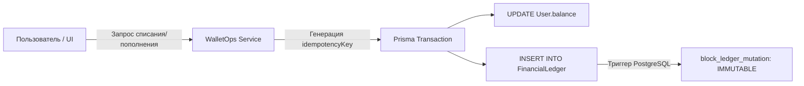

# 🏛️ Архитектурный Манифест SMMplan & SMMflux (Architecture Guide)

Этот документ описывает ключевые архитектурные принципы, шаблоны проектирования и механизмы отказоустойчивости платформы **SMMplan**.

---

## 💎 1. Архитектурный Стек (2026)

* **Фреймворк:** Next.js 16.x (App Router, Turbopack, React Server Components по умолчанию).
* **UI Библиотека:** React 19.x + HeroUI v3 + Lucide Icons + Framer Motion v12.
* **Стилизация:** Tailwind CSS 4.0.0 (`@theme` CSS-first дизайн-токены в `src/app/globals.css`).
* **База данных:** PostgreSQL 16 + Prisma ORM 5.
* **Очереди и кэш:** Redis 7 + BullMQ.
* **Безопасность и валидация:** Zod v3 + Argon2/Scrypt + JWT Sessions.
* **AI Движок:** Google Gemini (`gemini-3-flash`, `gemini-3-flash-preview`) + GraphRAG Memory.

---

## 🏢 2. Multi-Tenant Engine (Изоляция брендов)

Платформа обслуживает два независимых бренда из единой кодовой базы и базы данных:

```mermaid
flowchart TD
    Req[Входящий HTTP-запрос] --> MW[Next.js Middleware: getTenantHost]
    MW -->|smmplan.pro| T1[Тенант: smmplan (B2B SaaS Theme)]
    MW -->|smmflux.ru| T2[Тенант: flux (Prism Cyberpunk Theme)]
    T1 --> DB[(PostgreSQL: изолированные строки email_tenantId)]
    T2 --> DB
```

### Ключевые правила:
1. **Строгая изоляция:** Данные пользователей, заказов и тикетов разделены составным ключом `tenantId`.
2. **Запрет хардкода доменов:** Любые ссылки и Canonical URLs формируются через `getTenantHost(tenantId)` и `absoluteCanonical(tenantId, path)`.
3. **Кэширование:** Ключи в `unstable_cache` обязаны содержать префикс тенанта (например, `catalog-${tenantId}`).

---

## 💰 3. FinTech Trust Boundary (Финансовая безопасность)

В платформе действует банковский стандарт защиты денежных операций:



### Защитные гарантии:
* **Точность в копейках (`BigInt`):** Все финансовые вычисления ведутся строго в целых числах (копейках). Ошибки округления с плавающей точкой `float` математически исключены.
* **Неизменяемый гроссбух (`FinancialLedger`):** Таблица транзакций защищена триггером базы данных на уровне PostgreSQL. Любые попытки `UPDATE` или `DELETE` вызывают аварийный откат транзакции.
* **Атомарность `WalletOps`:** Начисление, списание и возврат (`refund`) выполняются строго в единой транзакции с аудитом `await auditAdminAwaitable()`.

---

## ⚡ 4. Shadow Catalog (Защита от перегрузки БД)

Провайдеры SMM-услуг предоставляют сырые API-каталоги размером от 5 000 до 20 000 позиций.
* ❌ **Антипаттерн:** Импортировать весь сырой мусор в PostgreSQL `Service`.
* ✅ **Паттерн Shadow Catalog:** 
  1. Воркер буферизует сырые каталоги в Redis (`provider:{id}:catalog`).
  2. Администратор через AI-сканер отбирает только качественные и стабильные услуги (**Cherry-Pick**).
  3. В PostgreSQL попадают только активные услуги витрины с гарантированным SLA.

---

## 🧾 5. Фискализация 54-ФЗ и НДС 2026 (Налоговая реформа)

Система полностью адаптирована к изменениям налогового законодательства РФ (ФЗ № 176-ФЗ и ФЗ № 425-ФЗ):
* **УСН до 20 млн ₽:** `vat_code: 1` (Без НДС).
* **Свыше 20 млн ₽:** `vat_code: 10` (НДС 22%).
* Формирование фискальных чеков для ЮKassa и Robokassa с номенклатурой услуг и автоматической отправкой покупателю.

---

## 🤖 6. ACE Triad Protocol (Автономная разработка)

Разработка платформы управляется трехуровневой архитектурой:
1. **Curator:** Поиск архитектурного контекста в GraphRAG памяти (порт 8100).
2. **Generator:** Чистая генерация изолированного кода без костылей.
3. **Reflector:** Верификация через HELP-скрипты, тесты Vitest и проверку типов TypeScript (`npx tsc --noEmit`).
