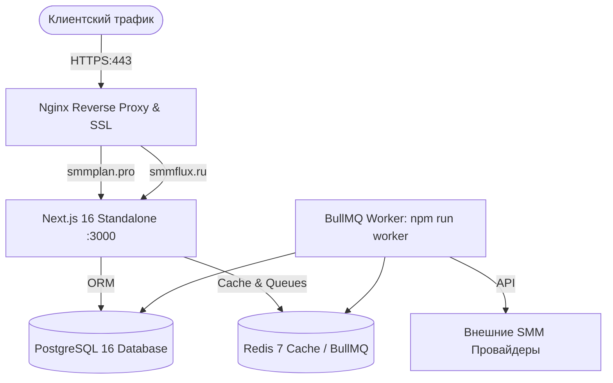

# 🚀 Руководство по развертыванию в продакшен (Production Deployment Guide)

В данном руководстве описан процесс развертывания **SMMplan / SMMflux** на сервере под управлением **Ubuntu 22.04 / 24.04 LTS**.

---

## 🏗️ 1. Архитектура продакшен-окружения



---

## 📦 2. Подготовка сервера Ubuntu

### Шаг 1: Обновление системы и установка базовых утилит
```bash
sudo apt update && sudo apt upgrade -y
sudo apt install -y curl wget git build-essential nginx certbot python3-certbot-nginx
```

### Шаг 2: Установка Node.js 22 LTS
```bash
curl -fsSL https://deb.nodesource.com/setup_22.x | sudo -E bash -
sudo apt install -y nodejs
```

### Шаг 3: Установка PostgreSQL 16 и Redis
```bash
sudo apt install -y postgresql postgresql-contrib redis-server

# Запуск и автозагрузка служб
sudo systemctl enable --now postgresql redis-server
```

### Шаг 4: Создание базы данных PostgreSQL
```bash
sudo -u postgres psql -c "CREATE USER smmplan_user WITH PASSWORD '<STRONG_DB_PASSWORD>';"
sudo -u postgres psql -c "CREATE DATABASE smmplan_prod OWNER smmplan_user;"
sudo -u postgres psql -c "GRANT ALL PRIVILEGES ON DATABASE smmplan_prod TO smmplan_user;"
```

---

## 📥 3. Установка и сборка приложения

### Шаг 1: Клонирование репозитория в `/var/www/smmplan`
```bash
sudo mkdir -p /var/www/smmplan
sudo chown -R $USER:$USER /var/www/smmplan
git clone https://github.com/kiliankaena85-byte/SMMplan.git /var/www/smmplan
cd /var/www/smmplan
```

### Шаг 2: Установка зависимостей
```bash
npm ci --prefer-offline
```

### Шаг 3: Настройка боевого `.env`
Создайте файл `/var/www/smmplan/.env`:
```env
NODE_ENV="production"
PORT=3000
DATABASE_URL="postgresql://smmplan_user:<STRONG_DB_PASSWORD>@localhost:5432/smmplan_prod?schema=public"
REDIS_URL="redis://localhost:6379"

JWT_SECRET="GENERATE_WITH_openssl_rand_hex_32"
NEXTAUTH_SECRET="GENERATE_WITH_openssl_rand_hex_32"
APP_ENCRYPTION_KEY="GENERATE_64_HEX_CHARS_KEY"
CRON_SECRET="GENERATE_SECURE_TOKEN"

NEXT_PUBLIC_APP_URL="https://smmplan.pro"
NEXT_PUBLIC_SMMPLAN_HOST="smmplan.pro"
NEXT_PUBLIC_SMMFLUX_HOST="smmflux.ru"

# Платёжные шлюзы и 54-ФЗ
YOOKASSA_SHOP_ID="your_shop_id"
YOOKASSA_SECRET_KEY="your_secret_key"
FISCAL_DEFAULT_VAT_CODE="1" # 1 = Без НДС (УСН), 10 = НДС 22%
```

### Шаг 4: Накат миграций и оптимизированная сборка
```bash
npx prisma migrate deploy
npm run build
```

---

## ⚙️ 4. Настройка автозапуска через Systemd

Создадим 2 службы: веб-сервер Next.js и фоновый воркер BullMQ.

### 1. Веб-сервер Next.js (`/etc/systemd/system/smmplan-web.service`):
```ini
[Unit]
Description=SMMplan Next.js Web Application
After=network.target postgresql.service redis-server.service

[Service]
Type=simple
User=root
WorkingDirectory=/var/www/smmplan
ExecStart=/usr/bin/npm run start
Restart=always
RestartSec=5
Environment=NODE_ENV=production

[Install]
WantedBy=multi-user.target
```

### 2. Фоновый воркер (`/etc/systemd/system/smmplan-worker.service`):
```ini
[Unit]
Description=SMMplan BullMQ Background Worker
After=network.target postgresql.service redis-server.service

[Service]
Type=simple
User=root
WorkingDirectory=/var/www/smmplan
ExecStart=/usr/bin/npm run worker
Restart=always
RestartSec=5
Environment=NODE_ENV=production

[Install]
WantedBy=multi-user.target
```

### Активация и запуск служб:
```bash
sudo systemctl daemon-reload
sudo systemctl enable --now smmplan-web smmplan-worker
sudo systemctl status smmplan-web smmplan-worker
```

---

## 🔒 5. Конфигурация Nginx и Let's Encrypt SSL

Создайте конфиг `/etc/nginx/sites-available/smmplan`:

```nginx
server {
    listen 80;
    server_name smmplan.pro www.smmplan.pro smmflux.ru www.smmflux.ru;

    location / {
        proxy_pass http://127.0.0.1:3000;
        proxy_http_version 1.1;
        proxy_set_header Upgrade $http_upgrade;
        proxy_set_header Connection 'upgrade';
        proxy_set_header Host $host;
        proxy_set_header X-Real-IP $remote_addr;
        proxy_set_header X-Forwarded-For $proxy_add_x_forwarded_for;
        proxy_set_header X-Forwarded-Proto $scheme;
        proxy_cache_bypass $http_upgrade;
    }
}
```

Активируйте сайт и выпустите SSL-сертификаты:
```bash
sudo ln -s /etc/nginx/sites-available/smmplan /etc/nginx/sites-enabled/
sudo nginx -t && sudo systemctl reload nginx

# Выпуск бесплатных SSL-сертификатов Let's Encrypt:
sudo certbot --nginx -d smmplan.pro -d smmflux.ru
```

---

## 🔄 6. Zero-Downtime обновление (Deploy Script)

Для последующих обновлений проекта используйте скрипт:
```bash
#!/bin/bash
set -e
echo "🚀 Начало обновления SMMplan..."
cd /var/www/smmplan
git pull origin main
npm ci --prefer-offline
npx prisma migrate deploy
npm run build
sudo systemctl restart smmplan-web
sudo systemctl restart smmplan-worker
echo "✅ Обновление успешно завершено!"
```
