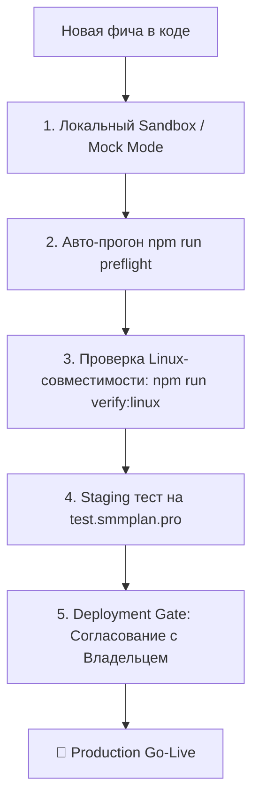

# 🚨 АВАРИЙНЫЕ ПРОТОКОЛЫ, РЕГЛАМЕНТ ПРЕДРЕЛИЗА И БЕЗОПАСНОСТЬ СЕРВЕРА
## Платформа OmniSMM 1.0 (SMMplan.pro / SMMflux.ru)

> **Назначение:** Документ описывает строгие протоколы внедрения новых фичей (Left-Shift Release Gate), аварийной остановки платформы (Killswitch), быстрого отката (Rollback) и правила кросс-платформенной совместимости с продакшн-сервером Linux/Docker.

---

## 🛑 1. КНОПКА ЭКСТРЕННОЙ ОСТАНОВКИ (EMERGENCY KILLSWITCH)

При возникновении P0-инцидента (аномальный слив кассы, сбой провайдера, DDoS-атака или сбой эквайринга) администратор может заблокировать внешние списания за 1 секунду:

### Консольные команды быстрого реагирования:
```bash
# 1. Проверить текущий статус платформы
npm run killswitch:status

# 2. ВКЛЮЧИТЬ ПОЛНЫЙ СТОП-КРАН (Аварийный режим)
npm run killswitch:on

# 3. ВЫКЛЮЧИТЬ СТОП-КРАН (Вернуть боевой режим)
npm run killswitch:off
```

### Что происходит при активации `npm run killswitch:on`:
1. **Витрины сайтов:** переходят в режим мягкого обслуживания (Maintenance Mode).
2. **Telegram-бот:** переводится в режим ожидания с информационным сообщением для пользователей.
3. **Защита кассы:** ни один новый заказ **не отправляется внешнему поставщику (VexBoost)** — все заказы изолируются в статус `PENDING_CHECK` (ручной контроль) без финансовых списаний с кошелька платформы.
4. **Безопасность клиентов:** средства клиентов на балансе замораживаются в 100% сохранности.

---

## 🔄 2. ПРОТОКОЛ ОТКАТА РЕЛИЗА (ROLLBACK & DISASTER RECOVERY)

Если после выката новой фичи на продакшн-сервер обнаружена критическая регрессия:

### Пошаговый сценарий отката (до 60 секунд):
1. **Шаг 1: Активировать Killswitch:**
   ```bash
   npm run killswitch:on
   ```
2. **Шаг 2: Откатить код на предыдущий стабильный Git-коммит:**
   ```bash
   git log -n 3 --oneline             # смотрим хэш стабильного коммита
   git checkout <СТАБИЛЬНЫЙ_ХЭШ>
   ```
3. **Шаг 3: Пересобрать бандл на хосте:**
   ```bash
   npm run build
   ```
4. **Шаг 4: Перезапустить контейнеры Docker:**
   ```bash
   docker-compose up -d --build web
   ```
5. **Шаг 5: Прогнать тесты и снять Killswitch:**
   ```bash
   npm run preflight
   npm run killswitch:off
   ```

---

## 🚀 3. РЕГЛАМЕНТ ПРЕДРЕЛИЗА НОВЫХ ФИЧЕЙ (STAGE-GATE PIPELINE)

Каждая новая функция, тариф или обновление UI перед выкатом на боевой сервер **ОБЯЗАНЫ** пройти 5 этапов проверки:



### Этап 1. Локальное изолированное тестирование (Sandbox)
* Новая фича тестируется в режиме `SANDBOX` (0 ₽ оплата + Mock Provider), исключая случайные списания реальных денег.

### Этап 2. Автоматизированная батарея проверок (`npm run preflight`)
* Обязательный запуск мастер-раннера:
  * TypeScript (0 ошибок типизации);
  * Tailwind 4 дизайн-токены (0 нарушений);
  * Юридический комплаенс (5 документов);
  * Точная финансовая математика копеек (`ExactMath`);
  * Инвариант Drip-Feed и защита от дрифта цен;
  * Комплексный пентест.

### Этап 3. Проверка кросс-платформенной совместимости с Linux (`npm run verify:linux`)
* **Критический инвариант:** В Windows пути `Folder/file.tsx` и `folder/file.tsx` не вызывают ошибок, но на продакшн-сервере Linux это вызывает мгновенный краш сборки `ModuleNotFound`.
* Скрипт `scripts/verify-linux-build.ts` автоматически проверяет регистрозависимость всех 1250+ файлов проекта и отсутствие обратных слэшей `\`.

### Этап 4. Тестовый стенд (Staging)
* Запуск Cloudflare туннеля через `scripts/start-tunnel.ps1` на домене `test.smmplan.pro`.
* Проверка в браузере (мобильная версия + десктоп).

### Этап 5. Лист согласования (Deployment Gate)
Перед деплоем формируется отчет из 5 обязательных пунктов:
1. **Что конкретно изменено:** список файлов и компонентов.
2. **Зачем нужно обновление:** точная бизнес-причина.
3. **Что изменится для пользователей:** влияние на интерфейс и балансы.
4. **Аудит безопасности:** подтверждение отсутствия утечек секретов в Git.
5. **Контроль Git:** чистый `git status`, атомарный коммит и пуш в `origin/main`.

---

## 🐧 4. АРХИТЕКТУРНЫЕ ИНВАРИАНТЫ ДЛЯ LINUX/DOCKER ПРОДАКШЕНА

1. **Сетевой биндинг `0.0.0.0`:**  
   Next.js сервер запускается строго с `HOSTNAME="0.0.0.0"`, чтобы Nginx и Cloudflare Tunnel могли проксировать запросы внутрь Docker-сети без ошибки `502 Bad Gateway`.
2. **Сборка через Webpack Standalone:**  
   В `package.json` зафиксировано: `next build --webpack`. Перед перезапуском Docker всегда запускается локальный билд на хосте.
3. **Защита базы данных от случайного стирания:**  
   Тестовый раннер Vitest содержит жесткую блокировку `Accidental DB wipe protection`, которая блокирует тесты, если `DATABASE_URL` не указывает на тестовую базу данных `smmplan_test`.

---

## 📊 Сводная таблица команд быстрого обслуживания

| Задача | Команда в терминале | Результат |
| :--- | :--- | :--- |
| **Полный предрелизный тест** | `npm run preflight` | Сквозная проверка 6 уровней надежности |
| **Проверка совместимости с Linux** | `npm run verify:linux` | Сканирование 1250+ файлов на case-sensitivity |
| **Статус аварийного режима** | `npm run killswitch:status` | Вывод текущего состояния защиты |
| **Экстренная остановка платформы** | `npm run killswitch:on` | Заморозка списаний, пауза заказов и бота |
| **Восстановление боевого режима** | `npm run killswitch:off` | Открытие витрин и запуск очередей |
| **Прогон финансовых тестов** | `npm test` | Тестирование точной математики копеек |
