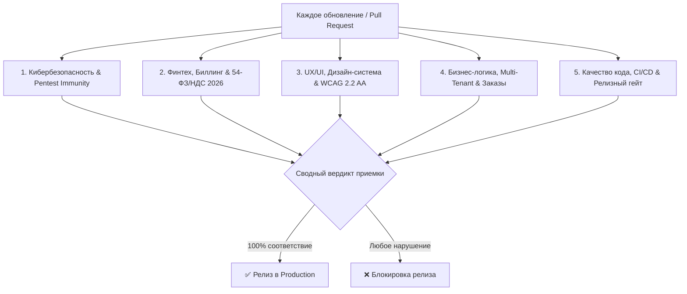

# 📋 RELEASE ACCEPTANCE CRITERIA (RAC-2026) — OmniSMM 1.0
## Единый регламент приёмки релизов и контроля качества платформы

> **Статус документа:** Обязательный стандарт для всех разработчиков, AI-ассистентов и релиз-инженеров.  
> **Нормативная база:** Действующие стандарты 2025–2026 гг. (OWASP Top 10:2025, OWASP ASVS v4.0.3, PCI DSS v4.0.1, 54-ФЗ/425-ФЗ, W3C WCAG 2.2 AA, ISO 9241-110:2020, RFC 9116/9331).

---

## 🏛️ Структура 5 столпов контроля качества (5-Pillar Quality Gate)



---

## 1. 🛡️ Безопасность и иммунитет к пентестам (Security & Pentest Immunity)

| Критерий | Нормативный документ | Конкретный пункт стандарта | Механизм проверки в коде |
|---|---|---|---|
| **Защита от IDOR и контроль доступа** | **OWASP Top 10:2025** / **ASVS v4.0.3** | **A01:2025**, ASVS V1.4.1, V4.1 | Проверка владения объектом `where: { id, userId: session.userId }` с отсечением гостей (`Guest-Proof IDOR Shield`). Все админ-экшены защищены `requireAdmin()` / `requireStaffPermission()`. |
| **Криптостойкость и защита секретов** | **OWASP Top 10:2025** / **PCI DSS v4.0.1** | **A02:2025**, PCI DSS Req 3.4 | Сравнение токенов и подписей строго через `crypto.timingSafeEqual`. Запрет передачи секретов в клиентский бандл (`NEXT_PUBLIC_*`). Секреты в БД зашифрованы AES-256-GCM. |
| **Защита от инъекций (SQL/Cypher/HTML)** | **OWASP Top 10:2025** | **A03:2025**, ASVS V5.3.1 | Использование типизированного Prisma ORM. Валидация меток в Cypher-запросах через белый список `VALID_LABELS = {'class', 'module', 'function', 'file'}`. Санитизация HTML. |
| **Защита от занижения платежей (Underpayment)** | **OWASP Top 10:2025** / **PCI DSS v4.0.1** | **A04:2025 (Insecure Design)**, PCI DSS Req 6.4 | `PaymentService.confirmPayment` сверяет сумму с базой: отклонение при `creditAmount < order.charge` (`UNDERPAID_ORDER`, `PAYMENT_AMOUNT_MISMATCH`). |
| **Симметричная очистка сессий** | **OWASP Top 10:2025** | **A07:2025**, ASVS V3.2.1 | Очистка сессионной куки с полными атрибутами: `Secure; HttpOnly; SameSite=Lax; MaxAge=0; Expires=0; Path=/`. |
| **Fail-Closed вебхуки** | **OWASP Top 10:2025** | **A08:2025 (Data Integrity)** | Если секрет вебхука не настроен — немедленный HTTP 500; если подпись не совпадает — HTTP 401/403 с алертом в `SecurityAlertService`. Запрет fail-open `if (secret && sig)`. |
| **Двухфазная защита от SSRF и DNS Rebinding** | **OWASP Top 10:2025** / **ASVS v4.0.3** | **A10:2025**, ASVS V12.6.1 | `SSRFGuard.assertSafeOutboundUrl` проводит двухфазную резолюцию DNS с блокировкой приватных подсетей (10.x, 192.168.x, 127.0.0.1) и Cloud Metadata (169.254.169.254). |
| **Стандарты раскрытия уязвимостей и RateLimit** | **RFC 9116** / **RFC 9331** | RFC 9116 (`security.txt`), RFC 9331 | Наличие `/.well-known/security.txt` со сроком действия и PGP-ключом. Заголовки RateLimit на публичных API. |
| **Защита персональных данных** | **152-ФЗ РФ** (в ред. 2026) / **GDPR** | 152-ФЗ ст. 18.1, 19; GDPR Art. 32 | Хранение персональных данных в РФ. Маскирование данных в логах аудита (`••••••`). |

---

## 2. 💳 Финтех, Биллинг, Точность и Фискализация (Fintech & 54-FZ/VAT 2026)

| Критерий | Нормативный документ | Конкретный пункт стандарта | Механизм проверки в коде |
|---|---|---|---|
| **Банковское округление и чистый BigInt** | **IEEE 754** / **ISO 4217** | ISO 4217 (RUB), IEEE 754 Anti-Float | Все денежные расчеты в копейках (`BigInt`). Использование `ExactMath.calculateOrderCostKopecks()` с банковским округлением (Half-Even) и защитным порогом $\ge 1$ коп. |
| **Принцип Ledger-First** | **Double-Entry Ledger Principles** / **PCI DSS 4.0.1 Req 10.2** | PCI DSS Req 10.2, ISO 20022 | Запись в `tx.ledgerEntry.create()` ОБЯЗАНА создаваться ДО изменения `tx.user.update({ balance })`. Запрет удаления записей леджера на уровне Prisma middleware. |
| **Исключение Transaction Escape** | **ACID Database Transactions** | PostgreSQL Serializable / Read Committed | Все вызовы внутри транзакции используют строго инстанс `tx: PrismaTx`, включая блоки `catch` при обработке P2002 (Duplicate Key). |
| **Идемпотентность транзакций** | **RFC 7231** / **Stripe/YooKassa Architecture** | RFC 7231 (Idempotency) | Каждая финансовая транзакция содержит обязательный уникальный `idempotencyKey` с защитой от повторного списания. |
| **Фискализация 54-ФЗ и НДС 2026** | **ФЗ № 54-ФЗ**, **ФЗ № 176-ФЗ**, **ФЗ № 425-ФЗ** | НК РФ ст. 164 п. 3, ст. 145 п. 1 | Базовая ставка НДС 22%. Порог УСН 20 млн ₽. В чеки ЮKassa передаются: `vat_code: 1` (Без НДС) или `vat_code: 10` (НДС 22%), `payment_subject: service`, `payment_mode: full_prepayment`. |
| **B2B-биллинг и счета для юрлиц** | **ГК РФ (ст. 434, 438)**, **ФЗ № 402-ФЗ «О бухучете»** | ФЗ № 402-ФЗ ст. 9 | Выставление счетов юрлицам только при валидном `LEGAL_INN` компании ($\ge 10$ цифр). Генерация УПД для Диадок/СБИС. |

---

## 3. 🎨 Дизайн-система, Эргономика и Доступность (UX/UI & WCAG 2.2 AA)

| Критерий | Нормативный документ | Конкретный пункт стандарта | Механизм проверки в коде |
|---|---|---|---|
| **Минимальный размер интерактивных зон** | **W3C WCAG 2.2 Level AA** | **Success Criterion 2.5.8** (Target Size Minimum), **SC 2.5.5** | Все кнопки и интерактивные элементы $\ge 44 \times 44\text{px}$ на мобильных устройствах (`min-h-[44px]`, `min-w-[44px]`). |
| **Цветовой контраст элементов интерфейса** | **W3C WCAG 2.2 Level AA** | **Success Criterion 1.4.3** (Contrast Minimum) | Контраст текста к фону $\ge 4.5:1$ для основного текста, $\ge 3:1$ для крупного текста, иконок и границ инпутов во всех темах (Light, Dark, Sky-Dark). |
| **Навигация Best Match Rule** | **ISO 9241-110:2020** | **Clause 5.4 (Conformity with user expectations)** | В меню (десктоп, мобильное, закрепленные) подсвечивается строго одна наиболее точная вкладка (`isNavTabActive`), исключая одновременную подсветку родителя и ребенка. |
| **Единая витрина способов оплаты** | **NN/g Usability Heuristic #5** (Error Prevention) | NN/g #5, ISO 9241-110 Clause 5.3 | Ненастроенные шлюзы (Робокасса, CryptoBot) скрыты во всех 5 интерфейсах. ЮKassa отображается единым блоком «Банковские карты РФ и СБП (ЮKassa)». |
| **Zero Horizontal Scroll & Viewport 100% Fit** | **Enterprise Ergonomics Standard** | ISO 9241-110 Clause 5.2 | Таблицы админки на 100% умещаются по ширине экрана (`w-full`), лимит 7–9 емких колонок, вторичные данные вынесены в Tooltips/Modals, отступы ячеек `px-2 py-1.5`. |
| **UX форм и перехват ошибок** | **NN/g Usability Heuristic #9** | NN/g #9, ISO 9241-110 Clause 5.5 | Кнопки отправки ВСЕГДА активны. При ошибке валидации — `animate-shake`, плавный скролл к первому ошибочному полю, серверная ошибка выводится над кнопкой Submit. |
| **Modal Hoisting и Context Clamping** | **React 19 & Radix/HeroUI Spec** | W3C WAI-ARIA Dialog Pattern | Запрет рендеринга `<Modal>` / `<Dialog>` внутри `DropdownMenuContent`, `Popover` или `Tooltip`. Состояние объявляется на уровне экрана. |

---

## 4. 📦 Бизнес-логика, Multi-Tenant и Заказы (Domain & Lifecycle Invariants)

| Критерий | Нормативный документ | Конкретный пункт стандарта | Механизм проверки в коде |
|---|---|---|---|
| **Multi-Tenant изоляция (OmniSMM 1.0 Engine)** | **Multi-Tenant SaaS Architecture** | Multi-Tenancy Isolation Rule | Поддержка брендов **SMMplan** (`smmplan.pro`) и **SMMflux** (`smmflux.ru`). Запрет фантомных брендов. Кэш-ключи `unstable_cache` включают `tenantId`. Абсолютные canonical URLs. |
| **Drip-Feed Floor Invariant** | **SMM Order Wizard Contract** | Business Continuity Invariant | При $N$ запусках Drip-Feed или $D$ днях объем на запуск $\lfloor Q/N \rfloor \ge \text{minQty}$. Автоматическое масштабирование нижнего порога $Q \ge \text{minQty} \times N$. Проверка на бэкенде в `checkoutAction`. |
| **Shadow Catalog & Cherry-Pick** | **SMM Catalog Buffer Protocol** | Data Cleanliness Invariant | Каталоги провайдеров (5000+ услуг) буферизуются в Redis (`provider:{id}:catalog`). В PostgreSQL импортируются только одобренные услуги с пересчетом маржи по курсу ЦБ РФ. |
| **Отображение розничных цен** | **E-Commerce Transparency Rule** | Price Transparency | Пользователь ВСЕГДА видит розничную цену за 1 штуку (`pricePerUnitRub ₽ / шт`). Запрещено писать `/ 1000 шт` или умножать цену на 1000 на клиенте. |
| **Защита от двойных списаний при ретраях** | **State Machine Integrity** | Finite State Machine Invariant | Провайдерские вебхуки модифицируют строго оплаченные заказы (`IN_PROGRESS`, `PENDING_CHECK`), игнорируя неоплаченные (`AWAITING_PAYMENT`). |

---

## 5. ⚙️ Качество кода, Сборка и Релизный гейт (Engineering & CI/CD)

| Критерий | Нормативный документ | Конкретный пункт стандарта | Механизм проверки в коде |
|---|---|---|---|
| **Server/Client Boundary в Server Actions** | **Next.js 16 App Router Spec** | Server Actions Error Contract | Server Actions строго в `src/actions/` с обязательным guard. Все Server Actions возвращают `{ success: boolean, error?: string }` без необработанных `throw new Error`. |
| **Strict Type Safety (TypeScript 5.7+)** | **TypeScript Strict Mode** | Zero `any` Policy | Запрет `any` (`@typescript-eslint/no-explicit-any`). Успешное прохождение `npx tsc --noEmit` с 0 ошибок. |
| **100% Unit & Integration Test Pass** | **Vitest 4 Test Suite** | Test-Driven Quality Gate | 100% успешный прогон тестов: `npx vitest run -c vitest.unit.config.ts` (158/158 тестов PASS). |
| **Контроль утечек секретов в бандлах** | **CI Security Gate** | Secret Leak Prevention | Сканирование клиентского бандла скриптом `scripts/check-bundle-secrets.mjs` и `check-api-docs-domains.ts`. |
| **Mandatory Container Rebuild Gate** | **Docker Production Gate** | Deployment Governance Rule | Сборка `npm run build` на хосте перед пересборкой Docker. Запрет перезапуска без подтверждения пользователя. |

---

## 🚦 Чек-лист проверки перед каждым релизом (Release Gate Verification)

```bash
# 1. Проверка типов TypeScript (0 ошибок)
npx tsc --noEmit

# 2. Прогон полного сьюта unit/интеграционных тестов (100% PASS)
npx vitest run -c vitest.unit.config.ts

# 3. Живой смок-тест контейнера (15/15 PASS)
npx tsx scripts/smoke-live-container.ts

# 4. Проверка токенов дизайн-системы (0 нарушений)
npx tsx scripts/check-design-system.ts

# 5. Продакшен-сборка и CI-гейты секретов
npm run build

# 6. Контроль версий
git status && git commit -m "..." && git push origin main
```
