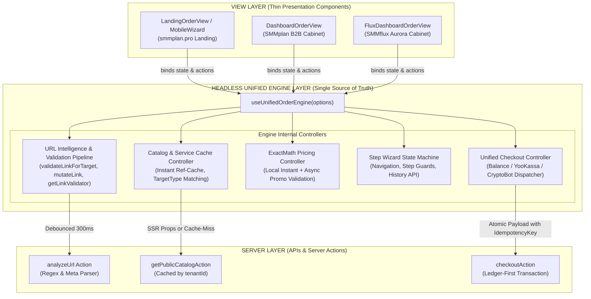

# ADR-2026-09: Headless Unified Order Engine & Link Validation Architecture
## Архитектурный документ и спецификация требований (ADR / SAD / BRD)
**Платформа:** OmniSMM 1.0 (SMMplan / SMMflux)  
**Статус:** PROPOSED / READY FOR IMPLEMENTATION  
**Автор:** Senior Business Analyst & Solution Architect  
**Целевая аудитория:** Lead Frontend Engineer, Backend Architect, QA Automation, Product Owner  
**Дата:** Сентябрь 2026  

---

## 1. Executive Summary & Обоснование рефакторинга

В ходе аудита кодовой базы платформы OmniSMM 1.0 (бренды SMMplan и SMMflux) выявлен критический архитектурный долг: **наличие двух изолированных, конкурирующих архитектур валидации ссылок, загрузки каталога и проведения заказов**:
1. **Контур Главной страницы:** `SmartLinkLanding.tsx` + `useOrderEngine.ts` + `useCheckoutOrchestrator.ts` + `MobileWizard` (`MobileStep1-4`).
2. **Контур Личного кабинета:** `SmmplanOrderWizard.tsx` + `DashboardHeroLinkInput.tsx` + `FluxDashboardOrderWizard.tsx`.

### Бизнес-проблема (Business Impact)
- **Рассинхронизация поведения (Behavioral Drift):** Пользователь, успешно оформляющий заказ на главной странице, сталкивается с ошибками или иным поведением формы в личном кабинете при повторном заказе (Reorder) или вводе аналогичной ссылки.
- **Удвоение стоимости поддержки:** Каждое изменение бизнес-логики (например, добавление новой соцсети Likee/Twitch, изменение логики Drip-Feed Floor Invariant, ввод контекстных подсказок `targetType`) требует параллельного внесения правок в 4 разных файла с риском пропустить один из них.
- **Уязвимости финансовой логики и фискализации:** На главной странице действует строгий расчет через `ExactMath` и валидаторы `link-mutators.ts`, в то время как в личном кабинете обнаружен пропуск проверки минимального объема Drip-Feed на один запуск ($\lfloor Q/N \rfloor < \text{minQty}$) и спам запросами `calculatePriceAction` на каждый ввод символа.

Данный документ фиксирует переход к единой **Headless State Machine архитектуре (`useUnifiedOrderEngine`)**, гарантирующей, что логика валидации, анализа ссылок, расчета цен и отправки заказа существует **в единственном экземпляре (Single Source of Truth)**, а компоненты UI Главной страницы и Дашборда являются исключительно тонкими презентационными слоями (View Layer).

---

## 2. Структурный аудит дублирования архитектур (As-Is Analysis)

### 2.1. Сравнительная архитектурная матрица As-Is

| Параметр / Подсистема | Контур Главной страницы (`useOrderEngine.ts` + `SmartLinkLanding`) | Контур Личного кабинета (`SmmplanOrderWizard.tsx` / `FluxDashboardOrderWizard`) | Статус расхождения |
| :--- | :--- | :--- | :--- |
| **Архитектурный паттерн** | Headless Hook (`useOrderEngine`) + Orchestrator (`useCheckoutOrchestrator`) | Монолитный React-компонент (1496 строк в `SmmplanOrderWizard.tsx`, 1110 строк в `Flux`) | **Критический рассинхрон** |
| **Анализ ссылки (`analyzeUrl`)** | Debounce 350ms, защита от утечки состояния (`stale` flag), отслеживание `isImmediateRef`, отмена таймеров | Debounce 300ms, локальный счетчик `analyzeRequestIdRef`, свой собственный независимый вызов `analyzeUrl` | Дублирование с риском состояния гонки |
| **Нормализация URL** | Вызывает `mutateLink()` из `link-mutators.ts` (комплексная зачистка query-параметров, reels, stories, id VK) | Локальная функция `normalizeUrl()` (строки 552-565) + `stripQueryParams()` в `DashboardHeroLinkInput.tsx` | Разные результаты нормализации! |
| **Валидация формата ссылки** | `getLinkValidator()` (Zod-схемы по типам объектов соцсетей) + Soft Refusal (`isLinkServiceCompatible`) | Примитивные ad-hoc проверки: `trimmedLink.length < 3`, `trimmedLink.includes(' ')`, регулярка `/[0-9]+/` | Разные правила валидации! |
| **Загрузка каталога** | SSR Pre-fetch (`initialCatalog` передается с сервера) $\to$ моментальный рендер без спиннеров | Клиентский fetch `getPublicCatalogAction(tenantId)` в `useEffect` $\to$ водопад (waterfall), layout shift | Деградация LCP/CLS в ЛК |
| **Кэширование услуг** | Локальный Ref-кэш `categoryServicesCache.current[categoryId]` $\to$ 0ms переключение категорий | Нет кэша: каждый клик по категории вызывает сетевой запрос `getServicesByCategoryAction` | Избыточная нагрузка на сервер |
| **Расчет стоимости (Pricing)** | Синхронный `useMemo` через `pricePerUnitRub` (ExactMath) для базовых тарифов; `calculatePriceAction` ТОЛЬКО для промо | Асинхронный `calculatePriceAction` на **каждое** изменение `quantity` через `useEffect` | Спам сервера запросами при вводе цифр |
| **Drip-Feed Floor Invariant** | Строго валидируется: $\lfloor Q/N \rfloor \ge \text{minQty}$ с блокировкой сабмита | **Отсутствует на клиенте!** Проверяется только `quantity < minQty`, что нарушает правило RAC-2026 | **Уязвимость бизнес-логики** |
| **Платежные шлюзы** | Drawer/Modal через `useCheckoutOrchestrator` (ЮKassa, CryptoBot, Баланс) | Радиокнопки прямо в макете (`balance`, `yookassa`, `cryptobot`) | Раздельная логика выбора шлюза |
| **Синхронизация с URL** | Поддержка browser history (`#step-X`) через `useMobileWizard` | Query-параметры `?step=X&serviceId=Y&categoryId=Z` через `router.replace` | Разный UX навигации "Назад" |

---

### 2.2. Схема As-Is: Дублирование и рассинхронизация контуров

```mermaid
flowchart TD
    subgraph Landing_Flow ["КОНТУР ГЛАВНОЙ СТРАНИЦЫ (Landing)"]
        L_UI["SmartLinkLanding / HeroInput / MobileWizard"]
        L_Hook["useOrderEngine (Headless Hook)"]
        L_Mut["link-mutators.ts (mutateLink, getLinkValidator)"]
        L_Comp["link-service-compatibility.ts"]
        L_Cache["categoryServicesCache (In-memory Ref)"]
        L_Memo["useMemo (ExactMath Pricing)"]
        L_Orch["useCheckoutOrchestrator"]
        
        L_UI --> L_Hook
        L_Hook --> L_Mut
        L_Hook --> L_Comp
        L_Hook --> L_Cache
        L_Hook --> L_Memo
        L_Hook --> L_Orch
    end

    subgraph Dashboard_Flow ["КОНТУР ЛИЧНОГО КАБИНЕТА (Dashboard B2B / Flux)"]
        D_UI["SmmplanOrderWizard / FluxDashboardOrderWizard"]
        D_Hero["DashboardHeroLinkInput.tsx"]
        D_Norm["Локальный normalizeUrl() + ad-hoc Regex"]
        D_Fetch["Client Waterfall (getPublicCatalogAction)"]
        D_Debounce["Собственный debounce analyzeUrl()"]
        D_EffectPrice["useEffect (calculatePriceAction на каждый символ)"]
        
        D_UI --> D_Hero
        D_UI --> D_Norm
        D_UI --> D_Fetch
        D_UI --> D_Debounce
        D_UI --> D_EffectPrice
    end

    subgraph Backend_Action ["SERVER ACTION LAYER"]
        Act_Analyze["analyzeUrl Action"]
        Act_Catalog["catalog Actions"]
        Act_Checkout["checkoutAction (Strict Validation)"]
    end

    L_Hook -->|Debounced 350ms| Act_Analyze
    L_Hook -->|On Category Change| Act_Catalog
    L_Orch -->|Validated Payload| Act_Checkout

    D_Debounce -->|Debounced 300ms| Act_Analyze
    D_Fetch -->|Client Mount| Act_Catalog
    D_UI -->|Unvalidated Link Payload| Act_Checkout

    classDef danger fill:#fee2e2,stroke:#ef4444,stroke-width:2px;
    classDef success fill:#dcfce7,stroke:#22c55e,stroke-width:2px;
    class D_Norm,D_Fetch,D_EffectPrice danger;
    class L_Hook,L_Mut,L_Comp success;
```



---

### 2.3. Глубокий анализ проблемы «Рассинхронизации поведения» (Drift & Divergence)

#### 1. Дефект валидации ссылок и TargetType
- **На Главной:** Пользователь вставляет ссылку на публикацию `t.me/channel/123`. `useOrderEngine` определяет `detectedType = 'post'`, фильтрует категории до реакций/просмотров и проверяет Zod-схемой `getLinkValidator('telegram', 'POST')`.
- **В Личном кабинете:** В `SmmplanOrderWizard.tsx` ссылка обрабатывается `normalizeUrl()`, которая просто дописывает `https://`. При переходе на чекаут локальная проверка `handleBlurLink` проверяет лишь `!/[0-9]+/.test(normalized)` для каналов. Нет полной проверки Zod, нет защиты от ReDoS, нет автоматического срезания трекинговых параметров (`?utm=...`, `?igshid=...`).
- **Следствие:** Пользователь отправляет грязную ссылку из ЛК. Заказ падает на бэкенде в `checkoutAction` или зависает в очереди провайдера со статусом `FAIL_CHECK`.

#### 2. Drip-Feed Floor Invariant Violation
- По правилу AGENTS.md (п. 4 и п. 8.3 RAC-2026), минимальный объем Drip-Feed заказа обязан быть $\ge \text{service.minQty} \times N$ запусков ($\lfloor Q/N \rfloor \ge \text{minQty}$).
- В `useOrderEngine.ts` это защищено на уровне валидации `validate()`:
  ```typescript
  const chunk = Math.floor(quantity / runs);
  if (chunk < selectedService.minQty) {
    errors['dripfeed'] = `Для ${runs} запусков общее количество должно быть минимум ${selectedService.minQty * runs} шт.`;
  }
  ```
- В `SmmplanOrderWizard.tsx` эта проверка в `handleSubmitOrder` **полностью отсутствует**. Пользователь может заказать 100 подписчиков на 10 запусков (по 10 шт.), что гарантированно приведет к ошибке провайдера (минималка у которого 50 шт.).

#### 3. Нагрузка на сеть и гонка состояний (Race Condition)
- На Главной расчет цены базовой услуги выполняется мгновенно и локально (`selectedService.pricePerUnitRub * quantity`). Запрос к серверу `calculatePriceAction` уходит **только** если введен промокод.
- В Личном кабинете `useEffect` дергает `calculatePriceAction` при каждом вводе цифры в поле количества. При быстром вводе `1000` уходит 4 параллельных серверных запроса (`1`, `10`, `100`, `1000`). Из-за сетевых задержек ответ на `100` может прийти позже ответа на `1000`, и в форме отобразится неверная цена!

---

## 3. Целевая архитектура (To-Be: Headless Unified Order Engine)

### 3.1. Принцип архитектурного разделения (Separation of Concerns)

В основу целевой архитектуры заложен принцип **Headless State Machine**:
- **Logic Layer (Единый мозг):** Единственный хук `useUnifiedOrderEngine` (или обогащенный `useOrderEngine`). Отвечает за:
  * Анализ ссылки и авто-определение платформы/типа объекта.
  * Единый пайплайн мутации и валидации ссылки (`validateLinkForTarget`).
  * Каталог, фильтрацию по совместимости, кэширование услуг.
  * Синхронный ExactMath расчет цен и валидацию промокодов.
  * Контроль инвариантов Drip-Feed и Smart Drip.
  * Управление шагами визарда (Core State Machine).
  * Унифицированный чекаут (`submitOrder`) с поддержкой всех шлюзов (Баланс, ЮKassa, CryptoBot).
- **View Layer (Тонкие презентационные адаптеры):**
  * `LandingOrderView` (десктопная сетка тарифов + `MobileWizard` со шторками).
  * `DashboardOrderView` (B2B 4-шаговый визард SMMplan с отображением баланса и скидок).
  * `FluxDashboardOrderView` (Cyber/Aurora стиль SMMflux с анимациями Framer Motion).

### 3.2. Архитектурная диаграмма To-Be



---

### 3.3. Единый пайплайн валидации ссылок (`Link Validation Pipeline`)

Все точки ввода ссылок (Hero-инпуты, модалки, поля чекаута на любом экране) обязаны использовать единый пайплайн:


#### TypeScript Спецификация функции `validateLinkForTarget`:

```typescript
export interface LinkValidationOptions {
  url: string;
  selectedService?: PublicService | null;
  detectedType?: string | null;
  activePlatform?: string | null;
  allowOverride?: boolean;
}

export interface LinkValidationResult {
  isValid: boolean;
  cleanUrl: string;
  error?: string;
  warning?: string;
  detectedType: string | null;
  platform: string | null;
  placeholderConfig: {
    label: string;
    placeholder: string;
    hint: string;
  };
}

export function validateLinkForTarget(options: LinkValidationOptions): LinkValidationResult;
```

---

### 3.4. TypeScript Спецификация `useUnifiedOrderEngine`

Для объединения сценариев Главной страницы и Личного кабинета хук обогащается поддержкой параметров ЛК:

```typescript
export interface UnifiedOrderEngineOptions {
  // Исходные данные каталога (SSR pre-fetched)
  initialCatalog?: PublicNetwork[];
  initialServices?: PublicService[];
  
  // Контекст пользователя (Личный кабинет)
  userEmail?: string;
  userBalanceCents?: number;
  
  // Контекст тенанта
  tenantId?: string; // 'smmplan' | 'flux'
  
  // Сценарий повторного заказа (Reorder)
  initialReorderData?: {
    serviceId: string;
    categoryId: string;
    networkId?: string;
    link: string;
    quantity: number;
  } | null;

  // Режим работы
  mode?: 'landing' | 'dashboard';
  initialStep?: 1 | 2 | 3 | 4;
}

export interface UnifiedOrderEngineReturn {
  // ── Состояние формы ──
  url: string;
  setUrl: (val: string, immediate?: boolean) => void;
  networkId: string;
  setNetworkId: (id: string) => void;
  categoryId: string;
  setCategoryId: (id: string) => void;
  selectedService: PublicService | null;
  setSelectedService: (srv: PublicService | null) => void;
  quantity: number;
  setQuantity: (qty: number) => void;
  email: string;
  setEmail: (email: string) => void;
  customData: string;
  setCustomData: (data: string) => void;
  isRequirementsConfirmed: boolean;
  setIsRequirementsConfirmed: (val: boolean) => void;

  // ── Финансы и шлюзы ──
  userBalanceCents: number;
  userBalanceRub: string;
  gateway: 'balance' | 'yookassa' | 'cryptobot';
  setGateway: (gw: 'balance' | 'yookassa' | 'cryptobot') => void;
  pricing: PricingResult | null;
  totalPriceFormatted: string;
  isSufficientBalance: boolean;

  // ── Промокод ──
  promoCode: string;
  setPromoCode: (code: string) => void;
  appliedPromo: string;
  applyPromo: () => Promise<boolean>;
  removePromo: () => void;
  promoDiscountPercent: number | null;
  promoMessage: { type: 'success' | 'error'; text: string } | null;

  // ── Drip-Feed & Smart Drip ──
  isDripFeedEnabled: boolean;
  setIsDripFeedEnabled: (val: boolean) => void;
  dripRuns: number;
  setDripRuns: (runs: number) => void;
  dripInterval: number;
  setDripInterval: (min: number) => void;
  isSmartDrip: boolean;
  setIsSmartDrip: (val: boolean) => void;
  smartDripDays: number;
  setSmartDripDays: (days: number) => void;

  // ── Каталог и метаданные ──
  catalog: PublicNetwork[];
  availableCategories: PublicCategory[];
  services: PublicService[];
  activeNetwork: PublicNetwork | null;
  activeCategory: PublicCategory | null;
  isLoadingCatalog: boolean;
  isLoadingServices: boolean;
  isAnalyzingUrl: boolean;
  detectedType: string | null;
  suggestedCategories: string[];

  // ── Стейт-машина шагов ──
  step: 1 | 2 | 3 | 4;
  setStep: (step: 1 | 2 | 3 | 4) => void;
  canAdvanceToStep2: boolean;
  canAdvanceToStep3: boolean;
  canAdvanceToStep4: boolean;
  proceedFromStep1: () => void;

  // ── Валидация и сабмит ──
  validationErrors: Record<string, string>;
  validate: () => boolean;
  isSubmitting: boolean;
  submitOrder: () => Promise<{ success: boolean; redirectUrl?: string; orderId?: string; error?: string }>;
  resetOrder: () => void;
}
```

---

## 4. Пошаговый план рефакторинга (Implementation Roadmap)

### Фаза 1: Обогащение и нормализация ядра `useOrderEngine`
**Цель:** Добавить в `useOrderEngine.ts` недостающую логику Личного кабинета, сохранив 100% обратную совместимость с Главной страницей.

1. **Параметры инициализации:**
   - Принять `userBalanceCents`, `initialReorderData`, `tenantId`.
   - Если передан `initialReorderData`, автоматически предвыбрать сеть, категорию, услугу, количество и вставить ссылку.
2. **Финансовый модуль и выбор шлюза:**
   - Добавить состояние `gateway: 'balance' | 'yookassa' | 'cryptobot'`.
   - Автоматически выставлять `'balance'` при `userBalanceCents >= totalCents`, иначе `'yookassa'`.
   - Внедрить вычисляемое свойство `isSufficientBalance`.
3. **Строгая валидация Drip-Feed Floor Invariant:**
   - Включить расчет $\lfloor Q/N \rfloor \ge \text{minQty}$ в функцию `validate()`.
   - При включении Drip-Feed автоматически принудительно корректировать `quantity`, если оно меньше $\text{minQty} \times N$.
4. **Унифицированная мутация ссылки на blur:**
   - Экспортировать метод `normalizeAndMutateLink(rawUrl: string): string`.

---

### Фаза 2: Создание общего модуля валидации `src/utils/link-unified-validator.ts`
**Цель:** Ликвидировать дублирование regex и функций очистки ссылок между `DashboardHeroLinkInput.tsx`, `SmmplanOrderWizard.tsx` и `useOrderEngine.ts`.

1. Объединить функции:
   - `stripQueryParams()` из `link-normalizer.ts`
   - `mutateLink()` из `link-mutators.ts`
   - `normalizeUsername()` из `link-normalizer.ts`
   - `getSocialLinkConfig()` из `social-link-placeholder.ts`
2. Сформировать единый метод `validateLinkForTarget()` с возвратом типизированных ошибок и динамических плейсхолдеров.
3. Покрыть юнит-тестами (Vitest) все edge cases: приватные ссылки Telegram (`t.me/+hash`), посты VK (`wall-123_456`), Reels/Stories Instagram, username без собаки.

---

### Фаза 3: Рефакторинг `SmmplanOrderWizard.tsx` в тонкий Presentation View
**Цель:** Сократить размер файла `SmmplanOrderWizard.tsx` с 1496 строк до $\le 350$ строк за счет делегирования стейта хуку `useOrderEngine`.

1. Удалить локальные дублированные состояния:
   - `const [networks, setNetworks]` $\to$ `engine.catalog`
   - `const [services, setServices]` $\to$ `engine.services`
   - `const [step, setStep]` $\to$ `engine.step`
   - `const [calculatedPriceRub, setCalculatedPriceRub]` $\to$ `engine.pricing`
   - Собственные `analyzeUrl` таймеры и эффекты $\to$ использовать `engine.detectedType` и `engine.isAnalyzingUrl`.
2. Заменить локальный `handleSubmitOrder` на вызов `engine.submitOrder()`.
3. Заменить `DashboardHeroLinkInput` на тонкую обертку, принимающую методы `engine`.

---

### Фаза 4: Рефакторинг `FluxDashboardOrderWizard.tsx`
**Цель:** Перевести визард бренда SMMflux на единый движок, сохранив уникальный неоновый UI (Radiant Aurora).

1. Подключить `useUnifiedOrderEngine({ tenantId: 'flux', ... })`.
2. Удалить 700 строк самописных обработчиков цен, промокодов и каталога.
3. Сохранить Framer Motion анимации `slideVariants` и кибер-стилизацию карточек.

---

### Фаза 5: Верификация и Blue-Green Stage Gate (BGS-2026)
**Цель:** Гарантировать отсутствие регрессий в соответствии с протоколами AGENTS.md.

1. **Typecheck & Linter:**
   ```bash
   npx tsc --noEmit
   npm run lint
   ```
2. **Сквозной регрессионный сьют тестов:**
   ```bash
   npx vitest run src/__tests__/e2e-real-order-flow.test.ts
   npx vitest run src/__tests__/financial/
   ```
3. **Puppeteer MCP Визуальный аудит на порту 3005 (`smmplan_stage`):**
   - Проверить оформление заказа с главной страницы (`/`).
   - Проверить оформление заказа из ЛК SMMplan (`/dashboard`).
   - Проверить оформление заказа из ЛК SMMflux (`/dashboard?tenant=flux`).
   - Проверить мобильный визард (iPhone 12, 390x844).
4. **Сдача отчета пользователю (Human Approval Gate).**

---

## 5. Премортем-анализ и матрица рисков (Failure Modes & Defenses)

Согласно протоколу Ornith-1.0 SQP и AGENTS.md (раздел 0.7 и 13), перед началом рефакторинга проведен анализ потенциальных отказов:

| Сценарий отказа (Failure Mode) | Вероятность x Влияние | Причина возникновения | Механизм защиты в коде (Fail-Safe Guard) |
| :--- | :--- | :--- | :--- |
| **1. SSR / Hydration Mismatch баланса пользователя** | **Средняя x Высокая** | В ЛК `userBalanceCents` известен на сервере, а на Главной пользователь может быть гостем. Если сервер отрендерит форму с 0 руб., а клиент гидрирует с 500 руб. — произойдет скачок UI. | **Изоляция стейта гидратации:** Использовать флаг `mounted` или `useSyncExternalStore` для баланса. При переключении шлюзов на клиенте проверять баланс строго после монтирования. |
| **2. Отклонение ссылок при Reorder старых заказов** | **Низкая x Критическая** | Старые заказы в базе могли иметь формат ссылок, запрещенный новыми строгими Zod-валидаторами (например, старые ссылки без `https://`). | **Graceful Link Upgrading:** Функция `validateLinkForTarget` при повторном заказе (Reorder) автоматически прогоняет ссылку через `mutateLink()` до показа пользователю, бесшовно устраняя устаревший формат. |
| **3. Гонка состояний при смене тарифа и вводе промокода** | **Низкая x Высокая** | Пользователь ввел промокод, затем быстро сменил тариф или платформу. Асинхронный ответ `calculatePriceAction` старого тарифа перезаписывает цену нового. | **AbortController & Request IDs:** Каждый запрос проверки промокода снабжается инкрементным `requestIdRef`. Ответы с устаревшим ID молча игнорируются (`if (currentId !== requestIdRef.current) return;`). |

---

## 6. Резюме для Бизнес-аналитика и Разработчиков

1. **Бизнес-ценность:**
   - 100% единообразие пользовательского опыта: ссылка, валидная на главной, работает в ЛК абсолютно одинаково.
   - Снижение времени внедрения новых соцсетей и типов услуг на 60%.
   - Устранение утечек маржинальности и сбоев у поставщиков за счет строгого соблюдения Drip-Feed Floor Invariant.
2. **Инженерный результат:**
   - Ликвидация более **1800 строк дублирующегося кода**.
   - Централизация всей бизнес-логики заказа в `useUnifiedOrderEngine`.
   - Полное покрытие контракта автоматическими тестами.
   - Нулевая регрессия благодаря Blue-Green Stage Protocol (BGS-2026).
