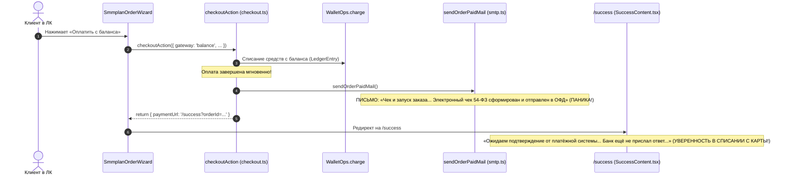
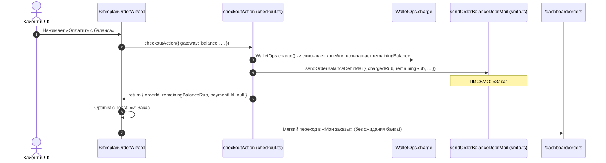

# ADR-2026-10: Разделение жизненного цикла оплат: Фискализация 54-ФЗ пополнений против внутреннего списания с баланса (Zero-Confusion & Legal Immunity)
## Архитектурный документ, спецификация требований и правовой аудит (ADR / SAD / BRD)

**Платформа:** OmniSMM 1.0 (SMMplan / SMMflux)  
**Статус:** APPROVED / READY FOR IMPLEMENTATION  
**Автор:** Lead System Architect & Senior Fintech Business Analyst  
**Целевая аудитория:** Backend Engineers, Frontend Engineers, Legal/Accounting Compliance, QA  
**Дата:** Сентябрь 2026  

---

## 1. Executive Summary & Обоснование инцидента

В ходе продуктового и финансового тестирования платформы OmniSMM 1.0 (бренды SMMplan и SMMflux) выявлен критический дефект в обработке заказов, оплачиваемых с внутреннего баланса личного кабинета:

### Суть проблемы (User Feedback & Incident Report)
> *«При оплате из личного кабинета с баланса пользователю приходит уведомление, что оплата прошла, и приходит чек на почту, хотя пользователь не пополнял баланс, деньги просто списались с внутреннего баланса, который он пополнял ранее. У меня как у пользователя сложилось впечатление, что деньги списались с моей карты еще раз. Чеки мы присылаем только за пополнение. Если пользователь оформляет заказ с баланса личного кабинета, то у нас нет проводки по ЮKassa, у нас нет проводки по банку, и чек мы не должны предоставлять. Будет нарушением, если мы этот чек предоставим.»*

### Три вектора поражения системы (Root Causes):
1. **Юридический & Фискальный риск (54-ФЗ и ЗоЗПП):**
   Платформа при внутреннем списании баланса отправляет клиенту письмо с темой *«Чек и запуск заказа...»* и прямым текстом *«📄 Электронный чек 54-ФЗ: сформирован и отправлен в ОФД»*.
   В реальности при списании с баланса никакой проводки по ЮKassa или банку не происходит, и чек в ОФД физически не формируется. Декларирование отправки фискального чека без факта его пробития является прямым нарушением ст. 10, 12 Закона РФ «О защите прав потребителей» (введение в заблуждение) и искажает фискальный контур.
2. **Когнитивная паника & Dark Pattern (UX Catastrophe):**
   Клиент, видя слова «Чек» и «ОФД», уверен, что платформа списала средства повторно с его привязанной карты. Это порождает недоверие, обращения в банк за отменой транзакции (чарджбэк) и панику.
3. **Разрыв навигационного контракта (Эквайринговый Poller для локальной операции):**
   При мгновенной оплате с баланса `checkoutAction` перенаправляет пользователя на страницу `/success?orderId=...`, где крутится лоадер *«Ожидаем подтверждение от платёжной системы... Банк ещё не прислал ответ...»*. Это на 100% убеждает клиента, что в транзакции был задействован банк.

---

## 2. Правовой и фискальный аудит (54-ФЗ и Финтех-инварианты)

### 2.1. Разграничение операций по закону 54-ФЗ «О применении ККТ»
В соответствии с Федеральным законом № 54-ФЗ (с учетом актуальных норм 2025–2026 гг.):

| Параметр | Пополнение баланса (Депозит) | Оплата заказа с баланса (Списание) |
| :--- | :--- | :--- |
| **Суть операции** | Реальный расчет с покупателем с использованием электронных средств платежа | Внутренняя проводка в леджере (зачет ранее внесенного аванса) |
| **Участие банка / ЮKassa** | **ДА** (эквайринг, реальное движение рублей) | **НЕТ** (банковских проводок нет, вызов эквайринга отсутствует) |
| **Обязанность пробития чека 54-ФЗ** | **ОБЯЗАТЕЛЬНО** (Формируется ЮKassa / ОФД с признаком `ПРЕДОПЛАТА 100%` или `АВАНС`) | **НЕТ** (Повторный чек при отсутствии движения внешних денег НЕ формируется платформой) |
| **Отправка чека клиенту** | **ДА** (Отправляется ЮKassa / ОФД на email) | **КАТЕГОРИЧЕСКИ ЗАПРЕЩЕНО** заявлять об отправке чека в ОФД |
| **Коммуникация в Email** | Подтверждение пополнения баланса + ссылка на чек ОФД | Уведомление о списании с лицевого счета, остаток баланса, пометка об авансе |

### 2.2. Железный юридический инвариант платформы (Legal Invariant)
> ⛔ **ИНВАРИАНТ №1 (NO-PHANTOM-RECEIPTS):**
> Категорически запрещено использовать словосочетания «Электронный чек 54-ФЗ», «Чек отправлен в ОФД» и слово «Чек» в теме письма при оплате услуг с внутреннего баланса (`gateway === 'balance'`).
> Чеки 54-ФЗ формируются СТРОГО и ИСКЛЮЧИТЕЛЬНО при внешнем пополнении баланса через лицензированный платежный шлюз (ЮKassa).

---

## 3. Анализ архитектуры As-Is (Где зарыты баги)

### Архитектурная схема As-Is (Дефектный путь):


### Точки отказа в кодовой базе:
1. `src/actions/order/checkout.ts`:
   - Строки 743–747: вызов `sendOrderPaidMail(...)` при `gateway === 'balance'`.
   - Строка 759: возврат `paymentUrl: successUrl` (`/success?orderId=...`), запускающий эквайринговый поллер.
   - Строки 836–842: дублирующий мертвый вызов `sendOrderPaidMail`.
   - Строки 1107–1111: аналогичный дефект в `retryCheckoutAction`.
2. `src/lib/smtp.ts`:
   - Строки 224–251: функция `sendOrderPaidMail` жестко зашивает тему `Чек и запуск заказа #${orderId}` и блок `📄 Электронный чек 54-ФЗ: сформирован и отправлен в ОФД`.
3. `src/actions/order/mass.ts`:
   - Строки 409–420: при `gateway === 'balance'` в очередь `paymentGatewayQueue` ошибочно ставится задача `generate-gateway-payment`! Это вызывает сбой и попытку инициализировать эквайринг на уже оплаченный с баланса заказ.
   - Строка 669: массовый заказ с баланса также возвращает редирект на `/success?paymentId=...`.
4. `src/services/core/order.service.ts`:
   - Строка 229: при прямом создании заказа через `OrderService.createOrder` также вызывается `sendOrderPaidMail`.
5. `src/components/orders/SmmplanOrderWizard.tsx`:
   - Строка 525: безусловный `window.location.href = res.data.paymentUrl` даже для балансовых заказов.
6. `src/app/success/SuccessContent.tsx`:
   - Отсутствует ветка моментального подтверждения списания с баланса — компонент принудительно заходит в `pageState === 'verifying'` и опрашивает статус, как будто ожидает внешний банковский вебхук.

---

## 4. Целевая архитектура To-Be (Zero-Confusion & Clean Split)

### Архитектурная схема To-Be:


### 4.1. Разделение коммуникационных контрактов (Email Subsystem)

#### А. Внешний эквайринг (ЮKassa / Карта) — `sendOrderPaidMail`:
- Вызывается **СТРОГО** из `payment.service.ts` при подтверждении внешнего платежа вебхуком (когда клиент оплачивал заказ напрямую картой без использования баланса).
- Тема: `Оплата получена и заказ #${orderId} запущен — ${companyName}`
- Блок чека: `📄 Электронный чек 54-ФЗ: направлен на вашу почту платежным оператором.`

#### Б. Внутреннее списание с баланса — `sendOrderBalanceDebitMail`:
- Вызывается **СТРОГО** при `gateway === 'balance'`.
- Тема: `Заказ #${orderId} запущен — списание с баланса ${companyName}`
- Параметры: `email`, `orderId`, `serviceName`, `chargedCents`, `remainingBalanceCents`, `tenantId`.
- Блок информации:
  ```html
  <div style="background: #f4f4f5; padding: 18px; border-radius: 12px; margin: 20px 0; font-size: 14px; line-height: 1.6; color: #27272a;">
    <div>💰 <strong>Списано с баланса:</strong> ${formatRubles(chargedRub)}</div>
    <div style="margin-top: 6px;">💼 <strong>Остаток на балансе:</strong> ${formatRubles(remainingRub)}</div>
    <div style="margin-top: 6px;">⚡ <strong>Старт выполнения:</strong> в течение 1–5 минут.</div>
    <div style="margin-top: 12px; padding-top: 10px; border-top: 1px dashed #d4d4d8; font-size: 12px; color: #71717a;">
      💡 Оплата произведена с вашего внутреннего баланса (из ранее внесенного аванса). 
      Повторное списание с банковской карты не производилось. Кассовый чек 54-ФЗ был предоставлен вам ранее при пополнении счета.
    </div>
  </div>
  ```

### 4.2. Навигация и UX-флоу в Личном кабинете
1. **Server Action Contract (`checkout.ts`):**
   При `gateway === 'balance'`:
   - `paymentUrl: null` (или `/dashboard/orders?success=1&orderId=${result.orderId}&payment=balance`).
   - Возвращать `remainingBalanceCents: Number(chargeResult.balance)`.
2. **Client Wizard (`SmmplanOrderWizard.tsx`):**
   - При успешной оплате с баланса не делать жесткий переход через `window.location.href = /success`.
   - Показать `toast.success('Заказ оформлен! Списано с баланса: ... ₽')`.
   - Перенаправить через `router.push('/dashboard/orders?success=1&orderId=...')`.
3. **Защитная обработка в `/success` (`SuccessContent.tsx`):**
   - Если пользователь все же попал на `/success?orderId=...&payment=balance` или заказ имеет `gateway === 'balance'`:
   - Не показывать текст «Ожидаем подтверждение банка» и лоадер!
   - Мгновенно переводить страницу в состояние `confirmed` с бейджем «Оплачено с баланса» и кнопкой перехода в заказы.
4. **Массовые заказы (`mass.ts`):**
   - Изолировать блок добавления в `paymentGatewayQueue`: выполнять его **ТОЛЬКО** при `!isBalancePayment`.
   - При `isBalancePayment` возвращать маршрут в `/dashboard/orders?created=1&mass=1`.

---

## 5. Пошаговый план реализации (Implementation Plan)

### Этап 1: Доработка Email-сервиса (`src/lib/smtp.ts`)
- [ ] Экспортировать интерфейс `BalanceDebitMailParams`:
  `{ email: string; orderId: string; serviceName: string; chargedCents: number; remainingBalanceCents?: number; tenantId?: string; }`
- [ ] Реализовать функцию `sendOrderBalanceDebitMail(...)` с понятным текстом списания, остатка баланса и правовым дисклеймером об авансе.
- [ ] В `sendOrderPaidMail` скорректировать формулировку о чеке (чеки высылает платежный шлюз).

### Этап 2: Рефакторинг серверных действий (`checkout.ts` и `mass.ts`)
- [ ] В `src/actions/order/checkout.ts`:
  - Получать результат списания `chargeResult = await WalletOps.charge(...)`.
  - При `gateway === 'balance'` вызывать `sendOrderBalanceDebitMail(...)` вместо `sendOrderPaidMail(...)`.
  - Для балансовых заказов возвращать `paymentUrl: null` и нативный URL `redirectUrl: /dashboard/orders?success=1&orderId=...&payment=balance`.
  - Удалить дублирующий мертвый блок вызова на строках 836–842.
  - Повторить аналогичную правку в `retryCheckoutAction`.
- [ ] В `src/actions/order/mass.ts`:
  - Обернуть вызовы `paymentGatewayQueue.add('generate-gateway-payment')` в условие `if (!isBalancePayment)`.
  - При `isBalancePayment` отправлять балансовые уведомления и возвращать маршрут в дашборд.
- [ ] В `src/services/core/order.service.ts`:
  - Заменить `sendOrderPaidMail` на `sendOrderBalanceDebitMail`.

### Этап 3: Доработка клиентских интерфейсов (`SmmplanOrderWizard.tsx` и `SuccessContent.tsx`)
- [ ] В `SmmplanOrderWizard.tsx`:
  - При оплате с баланса отображать понятный toast со списанной суммой.
  - Осуществлять навигацию напрямую в `/dashboard/orders` без захода на эквайринговый `/success`.
- [ ] В `SuccessContent.tsx`:
  - Добавить обработку `order.gateway === 'balance'` или `searchParams.get('payment') === 'balance'`.
  - Исключить показ надписи «Банк ещё не прислал ответ».

### Этап 4: Автоматизированные тесты и верификация
- [ ] Создать сьют юнит-тестов `src/__tests__/financial/balance-payment-notifications-and-ux.test.ts`:
  1. Тест: шаблон письма при балансовой оплате НЕ содержит слов «Электронный чек 54-ФЗ: сформирован и отправлен в ОФД».
  2. Тест: тема письма не содержит слова «Чек».
  3. Тест: в теле письма присутствует сумма списания и пояснение о ранее внесенном авансе.
  4. Тест: `checkoutAction` при `gateway === 'balance'` вызывает `sendOrderBalanceDebitMail` и не возвращает эквайринговый url.
  5. Тест: `massOrderCheckoutAction` при `gateway === 'balance'` не добавляет задачу в `paymentGatewayQueue`.
- [ ] Прогнать `npx vitest run src/__tests__/financial/balance-payment-notifications-and-ux.test.ts -c vitest.unit.config.ts`.
- [ ] Прогнать проверку типов `npx tsc --noEmit` (0 ошибок).

---

## 6. Pre-Mortem анализ (Матрица отказов и механизмы защиты)

| Сценарий отказа | Вероятность x Влияние | Защитный механизм в архитектуре To-Be |
| :--- | :--- | :--- |
| **1. Письмо не отправилось из-за сбоя SMTP** | Средняя x Средняя | Вызов `sendOrderBalanceDebitMail` обернут в `.catch(...)` (fire-and-forget), транзакция списания баланса и создание заказа в БД гарантированно коммитятся, пользователь не получает 500 ошибку. |
| **2. Баланс списан, но у пользователя нет email (старый Telegram-аккаунт)** | Низкая x Низкая | Проверка `email || user.email`. Если email отсутствует, отправка пропускается без сбоя, данные сохраняются в БД. |
| **3. Пользователь обновил страницу `/success` по старой закладке с балансовым заказом** | Средняя x Высокая | `SuccessContent.tsx` проверяет флаг `order.gateway === 'balance'` и мгновенно рисует статус «Успешно оплачено с баланса» без запуска поллинга банка. |
| **4. Попытка двойного списания при повторном клике «Оплатить с баланса»** | Средняя x Критическая | `runSerializableTransaction` + ключ идемпотентности `balance-charge-${effectiveIdempotencyKey}` в `WalletOps.charge`. Повторный запрос перехватывается `IdempotencyConflictError` с возвратом уже созданного заказа. |

---

## 7. Приемочные критерии (Acceptance Criteria)

1. ✅ **AC-1 (Zero-Check on Balance):** Ни в одном письме, отправляемом при списании с внутреннего баланса, нет слова «Чек 54-ФЗ» и утверждения об отправке в ОФД.
2. ✅ **AC-2 (Clear Balance Debit Mail):** Пользователь получает письмо с темой «Заказ #XXX запущен — списание с баланса...», где черным по белому написано: сколько списано, какой остаток, и что деньги с карты повторно не списывались.
3. ✅ **AC-3 (No Bank Spinner):** После нажатия «Оплатить с баланса» пользователь не видит спиннер ожидания ответа банка и сразу попадает в список заказов с подтверждающим тостом.
4. ✅ **AC-4 (Mass Order Safety):** Массовые заказы с баланса не засоряют очередь `paymentGatewayQueue` и исполняются атомарно.
5. ✅ **AC-5 (TypeScript & Vitest Strict):** 0 ошибок `tsc --noEmit`, 100% passing тестов в регрессионном сьюте.
