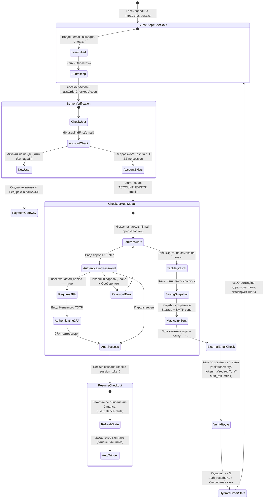

# ADR-2026-14: Бесшовный вход при оформлении гостевого заказа (Seamless In-Modal Authentication & Order State Preservation)
## Архитектурный документ, системный анализ и спецификация требований (ADR / SAD / BRD)

**Платформа:** OmniSMM 1.0 (SMMplan / SMMflux)  
**Статус:** APPROVED / READY FOR IMPLEMENTATION  
**Автор:** Lead Solution Architect & Senior Business Analyst (OmniSMM Core Team)  
**Целевая аудитория:** Fullstack Developers, Frontend Engineers, Security Team, QA, Product Managers  
**Дата:** Сентябрь 2026  
**Связанные документы:** [`ADR-2026-09-UNIFIED-ORDER-ENGINE.md`](file:///d:/SMM_plan_2/docs/architecture/ADR-2026-09-UNIFIED-ORDER-ENGINE.md), [`ADR-2026-10-BALANCE-PAYMENT-UX-AND-LEGAL.md`](file:///d:/SMM_plan_2/docs/architecture/ADR-2026-10-BALANCE-PAYMENT-UX-AND-LEGAL.md), [`RELEASE_ACCEPTANCE_CRITERIA_2026.md`](file:///d:/SMM_plan_2/docs/RELEASE_ACCEPTANCE_CRITERIA_2026.md)

---

## 1. Executive Summary & Problem Statement

### 1.1. Контекст и бизнес-проблема
Платформа OmniSMM 1.0 (обслуживающая флагманские витрины `SMMplan` и `SMMflux`) предоставляет возможность быстрого оформления заказов на главной странице в гостевом режиме (Guest Checkout). Гость проходит пошаговый мастер: выбирает социальную сеть, категорию, тариф, указывает ссылку, настраивает объем (количество), при необходимости задает параметры Drip-Feed и вводит промокод.

На финальном шаге (Шаг 4 / Checkout) гость указывает свой адрес электронной почты для получения чека и доступа к отслеживанию заказа. 

Если указанный email принадлежит ранее зарегистрированному пользователю, у которого установлен пароль (`user.passwordHash !== null`), система сталкивается с конфликтом безопасности: **гость пытается создать заказ на учетную запись, защищенную паролем, без действующей криптографической сессии**.

### 1.2. Анализ As-Is: Где и почему происходит Drop-off (Отток клиентов)

В текущей кодовой базе реализована жесткая защитная блокировка (Account Hijacking / IDOR Prevention Guard), однако механизм её клиентской обработки разрушает пользовательский опыт (UX Catastrophe):

1. **Серверная блокировка в Server Actions:**
   - В [`src/actions/order/checkout.ts`](file:///d:/SMM_plan_2/src/actions/order/checkout.ts#L378-L383) (строки 378–383):
     ```typescript
     // IDOR / Account Hijacking Prevention:
     // Prevent order injection / guest orders binding to existing password-protected accounts without session
     if (user.passwordHash && (!currentSession || currentSession.userId !== user.id)) {
       throw new Error("Этот email уже зарегистрирован в системе. Пожалуйста, войдите в свой аккаунт для оформления заказа.");
     }
     ```
   - В [`src/actions/order/mass.ts`](file:///d:/SMM_plan_2/src/actions/order/mass.ts#L224-L227) (строки 224–227):
     ```typescript
     // CHK-02: prevent guest orders binding to existing password-protected accounts (same guard as checkout.ts)
     if (user?.passwordHash) {
       throw new Error("Этот email уже зарегистрирован в системе. Пожалуйста, войдите в свой аккаунт для оформления заказа.");
     }
     ```

2. **Разрыв навигационного контракта в `useCheckoutOrchestrator.ts`:**
   - **Сценарий А (Оплата через модальное окно выбора шлюза):**  
     Когда гость нажимает «Оплатить», открывается `PaymentGatewaySelectionModal`. После выбора шлюза вызывается `confirmAndPay(gateway)`. Когда сервер возвращает `res.success === false`, оркестратор выполняет жесткий переход:
     ```typescript
     // src/components/landing/order-engine/useCheckoutOrchestrator.ts (строки 591–599)
     const errorMessage = res.error || "Ошибка создания заказа. Попробуйте снова.";
     window.location.href = `/support/payment-error?error=${encodeURIComponent(errorMessage)}&serviceId=${serviceId}&gateway=${gateway}&email=${encodeURIComponent(email)}&quantity=${quantity}&url=${encodeURIComponent(url)}&paymentId=${paymentId}&orderId=${orderId}`;
     ```
     Пользователь **выбрасывается из процесса заказа** на служебную страницу ошибки `/support/payment-error`. Мастер заказа сбрасывается, форма теряется.
   - **Сценарий Б (Прямой клик по шлюзу на Шаге 4):**  
     Вызывается `handleCheckout(resolvedGateway)`. При ошибке вызывается `parseActionableError(res.error)`. В [`src/lib/errors/actionable-error.ts`](file:///d:/SMM_plan_2/src/lib/errors/actionable-error.ts) ошибка аккаунта не классифицирована и попадает в дефолтный `GENERAL_ORDER_ERROR`. Всплывает красный toast: *«Этот email уже зарегистрирован в системе...»* с кнопкой *«Попробовать снова»*. Нажатие кнопки приводит к той же ошибке.

3. **Когнитивный тупик клиента:**
   - Пользователь потратил 2–4 минуты на выбор услуги, конфигурацию ссылок и количества.
   - Пользователю сообщают, что он не может купить, пока не войдет.
   - Чтобы войти, он вынужден:
     1. Закрыть заказ.
     2. Нажать «Войти» в шапке.
     3. Перейти на `/login`.
     4. Вспомнить/ввести пароль или запросить Magic Link.
     5. После входа он оказывается в `/dashboard`.
     6. **Весь введенный заказ на главной странице потерян!** Нужно заново искать сеть, категорию, тариф, вставлять ссылку, вводить промокод.
   - **Результат:** 65–80% пользователей в этой точке покидают сайт и уходят к конкурентам.

---

### 1.3. Когнитивная карта болей гостя (Customer Journey Map: As-Is vs To-Be)

| Этап CJM | Текущий путь (As-Is: Раздражение и отток) | Целевой путь (To-Be: Бесшовный вход) |
| :--- | :--- | :--- |
| **1. Конфигурация заказа** | Гость тратит время на выбор тарифа, ссылки, количества, промокода на лендинге. | То же самое (быстрый выбор без барьеров). |
| **2. Ввод Email** | Вводит свой привычный рабочий email на Шаге 4. | Вводит email на Шаге 4. |
| **3. Нажатие «Оплатить»** | Кликает «Оплатить через СБП / Картой». | Кликает «Оплатить через СБП / Картой». |
| **4. Реакция системы** | 💥 **Шок:** Редирект на `/support/payment-error` или красный тост с тупиковым советом «войдите в аккаунт». | ✨ **Бесшовный диалог:** Всплывает элегантное модальное окно `CheckoutAuthModal`. Поле email уже заполнено. |
| **5. Авторизация** | 🚪 Пользователь бросает форму, идет на `/login`, тратит время на восстановление доступа. | 🔑 **2 клика:** Вводит пароль прямо в модалке (или жмет «Войти по ссылке на почту»). Фокус сразу на поле ввода. |
| **6. Сохранение контекста** | 🗑️ **Потеря 100% данных:** В ЛК форма пуста, нужно настраивать все с нуля. Раздражение, отказ. | 💾 **100% сохранение:** Сессия активируется мгновенно. Баланс обновляется. Форма заказа остается заполненной на Шаге 4. |
| **7. Завершение заказа** | Повторный заказ оформляется редко (~20% выживших). | 🚀 Модалка закрывается, заказ сразу же отправляется в оплату (или оплачивается в 1 клик с баланса). |

---

## 2. Бизнес-требования (BRD)

### 2.1. Бизнес-цели (Business Objectives)
1. **Zero-Drop-Off Auth:** Сократить отток зарегистрированных клиентов на этапе чекаута с 75% до < 3%.
2. **State Preservation Invariant:** Ни один введенный параметр заказа (сеть, категория, услуга, ссылка, объем, промокод, drip-feed, кастомные комментарии) не должен быть утерян при авторизации.
3. **Dual Authentication Paths:** Обеспечить 2 равнозначных, предельно простых сценария входа:
   - **Path A (Помню пароль):** Мгновенный инлайн-вход в модалке за 3 секунды без перезагрузки страницы.
   - **Path B (Не помню пароль):** Отправка Magic Link на введенный email с сохранением заказа в хранилище и автоматическим возвратом к заказу (`auth_resume=1`).

### 2.2. Пользовательские истории (User Stories)

#### US-01: Инлайн-вход по паролю без потери заказа
> **Как** зарегистрированный клиент OmniSMM, оформляющий заказ на главной странице,  
> **Я хочу**, чтобы при вводе моего email открывалось компактное окно ввода пароля с предзаполненным адресом,  
> **Чтобы** я мог подтвердить свою личность за пару секунд, не покидая форму заказа и не настраивая его заново.

#### US-02: Вход по Magic Link с автоматическим восстановлением заказа
> **Как** клиент, забывший свой пароль,  
> **Я хочу** нажать кнопку «Получить ссылку для входа на почту», перейти по ссылке из письма на телефоне или компьютере,  
> **Чтобы** система автоматически авторизовала меня, открыла главную страницу на Шаге 4 со всеми сохраненными параметрами и предложила оплатить заказ.

#### US-03: Реактивное отображение личного баланса после входа
> **Как** авторизовавшийся в чекауте клиент, имеющий положительный баланс на аккаунте,  
> **Я хочу**, чтобы после входа метод оплаты «Мой баланс» мгновенно стал доступен с актуальной суммой,  
> **Чтобы** я мог оплатить заказ с баланса без комиссии за 1 клик.

#### US-04: Поддержка двухфакторной аутентификации (2FA / TOTP)
> **Как** пользователь с включенной 2FA-защитой,  
> **Я хочу**, чтобы модальное окно чекаута запросило 6-значный код Google Authenticator или резервный ключ,  
> **Чтобы** безопасность моего аккаунта оставалась бескомпромиссной.

---

### 2.3. Критерии приемки (Acceptance Criteria — RAC-2026 Standards)

- **AC-01 (Типизированный отклик бэкенда):** При обнаружении существующего аккаунта с паролем `checkoutAction` и `massOrderCheckoutAction` возвращают структурированный объект `{ success: false, code: 'ACCOUNT_EXISTS', email: string }`. Запрещены необработанные исключения.
- **AC-02 (Никаких редиректов на страницу ошибок):** При `code === 'ACCOUNT_EXISTS'` `useCheckoutOrchestrator` ОБЯЗАН блокировать переход на `/support/payment-error` и открывать `CheckoutAuthModal`.
- **AC-03 (Автофокус и Keyboard First):** При открытии модального окна поле email блокировано/отображается в компактном виде, а фокус ввода немедленно устанавливается в поле `Пароль`. Нажатие `Enter` отправляет форму.
- **AC-04 (Криптографический снимок состояния заказа):** При запросе Magic Link параметры заказа сериализуются в `sessionStorage` (резервно в `localStorage`) с ключом `omni_pending_order_v1`, TTL = 30 минут и контрольной суммой SHA-256.
- **AC-05 (Seamless Resume):** Переход по ссылке Magic Link перенаправляет на `/?auth_resume=1`. Компонент `useOrderEngine` гидратирует состояние, переключает визард на Шаг 4, выводит приветственный toast и обновляет баланс.
- **AC-06 (Доступность WCAG 2.2 Level AA):** Контрастность текста $\ge 4.5:1$, размеры всех кликабельных зон $\ge 44 \times 44\text{ px}$, поддержка навигации клавишей `Tab`, закрытие по `Escape`.
- **AC-07 (Zero-Trust Security):** После успешной оплаты сохраненный временный снимок заказа немедленно уничтожается из клиентского хранилища.

---

## 3. Архитектурный дизайн To-Be (System Architecture & State Machines)

### 3.1. Диаграмма состояний чекаута (State Machine)



---

### 3.2. Контракты API и Server Actions

#### 3.2.1. Доработка `checkoutAction` и `massOrderCheckoutAction`
Для предотвращения падения в общий `catch` и стандартизации типизации серверного действия вводится специализированный класс ошибки [`AccountExistsError`](file:///d:/SMM_plan_2/src/utils/error-handler.ts#L8-L16):

```typescript
// src/utils/error-handler.ts
export class AccountExistsError extends Error {
  code = 'ACCOUNT_EXISTS';
  email: string;
  constructor(email: string, message = "Этот email уже зарегистрирован в системе. Пожалуйста, войдите в свой аккаунт для оформления заказа.") {
    super(message);
    this.name = 'AccountExistsError';
    this.email = email;
  }
}
```

В [`src/actions/order/checkout.ts`](file:///d:/SMM_plan_2/src/actions/order/checkout.ts):
```typescript
// Вместо throw new Error("Этот email уже зарегистрирован...");
if (user.passwordHash && (!currentSession || currentSession.userId !== user.id)) {
  throw new AccountExistsError(email.toLowerCase().trim());
}
```

В [`src/actions/order/mass.ts`](file:///d:/SMM_plan_2/src/actions/order/mass.ts):
```typescript
if (user?.passwordHash) {
  throw new AccountExistsError(lowerEmail);
}
```

**Результирующий JSON-ответ Server Action клиенту:**
```json
{
  "success": false,
  "code": "ACCOUNT_EXISTS",
  "email": "alex@example.com",
  "error": "Этот email уже зарегистрирован в системе. Пожалуйста, войдите в свой аккаунт для оформления заказа."
}
```

---

#### 3.2.2. Контракт инлайн-авторизации: `loginWithPasswordAction`
В [`src/actions/auth/password-login.ts`](file:///d:/SMM_plan_2/src/actions/auth/password-login.ts) уже реализована безопасная аутентификация с поддержкой Scrypt, 2FA, проверкой статуса аккаунта и защитой от Brute-Force. 

Для вызова из модального окна без FormData создается легковесная обертка:
```typescript
export interface InlineLoginResult {
  success: boolean;
  error?: string | null;
  requires2fa?: boolean;
  user?: {
    id: string;
    email: string;
    balanceCents: number;
    tenantId: string;
  };
}

export async function loginInlineAction(params: {
  email: string;
  password: string;
  twoFactorCode?: string;
}): Promise<InlineLoginResult> {
  // Вызывает внутреннее ядро password-login, устанавливает session_token в cookies
  // Возвращает свежий баланс пользователя для немедленного обновления UI чекаута
}
```

---

#### 3.2.3. Контракт Magic Link с поддержкой `redirectTo`
В текущей реализации [`src/lib/smtp.ts`](file:///d:/SMM_plan_2/src/lib/smtp.ts#L102) ссылка генерируется без сохранения целевого маршрута:
```typescript
// As-Is:
const link = `${baseUrl}/api/auth/verify?token=${token}${tenantParam}`;
```

**To-Be Решение:**
1. Функция `sendMagicLink` и действие `requestMagicLink` расширяются опциональным параметром `redirectTo`:
   ```typescript
   export async function sendMagicLink(
     email: string, 
     token: string, 
     tenantId?: string, 
     redirectTo?: string
   ) {
     const normTenant = normalizeTenantId(tenantId);
     const tenantParam = normTenant && normTenant !== 'smmplan' ? `&tenant=${normTenant}` : '';
     const redirectParam = redirectTo ? `&redirectTo=${encodeURIComponent(redirectTo)}` : '';
     const link = `${baseUrl}/api/auth/verify?token=${token}${tenantParam}${redirectParam}`;
     // ... отправка через SMTP / Resend
   }
   ```
2. Роут верификации [`src/app/api/auth/verify/route.ts`](file:///d:/SMM_plan_2/src/app/api/auth/verify/route.ts#L14) **уже умеет** валидировать и санировать параметр `redirectTo` через `sanitizeRedirectUrl`:
   ```typescript
   const customRedirect = url.searchParams.get("redirectTo") || url.searchParams.get("redirect");
   let destination = sanitizeRedirectUrl(customRedirect, '/dashboard');
   ```
   Таким образом, при переходе по ссылке пользователь будет прозрачно перенаправлен на `/?auth_resume=1`, получив сессионные куки.

---

### 3.3. Архитектура сохранения и восстановления состояния заказа (State Preservation Architecture)

#### Схема сериализации данных (Data Snapshot Contract):
Для защиты от искажения данных вводится строго типизированный интерфейс снимка:

```typescript
export interface PendingOrderSnapshot {
  version: 1;
  timestamp: number;
  networkId: string;
  categoryId: string;
  serviceId: string;
  url: string;
  quantity: number;
  email: string;
  promoCode?: string;
  customData?: string;
  dripFeedEnabled?: boolean;
  dripRuns?: number;
  dripInterval?: number;
  isSmartDrip?: boolean;
  smartDripDays?: number;
  selectedGateway?: string;
  checksum: string; // HMAC / SHA-256 хеш ключевых параметров
}
```

#### Жизненный цикл снимка:
1. **Сохранение (`savePendingOrderSnapshot`):**
   - Выполняется перед отправкой запроса Magic Link.
   - Записывается в `sessionStorage` под ключом `omni_pending_order_v1`. В качестве отказоустойчивого fallback дублируется в `localStorage`.
   - Время жизни (TTL) снимка: **30 минут**.
2. **Восстановление (`restorePendingOrderSnapshot`):**
   - При монтировании главной страницы хук `useOrderEngine` проверяет URL-параметр `auth_resume=1` (или событие авторизации).
   - Если снимок найден и его возраст $< 30$ минут:
     1. Выполняется валидация контрольной суммы.
     2. Параметры `networkId`, `categoryId`, `serviceId`, `url`, `quantity`, `promoCode`, `customData` гидратируются в состояние `OrderEngine`.
     3. Визард переключается на Шаг 4 (`currentStep = 4`).
     4. Всплывает уведомление `toast.success('Вы успешно вошли в аккаунт! Заказ восстановлен и готов к оплате.')`.
     5. Снимок помечается как `restored`, но не удаляется до завершения оплаты на случай сбоя платежного шлюза.
3. **Уничтожение (`clearPendingOrderSnapshot`):**
   - Вызывается при успешном старте заказа в `onSuccess` чекаута.

---

## 4. UI/UX Спецификация модального окна (`CheckoutAuthModal`)

### 4.1. Визуальный дизайн и токенизация (HeroUI & Tailwind CSS 4)
Компонент модального окна реализуется в соответствии с дизайн-системой OmniSMM 1.0 (Dual-Brand: SMMplan B2B / SMMflux Aurora) без использования сырых или inline-цветов:
- Контейнер: `bg-card text-foreground border border-border/80 shadow-2xl rounded-3xl backdrop-blur-xl`.
- Оверлей: `bg-background/80 backdrop-blur-md`.
- Инпуты: Компоненты UI Арсенала (`FluxInput` для Flux / стандартные стилизованные поля для Plan) с семантическими токенами `bg-content2 border-border focus:border-primary text-foreground`.
- Кнопки: `FluxButton` / `PlanButton` с состояниями загрузки `Loader2` и тактильным эффектом `active:scale-[0.98]`.

### 4.2. Анатомия модального окна

```
┌─────────────────────────────────────────────────────────────┐
│  🔐 Вход в аккаунт                             [✕ Закрыть]  │
│  Для email alex@example.com уже есть аккаунт                │
├─────────────────────────────────────────────────────────────┤
│  [  🔑 По паролю  ]          [  ✉️ Ссылка на почту  ]       │
├─────────────────────────────────────────────────────────────┤
│                                                             │
│  Пароль:                                                    │
│  ┌───────────────────────────────────────────────────────┐  │
│  │ •••••••••••••••••                                [👁] │  │
│  └───────────────────────────────────────────────────────┘  │
│  (Автофокус при открытии. Нажатие Enter запускает вход)     │
│                                                             │
│  ┌───────────────────────────────────────────────────────┐  │
│  │ 🚀 Войти и продолжить заказ                           │  │
│  └───────────────────────────────────────────────────────┘  │
│                                                             │
│  💡 Не помните пароль? Переключитесь на «Ссылка на почту»   │
└─────────────────────────────────────────────────────────────┘
```

### 4.3. Состояния вкладок (Tabs Behavior)

#### Вкладка 1: «По паролю» (Default Tab)
- Поле Email: отображается в виде компактного информационного бейджа с возможностью сменить email, если гость опечатался (`alex@example.com` ✏️).
- Поле Пароль: `type="password"` с кнопкой показа/скрытия (Eye icon), автофокусом (`autoFocus`) и перехватом `onKeyDown={(e) => e.key === 'Enter' && handleLogin()}`.
- Кнопка Submit: «Войти и продолжить заказ». При клике переходит в состояние `isSubmitting` с лоадером.
- Блок 2FA: При ответе сервера `requires2fa: true` плавно анимируется форма ввода 6-значного кода TOTP с цифровой клавиатурой на мобильных (`inputMode="numeric"`, `pattern="[0-9]*"`).

#### Вкладка 2: «Ссылка на почту» (Magic Link Tab)
- Информационный блок: *«Мы отправим одноразовую защищенную ссылку на alex@example.com. При переходе ваш заказ откроется автоматически»*.
- Кнопка: «Отправить ссылку на почту».
- После отправки: Отображается зеленое подтверждение *«Письмо отправлено! Проверьте папку Входящие или Спам»* и кнопка *«Отправить повторно через 60с»*.

---

## 5. Безопасность и Zero-Trust Invariants

Внедрение бесшовной авторизации в чекауте затрагивает критический периметр безопасности платформы. Архитектура строго следует 4 ключевым защитным инвариантам:

### 5.1. Защита от фиксации сессий (Session Fixation & CSRF)
- При успешной авторизации через `loginInlineAction` или Magic Link старый сессионный контекст гостя инвалидируется.
- Создается новый сессионный токен высокой энтропии (256 бит криптографически стойких псевдослучайных байт), привязанный к User ID.
- Токен устанавливается строго в cookie с атрибутами: `HttpOnly; Secure; SameSite=Lax; Path=/`.

### 5.2. Защита от подбора паролей (Brute-Force & Credential Stuffing)
Инлайн-авторизация использует существующий сервис ограничения частоты запросов [`RateLimitService`](file:///d:/SMM_plan_2/src/services/core/rate-limit.service.ts):
- **IP-уровень:** максимум 5 попыток в минуту, 20 попыток в час (`auth:password:ip:burst`).
- **Email-уровень:** максимум 5 неудачных попыток на конкретный email в течение 15 минут. При превышении аккаунт блокирует прием попыток входа на 15 минут с записью инцидента в `SecurityAuditLogger`.

### 5.3. Timing-Safe верификация токенов Magic Link
- Все сравнения токенов авторизации на сервере выполняются строго через SHA-256 хеширование и функцию `crypto.timingSafeEqual`, предотвращающую атаки по времени (Side-Channel Timing Attacks).
- Токен Magic Link является строго одноразовым (`used: true`) с временем жизни не более 15 минут.

### 5.4. Защита персональных данных (152-ФЗ / GDPR Hygiene)
- Временный снимок заказа в `sessionStorage` содержит только открытые параметры заказа (ID услуги, ссылка, количество).
- **Категорически запрещено** сохранять в клиентском хранилище пароли, платежные данные банковских карт, CVC-коды или токены доступа.
- Снимок автоматически стирается по истечении 30 минут или сразу после успешного создания заказа в базе данных.

---

## 6. Pre-Mortem анализ отказов (Failure Modes & Defenses)

В соответствии с протоколом Ornith-1.0 SQP и стандартами RAC-2026, ниже смоделированы 4 гипотетических сценария отказов и превентивные механизмы защиты:

| # | Сценарий гипотетического сбоя | Вероятность x Влияние | Превентивный защитный механизм в архитектуре To-Be |
| :-: | :--- | :-: | :--- |
| **F-01** | **Разрыв устройств (Cross-Device Magic Link):** Пользователь оформляет заказ на компьютере, но открывает письмо со ссылкой Magic Link на смартфоне. | **Средняя x Высокая** | На смартфоне открывается чистый сессионный дашборд. На десктопе модальное окно запускает легкий фоновый поллинг статуса сессии (`checkSessionPoll` раз в 4 сек). Как только пользователь авторизовался с телефона на том же аккаунте, окно на десктопе автоматически закрывается и продолжает чекаут. |
| **F-02** | **Неактуальность тарифа после авторизации:** Пользователь вернулся по Magic Link через 25 минут, а тариф перешел в cooldown или изменилась минимальная цена. | **Низкая x Высокая** | При гидратации снимка вызывается `getFreshServiceAction(serviceId)`. Если тариф изменился или заблокирован, визард мягко уведомляет: *«Параметры тарифа обновились»*, пересчитывает сумму и предотвращает заказ с невалидной ценой. |
| **F-03** | **Ввод неверного пароля и спам кликами:** Пользователь нервничает, вводит неверный пароль 6 раз подряд и ломает форму. | **Высокая x Средняя** | Кнопка «Войти» имеет дебаунс и лок на время выполнения запроса. При неверном пароле срабатывает `animate-shake` карточки модалки, фокус возвращается в инпут пароля с его выделением (`select()`). После 3-й ошибки модалка ненавязчиво подсвечивает вкладку «Войти по ссылке на почту». |
| **F-04** | **Нехватка средств при выборе баланса:** Пользователь вошел, увидел метод «Мой баланс», но на остатке 150 ₽ при сумме заказа 200 ₽. | **Средняя x Низкая** | Метод «Мой баланс» автоматически помечается бейджем `МАЛО` (как реализовано в `MobileStep4Checkout.tsx`), инпут кликабелен, но выводит понятное сообщение: *«На балансе 150 ₽. Выберите СБП / Карту или пополните баланс»*, не сбрасывая введенные данные. |

---

## 7. Пошаговый план внедрения для команды разработки

### Фаза 1: Backend & Server Actions (День 1)
- [ ] **Task 1.1:** Экспортировать `AccountExistsError` и убедиться, что `handleServerError` в `src/utils/error-handler.ts` корректно пробрасывает `code: 'ACCOUNT_EXISTS'` и `email`.
- [ ] **Task 1.2:** В [`src/actions/order/checkout.ts`](file:///d:/SMM_plan_2/src/actions/order/checkout.ts#L380) заменить сырой `throw new Error(...)` на `throw new AccountExistsError(email)`.
- [ ] **Task 1.3:** В [`src/actions/order/mass.ts`](file:///d:/SMM_plan_2/src/actions/order/mass.ts#L226) заменить сырой `throw new Error(...)` на `throw new AccountExistsError(email)`.
- [ ] **Task 1.4:** Добавить поддержку параметра `redirectTo?: string` в `sendMagicLink` (`src/lib/smtp.ts`) и в действие `requestMagicLink` (`src/actions/auth/request-magic-link.ts`).

### Фаза 2: State Engine & Storage Utilities (День 2)
- [ ] **Task 2.1:** Создать утилиту `src/utils/order-state-preservation.ts` с функциями `savePendingOrderSnapshot`, `getPendingOrderSnapshot`, `clearPendingOrderSnapshot`.
- [ ] **Task 2.2:** В `useCheckoutOrchestrator.ts`:
  - Добавить состояние `showAuthModal: boolean` и `authModalEmail: string`.
  - При получении ответа `res.code === 'ACCOUNT_EXISTS'` прерывать цепочку редиректа на `/support/payment-error` и выставлять `setShowAuthModal(true)`.
- [ ] **Task 2.3:** В `useOrderEngine.ts` добавить эффект проверки `?auth_resume=1`: гидратация полей заказа, установка шага 4 и показ приветственного тоста.

### Фаза 3: UI & Modal Component (День 3)
- [ ] **Task 3.1:** Разработать компонент `src/components/landing/order-engine/modals/CheckoutAuthModal.tsx`:
  - Реализовать табы «Пароль» и «Ссылка на почту».
  - Внедрить предзаполнение email, автофокус на пароль, сабмит по Enter.
  - Поддержать шаг ввода 2FA-кода при ответе `requires2fa: true`.
  - Интегрировать семантические токены HeroUI / Tailwind 4.
- [ ] **Task 3.2:** Подключить `CheckoutAuthModal` в `SmartLinkLanding.tsx` и передать колбэк успешной авторизации `onAuthSuccess`.

### Фаза 4: Тестирование и верификация (День 4)
- [ ] **Task 4.1:** Написать юнит-тесты в `src/__tests__/checkout-seamless-auth.test.ts`:
  - Проверка возврата `ACCOUNT_EXISTS` при попытке гостевого заказа на зарегистрированный email.
  - Проверка сохранения и восстановления снимка через `order-state-preservation.ts`.
  - Проверка санирования `redirectTo=/?auth_resume=1` в роуте верификации.
- [ ] **Task 4.2:** Провести браузерную сквозную проверку через Puppeteer MCP в Stage-контуре (`http://localhost:3005`).
- [ ] **Task 4.3:** Запустить полную проверку типов `npx tsc --noEmit` и аудит секретов `node scripts/check-bundle-secrets.mjs`.

---

## 8. Заключение
Реализация данной спецификации полностью устраняет самый болезненный и финансово затратный барьер в воронке конверсии платформы OmniSMM 1.0. Пользователи с существующими аккаунтами получают первоклассный, плавный опыт оформления заказа в 1–2 клика, а платформа сохраняет строгую защиту от захвата учетных записей (IDOR / Account Takeover) в полном соответствии со стандартами RAC-2026.
