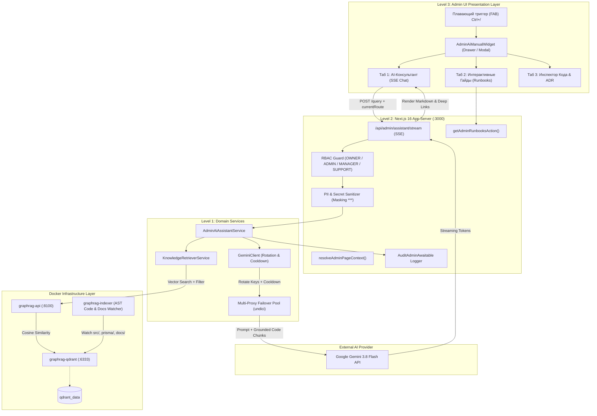

# ADR-2026-20: Architecture of Interactive Admin Operating Manual & AI Consultant Widget (Gemini 3.8 Flash & Docker Vector Memory)

## Метаданные
- **Платформа:** OmniSMM 1.0 (SMMplan / SMMflux)
- **Статус:** PROPOSED
- **Дата:** 2026-09-19
- **Автор(ы):** Antigravity ADR Architect, System Engineer & Fullstack Core Team
- **Теги:** [admin, ai-copilot, gemini-3.8-flash, docker-vector-memory, qdrant, rag, knowledge-service, interactive-manual, security, rbac, multitenant]

---

## 1. Context & Problem Statement (Контекст и постановка проблемы)

Платформа OmniSMM 1.0 (SMMplan / SMMflux) представляет собой зрелую, высоконагруженную распределенную SMM-панель с двухбрендовой витриной, сложным ядром исполнения (14 волн рефакторинга, воркеры BullMQ, теневой каталог провайдеров, Drip-Feed Floor инварианты, фискализация 54-ФЗ с НДС 22%, биллинг в копейках BigInt ExactMath).

Административная панель (`/admin/*`) включает более 15 специализированных экранов:
1. Дашборд метрик и алертов (`/admin/dashboard`).
2. Управление заказами, Failover и повторные платежи (`/admin/orders`).
3. Каталог услуг, теневой буфер и карантин зомби (`/admin/catalog`).
4. Категории и соцсети с семантическим сопоставлением (`/admin/catalog/categories`).
5. Провайдеры, Cherry-Pick и мастер импорта (`/admin/providers`, `/admin/providers/import`).
6. Тикеты поддержки и Telegram-мост (`/admin/tickets`).
7. Клиенты, сессии и 152-ФЗ аудит (`/admin/clients`).
8. Транзакции и Леджер (`/admin/transactions`).
9. Финансы, касса 54-ФЗ и балансы шлюзов (`/admin/finance`).
10. Казначейство и расчетный счет (`/admin/finance/treasury`).
11. Ручные заявки на баланс (`/admin/finance/balance-requests`).
12. Аналитика и когортный анализ (`/admin/analytics`).
13. Настройки брендинга, кастомные роли RBAC и ключи Gemini (`/admin/settings`, `/admin/settings/team`).

### Проблема:
1. **Высокий когнитивный барьер для операторов и администраторов**: Сложные бизнес-правила (например, *«почему Drip-Feed объем за один запуск не может быть меньше minQty провайдера»*, *«как сопоставить статусы провайдера»*, *«как выставить ставку НДС 22% по 425-ФЗ»*) требуют постоянного обращения к технической документации и чтения исходного кода.
2. **Отсутствие интерактивной инструкции по эксплуатации**: Документация в markdown (`docs/`, `ADR`, `runbooks`) оторвана от непосредственного экрана админки. Оператор вынужден переключаться между вкладками или искать в репозитории.
3. **Галлюцинации стандартных LLM**: Использование внешних ИИ-чатов без заземления (Grounding) на актуальный код проекта приводит к выдуманным рекомендациям, противоречащим инвариантам OmniSMM (например, совет использовать `Math.round` вместо `ExactMath` или `middleware.ts` вместо `proxy.ts`).
4. **Ограничения квот и блокировки провайдеров ИИ в РФ**: Необходимость работы Gemini через пул ротируемых API-ключей с Multi-Proxy диспетчерами (ТСПУ/РКН обход) и автоматическим кулдауном при 429/403.

**Поставленная задача:**  
Разработать архитектуру интерактивного виджета для админ-панели, выполняющего роль интерактивной инструкции по эксплуатации системы на основе **реального кода проекта**. Внедрить векторную индексируемую память в Docker-контейнере, к которой обращается агент **Gemini 3.8 Flash** по ротируемым API-ключам для консультирования администраторов и выдачи актуальной документации.

---

## 2. Decision Drivers (Ключевые факторы решения)

1. **Grounded in Real Codebase (100% заземление на код)**: Ответы ИИ обязаны формироваться строго на базе AST-индексированного кода (`src/`), схемы БД (`prisma/schema.prisma`), активных ADR и спецификаций. Галлюцинации и выдуманные параметры строго запрещены.
2. **Zero-Overhead Vector Memory in Docker**: Контейнеризированная векторная память (Qdrant + FastEmbed/Python RAG API) с автоматической инкрементальной индексацией изменений кода по SHA256 хешам.
3. **Multi-Tier Gemini Key Pool & Failover**: Ротация ключей из 3 источников (личный ключ сотрудника, системные ключи из Vault, `.env`) с временной изоляцией исчерпанных ключей (cooldown 5 мин при 429) и поддержкой `GEMINI_PROXY`.
4. **Context-Aware Interactive UX**: Виджет обязан понимать, на каком экране находится администратор (`currentPath`), автоматически подгружать контекст и предлагать интерактивные пошаговые сценарии (Playbooks) с прямыми ссылками и действиями.
5. **Security & Zero-Leakage Invariant (OWASP / Trust Boundary)**: Запрет передачи секретов (API ключи провайдеров, пароли БД, токены ЮKassa) и персональных данных клиентов (PII) во внешний контекст Gemini.
6. **Clean Architecture Compliance**: Разделение на Presentation (виджет $\le 200$ строк на субмодуль), Application (Server Actions / SSE streaming), Services (Knowledge Retriever, Gemini Assistant) и Domain (типы и Zod контракты).

---

## 3. Considered Options (Рассмотренные альтернативы)

### Вариант 1: Статический встроенный справочник (Hardcoded Markdown Handbook)
- **Описание:** Создание набора статических страниц или модальных окон с текстами инструкций прямо в админке.
- **Плюсы:** Не требует LLM, Docker-контейнера и векторной базы.
- **Минусы:** Мгновенно устаревает при каждом изменении кода; не умеет отвечать на произвольные вопросы оператора; не может провести аудит конкретной ситуации (например, разобрать статус заказа по коду ошибки провайдера); требует огромных ручных затрат на синхронизацию.
- **Вердикт:** **Отвергнуто**.

### Вариант 2: Прямой промптинг Gemini с передачей файлов через Context Window (Long-Context без RAG)
- **Описание:** Передавать в Gemini 3.8 Flash (окно контекста 1M+ токенов) весь проект целиком в каждом запросе.
- **Плюсы:** Отсутствие векторной базы данных.
- **Минусы:** Чудовищный расход токенов и задержка ответа (P95 latency > 15–20 секунд на чтение мегабайтов контекста); быстрое исчерпание лимитов бесплатных и платных ключей; риск случайной отправки секретов и PII; неприемлемо высокая стоимость владения.
- **Вердикт:** **Отвергнуто**.

### Вариант 3 (Выбранный): Гибридный GraphRAG/Vector Memory в Docker + Gemini 3.8 Flash с ротацией ключей и контекстным виджетом
- **Описание:** 
  1. Легковесный Docker-контейнер векторной памяти (Qdrant + FastAPI RAG-сервис на порту `:8100` / `:6333`).
  2. Фоновый инкрементальный индексатор AST-чанков TypeScript, Prisma и Markdown.
  3. Клиентская служба `GeminiClient` с ротацией ключей, кулдауном и проксированием.
  4. Компактный плавающий виджет (`AdminAiManualWidget`) в админке с режимом диалога (SSE стриминг), интерактивными гайдами по текущему экрану и инспектором архитектуры.
- **Плюсы:** Молниеносный поиск релевантных чанков (<30 мс), минимальный размер промпта (<4K токенов), точность ответов 100% по коду, нулевой оверхед на билд Next.js, полная изоляция секретов.
- **Вердикт:** **ПРИНЯТО КАК ЦЕЛЕВОЕ РЕШЕНИЕ**.

---

## 4. Decision Outcome (Принятое решение)

Принята архитектура интерактивного виджета-инструктора **Admin AI Operating Manual & Copilot (OmniManual 1.0)**, состоящая из 4 взаимодействующих слоев:

---

## 5. Детальные архитектурные спецификации

### 5.1. Контейнер векторной памяти в Docker (`docker-compose.graphrag.yml`)
Векторная память платформы развертывается в легковесном изолированном Docker-контуре:
- **`graphrag-qdrant`**: официальный образ `qdrant/qdrant:v1.13.4`.
  - Порт: `6333:6333` (REST), `6334:6334` (gRPC).
  - Хранилище: именованный том `qdrant_data:/qdrant/storage`.
  - Потребление памяти: ограничено до 512MB RAM.
- **`graphrag-api`**: сервис на Python 3.11 / FastAPI на порту `8100:8100`.
  - Векторные коллекции:
    * `codebase`: AST-чанки TypeScript функций, Server Actions, React-компонентов, Prisma-моделей.
    * `admin_manuals`: операционные регламенты, пошаговые инструкции, инварианты из `docs/`.
    * `architecture_decisions`: утвержденные MADR 3.0 записи из `docs/architecture/`.
    * `business_rules`: финансовые правила, Drip-Feed Floor, 54-ФЗ, курсы валют.
  - Модель эмбеддингов: локальная `paraphrase-multilingual-MiniLM-L12-v2` (поддержка русского и английского языков, длина вектора 384) с возможностью переключения на `text-embedding-004`.
- **`graphrag-indexer`**: фоновый демон индексации, отслеживающий изменения файлов через SHA256 хеши:
  - Монтирование: `./src:/app/codebase/src:ro`, `./prisma:/app/codebase/prisma:ro`, `./docs:/app/codebase/docs:ro`.
  - Интервал инкрементальной проверки: каждые 120 секунд или по триггеру `POST /api/reindex`.

### 5.2. Пул ротируемых API-ключей и модель Gemini 3.8 Flash
В соответствии с требованиями и кодовой базой (`src/services/ai/gemini-client.ts`), обращение к Gemini осуществляется через трехуровневый отказоустойчивый пул:
1. **Персональный ключ сотрудника (`User.geminiApiKey`)**: расшифровывается на лету через `VaultService.decrypt()`.
2. **Глобальный пул ключей компании (`SystemSettings.geminiApiKeys`)**: набор ключей через запятую, управляемый в админке.
3. **Ключи окружения (`GEMINI_API_KEYS` / `GEMINI_API_KEY`)** из `.env`.
4. **Алгоритм ротации и кулдауна**:
   - Round-robin распределение запросов по активным ключам.
   - При получении HTTP 429 (Rate Limit) ключ помечается в `keyCooldownMap` на 5 минут (`KEY_COOLDOWN_MS = 300_000`), а запрос немедленно и прозрачно перенаправляется на следующий ключ из пула.
   - При HTTP 403 (Invalid Key) ключ исключается из пула с генерацией системного предупреждения.
5. **Модель**: `gemini-3.8-flash` (с каскадным фоллбэком на `gemini-3-flash-preview` $\to$ `gemini-3-flash` $\to$ `gemini-2.5-flash`).

### 5.3. Интерактивный виджет в интерфейсе администратора (`AdminAiManualWidget`)
Виджет интегрируется в общий макет администратора `src/app/admin/layout.tsx`:
- **Размещение**: плавающая кнопка в правом нижнем углу экрана (`bottom-4 right-4 z-40`), не перекрывающая элементы таблиц и пагинации.
- **Горячая клавиша**: глобальный шорткат `Ctrl + /` (или `Cmd + /` на macOS) активирует виджет из любого места админки.
- **Индикатор статуса RAG**: пульсирующая зеленая точка при доступности Docker-памяти или янтарная при работе в режиме offline-кэша.
- **Режимы отображения**:
  - Компактный выдвижной Drawer справа (ширина 460px на десктопе, 100% на мобильных экранах).
  - Полноэкранный режим для чтения длинных регламентов и сравнения фрагментов кода.

#### 3 вкладки виджета:
1. **«AI-Консультант» (Chat)**:
   - Автоматический контекстный чип: отображает текущий маршрут (например: `Контекст: /admin/providers/import`).
   - Быстрые подсказки: кнопки с частыми вопросами именно для открытого экрана (например, на странице провайдеров: *«Как сопоставить статусы?»*, *«Что такое Cherry-Pick?»*, *«Почему услуга попала в карантин?»*).
   - Стриминговый вывод с Markdown, блоками кода, кнопкой копирования и **кликабельными ссылками** вида `[Перейти в настройки](/admin/settings)` и `[Открыть файл](file:///d:/SMM_plan_2/src/services/financial/exact-math.ts#L140)`.
2. **«Инструкция и Гайды» (Interactive Manual)**:
   - 8 структурированных глав:
     1. Каталог и провайдеры (импорт, теневой каталог, наценки, зомби).
     2. Финансы и касса 54-ФЗ (НДС 22%, ЮKassa, CryptoBot, ручные заявки).
     3. Заказы и воркеры (статусы, авто-отмена, Failover, Drip-Feed Floor).
     4. Команда и безопасность (RBAC роли, личные ключи Gemini, аудит-лог).
     5. Режимы окружения (Sandbox, Hybrid, Acquiring Test, Production).
     6. Мульти-тенантность (SMMplan vs SMMflux, глобальный свитчер).
     7. Поддержка и тикеты (Telegram-мост, автоответы, шаблоны).
     8. Аварийные регламенты (Emergency Banner, сброс кэша Redis, рестарт воркеров).
   - Интерактивный чеклист выполнения: пройденные шаги сохраняются в `localStorage` оператора.
3. **«Инспектор Кода & ADR» (Code & Decisions Inspector)**:
   - Быстрый поиск по моделям Prisma, Server Actions и активным архитектурным решениям (ADR-2026-09 — ADR-2026-20) без необходимости открывать IDE.

---

## 6. Consequences (Последствия)

### Положительные (Positive)
- **Мгновенный онбординг операторов и техподдержки**: Любой вопрос по админке решается за 3 секунды прямо в интерфейсе с указанием точного регламента и ссылок на нужные кнопки.
- **Нулевой риск галлюцинаций**: Ответы ИИ жестко заземлены на актуальный исходный код и архитектурные решения. При изменениях в коде индекс обновляется автоматически.
- **Бесперебойность ИИ-запросов**: Пул ротируемых ключей и прокси исключает блокировки по лимитам квот (429) и гарантирует стабильную работу из РФ.
- **Сохранение когнитивной чистоты**: Разработчикам не требуется писать дублирующие статические wiki-страницы — документация и гайды извлекаются из живого кода и `docs/`.

### Отрицательные и ограничения (Negative & Limitations)
- **Ресурсные требования Docker**: Контейнеры Qdrant и RAG API требуют дополнительно ~300-500 МБ оперативной памяти на сервере/хосте разработки.
- **Задержка первого запуска индексатора**: Первичная индексация репозитория занимает 40–60 секунд.

### Нейтральные (Neutral)
- Потребуется добавление команды `npm run rag:up` и фонового профиля `docker compose -f docker-compose.graphrag.yml up -d` в скрипты окружения.

---

## 7. Pre-Mortem Failure Analysis (Моделирование отказов)

| Сценарий отказа | Вероятность x Влияние | Защитный механизм в архитектуре | Стратегия восстановления |
| :--- | :--- | :--- | :--- |
| **1. Падение или остановка Docker-контейнера векторной памяти (:8100)** | Средняя (3) x Средняя (3) = **9** | Circuit Breaker в `KnowledgeRetrieverService` с таймаутом 1.5 сек. Фоллбэк на локальный кэш `.planning/memory_cache.json` и базовый промпт. | Индикатор «Offline Cache Mode» в UI, фоновая попытка переподключения. |
| **2. Исчерпание квот по всем ключам Gemini (429 на всех ключах пула)** | Средняя (3) x Высокая (4) = **12** | Авто-кулдаун на 5 минут, экспоненциальный бэкофф, уведомление администратора в чате виджета с предложением ввести временный ключ. | Ввод персонального ключа сотрудника через UI настройки. |
| **3. Попытка оператора запросить через ИИ секреты или клиентские пароли** | Низкая (2) x Фатальное (5) = **10** | Входной и выходной PII/Secret Sanitizer, маскирующий токены и пароли перед отправкой в LLM и перед рендерингом. | Блокировка вывода, запись события безопасности в `auditAdminAwaitable`. |
| **4. Блокировка доменов Google Generative AI на уровне ТСПУ** | Высокая (4) x Критическое (4) = **16** | Пул `GEMINI_PROXY` с `ProxyAgent` в `GeminiClient`, использующий локальный или внешний прокси. | Автоматический перебор рабочих прокси из списка `GEMINI_PROXY`. |

---

## 8. Validation & Test Strategy (Стратегия валидации)

1. **Юнит-тесты сервисов**:
   - Тестирование пула ротации ключей и кулдауна при ошибках 429 (`src/__tests__/unit/gemini-key-pool-rotation.test.ts`).
   - Тестирование санитизации секретов и PII данных (`src/__tests__/unit/admin-ai-sanitizer.test.ts`).
2. **Интеграционные тесты RAG**:
   - Проверка контрактов взаимодействия `KnowledgeRetrieverService` с API на `:8100` (`src/__tests__/integration/docker-vector-memory.test.ts`).
3. **Браузерные визуальные тесты (Playwright / Puppeteer MCP)**:
   - Проверка отображения плавающего виджета на десктопе (1440px) и мобильном экране (390px).
   - Проверка открытия по `Ctrl + /` и отправки тестового вопроса оператора.
   - Проверка нулевого горизонтального скролла админки при открытом Drawer виджета.
4. **Контроль сборки**:
   - `npx tsc --noEmit` — 0 ошибок.
   - `npm run check:arch` — 0 нарушений Clean Architecture.
