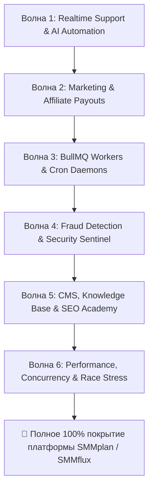

# ВОЛНОВОЙ ПЛАН ВНЕДРЕНИЯ И ВЫПОЛНЕНИЯ РАСШИРЕННЫХ E2E ТЕСТОВ (БЛОКИ 12–17)

> **Цель**: Поэтапное, управляемое внедрение и запуск 6 дополнительных блоков сквозных тестов (Блоки 12–17) с сохранением стабильности кодовой базы, автоматическим выявлением и устранением дефектов на каждом шаге.

---

## 🌊 АРХИТЕКТУРА И ГРАФИК ВОЛН (WAVE ROADMAP)

---

## 🌊 ВОЛНА 1: Поддержка в реальном времени и AI-автоматизация (Блок 12)
* **Целевой файл**: `e2e/12-realtime-support-and-ai.spec.ts`
* **Фокус модулей**: `/api/support/chat/stream`, `SupportAiService` (`gemini-3-flash`), `/api/support/upload`, `TicketRateLimitService`.
* **Тестируемые сценарии (5 тестов)**:
  1. Двусторонний SSE-стриминг сообщений тикета без перезагрузки страницы.
  2. Генерация интеллектуальных AI-ответов на типовые вопросы клиентов.
  3. Валидация загрузки скриншотов (MIME-типы, лимит 5 МБ, блокировка опасных файлов).
  4. Защита от спама и кулдаун в тикетах.
  5. Переходы статусов тикета (`OPEN` → `ANSWERED` → `IN_PROGRESS` → `CLOSED`).
* **Критерий завершения (DoD)**: 5/5 тестов зелёные, 0 регрессий в существующих блоках 1–11.

---

## 🌊 ВОЛНА 2: Маркетинг, Промокоды и Выплаты рефералам (Блок 15)
* **Целевой файл**: `e2e/15-promocodes-and-affiliate-payouts.spec.ts`
* **Фокус модулей**: `src/services/marketing/`, `src/actions/finance/payout.ts`, `/admin/finance/balance-requests`.
* **Тестируемые сценарии (5 тестов)**:
  1. Применение процентного и фиксированного промокода на депозит с начислением через `WalletOps.credit`.
  2. Проверка ограничений промокода (лимит использований `maxUses` и срок действия `expiresAt`).
  3. Создание заявки на вывод реферального баланса (`BalanceRequest`) с холдированием средств.
  4. Одобрение выплаты администратором с указанием TXID / чека и финальным списанием.
  5. Отклонение заявки с мгновенным возвратом средств на реферальный баланс.
* **Критерий завершения (DoD)**: 5/5 тестов зелёные, подтверждена финансовая точность в `BigInt`.

---

## 🌊 ВОЛНА 3: Фоновые воркеры BullMQ и Крон-процессоры (Блок 14)
* **Целевой файл**: `e2e/14-bullmq-workers-and-cron.spec.ts`
* **Фокус модулей**: `src/workers/`, `src/workers/processors/`, `/api/cron/sync-orders`, `/api/cron/sync-cbr`.
* **Тестируемые сценарии (5 тестов)**:
  1. Крон синхронизации статусов заказов у провайдеров с проверкой токена `CRON_SECRET`.
  2. Детектор «мертвых» заказов (`zero-start-detector`) с переводом в `PENDING_CHECK`.
  3. Детектор скачка цен (`price-drift-detector`) с авто-карантином подорожавших услуг (>20%).
  4. Крон обновления курсов валют ЦБ РФ (`sync-cbr`) и пересчет тарифов.
  5. Очистка старых сессий (`cleanup.processor`).
* **Критерий завершения (DoD)**: 5/5 тестов зелёные, проверено взаимодействие с Redis BullMQ.

---

## 🌊 ВОЛНА 4: Антифрод, Velocity Checks и Защита от атак (Блок 13)
* **Целевой файл**: `e2e/13-fraud-detection-and-sentinel.spec.ts`
* **Фокус модулей**: `src/lib/fraud/`, `src/services/security/`, `LinkAnalyzer`.
* **Тестируемые сценарии (5 тестов)**:
  1. Velocity Check на частоту пополнений баланса (блокировка при спаме платежами).
  2. Обнаружение мультиаккаунтинга по отпечатку платежного инструмента (Card/Crypto Fingerprint).
  3. Блокировка фишинговых и вредоносных доменов в ссылках заказов.
  4. Автоматический перевод подозрительных операций в `quarantineBalance`.
  5. Brute Force защита формы входа (бан IP на 15 минут при 5 ошибках пароля).
* **Критерий завершения (DoD)**: 5/5 тестов зелёные, подтверждена безопасность внешних границ.

---

## 🌊 ВОЛНА 5: CMS База знаний, Академия и SEO-инварианты (Блок 16)
* **Целевой файл**: `e2e/16-cms-knowledge-and-seo-academy.spec.ts`
* **Фокус модулей**: `/academy/`, `/knowledge/`, `/legal/`, JSON-LD микроразметка.
* **Тестируемые сценарии (5 тестов)**:
  1. Публикация и верстка обучающих лонгридов в Академии SMMplan.
  2. Валидация разметки Schema.org (`Article`, `BreadcrumbList`, `Service`, `FAQPage`).
  3. Мульти-тенантная изоляция статей базы знаний (`smmplan.pro` vs `smmflux.ru`).
  4. Юридические документы и реквизиты 152-ФЗ с авто-подстановкой бренда.
  5. 301 Permanent Redirect при смене slug категории или статьи.
* **Критерий завершения (DoD)**: 5/5 тестов зелёные, 0 ошибок SEO-разметки.

---

## 🌊 ВОЛНА 6: Нагрузочное и стресс-тестирование (Блок 17)
* **Целевой файл**: `e2e/17-performance-and-concurrency-stress.spec.ts`
* **Фокус**: Конкурентность транзакций, пул соединений PostgreSQL, Redis throughput.
* **Тестируемые сценарии (3 комплексных стресс-теста)**:
  1. **Parallel Balance Debit Concurrency Test**: 50 одновременных запросов на списание при балансе 1 000 ₽ — ровно 10 успешных, 40 отклонённых, остаток строго 0 копеек (0 race conditions).
  2. **B2B API High Throughput Test**: 300 RPS на чтение каталога (`/api/v2?action=services`), p95 < 150 мс, 0 сбоев коннектов к БД.
  3. **Массовый одновременный чекаут**: 100 одновременных пользователей с удержанием пула соединений БД (`connection_limit=5`).
* **Критерий завершения (DoD)**: 3/3 стресс-теста пройдены без дедлоков и сбоев данных.

---

## 🔄 МЕТОДОЛОГИЯ ВЫПОЛНЕНИЯ КАЖДОЙ ВОЛНЫ (Ralph Loop v3)

Для каждой волны агент выполняет строгий 5-шаговый цикл:

1. **Шаг 1 (Анализ)**: Исследование исходных кодов целевых сервисов и Server Actions.
2. **Шаг 2 (Разработка)**: Создание spec-файла с `beforeAll` / `afterAll` изоляцией тестовых данных.
3. **Шаг 3 (Запуск и отладка)**: `npx dotenv-cli -e .env.test -- playwright test e2e/<блок>.spec.ts`.
4. **Шаг 4 (Self-Correction)**: Устранение любых выявленных багов или уязвимостей в кодовой базе.
5. **Шаг 5 (Сквозная регрессия)**: Запуск `npm run test:e2e` (проверка, что ВСЕ ранее созданные блоки остаются зелеными), проверка типов `npm run typecheck` и коммит в `git`.
