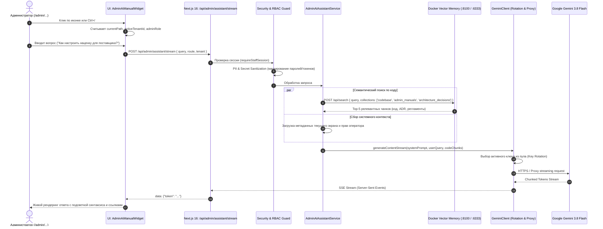

# SPEC-2026-09-19: Interactive Admin Operating Manual & AI Consultant Widget (OmniManual 1.0)

> **Статус:** DRAFT SPECIFICATION (Tier 1 Architecture & Functional Contract)  
> **Соответствие стандартам:** RAC-2026, OWASP Top 10:2025, Clean Architecture, MADR 3.0 (ADR-2026-20)  
> **Архитектурный контекст:** OmniSMM 1.0 Platform (`smmplan.pro` & `smmflux.ru`)  
> **Целевая аудитория:** Администраторы платформы, операторы поддержки, менеджеры каталога и владельцы (OWNER, ADMIN, MANAGER, SUPPORT).

---

## 1. Executive Summary (Общее описание)

**OmniManual 1.0** — это встраиваемый интерактивный виджет административной панели и интеллектуальный консультант, спроектированный для мгновенного онбординга, разъяснения сложной бизнес-логики платформы и предоставления контекстной документации по эксплуатации.

Виджет объединяет:
1. **Интерактивную инструкцию по эксплуатации**: пошаговые сценарии (Playbooks / Runbooks), привязанные к текущему открытому экрану админки, с кликабельными ссылками на элементы управления.
2. **AI-консультанта на базе Gemini 3.8 Flash**: диалоговый агент, формирующий ответы исключительно на основе **фактического исходного кода** платформы, схемы базы данных Prisma, активных архитектурных решений (ADR) и регламентов.
3. **Векторную индексируемую память в Docker**: контейнеризированный сервис (Qdrant + Python FastAPI + AST Indexer), обеспечивающий семантический поиск чанков кода и документации с задержкой $\le 30$ мс.
4. **Отказоустойчивый пул ротируемых API-ключей**: динамическая смена ключей с изолированным кулдауном при лимитах 429 и поддержкой Multi-Proxy диспетчеров для суверенной работы в РФ.

---

## 2. Архитектура системы и топология (System Topology)



---

## 3. Спецификация Docker-контейнера векторной памяти

### 3.1. Docker Compose конфигурация (`docker-compose.graphrag.yml`)
Сервис векторной памяти функционирует в изолированной Docker-сети `smmplan_default` и состоит из трех сервисов:

```yaml
version: '3.8'

services:
  # Векторная база данных Qdrant
  graphrag-qdrant:
    image: qdrant/qdrant:v1.13.4
    container_name: graphrag-qdrant
    restart: unless-stopped
    ports:
      - "127.0.0.1:6333:6333"
      - "127.0.0.1:6334:6334"
    volumes:
      - qdrant_data:/qdrant/storage
    environment:
      - QDRANT__TELEMETRY_DISABLED=true
    deploy:
      resources:
        limits:
          memory: 512M

  # FastAPI REST-шлюз и семантический движок
  graphrag-api:
    build:
      context: ./knowledge-service
      dockerfile: Dockerfile
    container_name: graphrag-api
    restart: unless-stopped
    ports:
      - "127.0.0.1:8100:8100"
    environment:
      - QDRANT_URL=http://graphrag-qdrant:6333
      - EMBEDDING_PROVIDER=local
      - LOCAL_MODEL_NAME=paraphrase-multilingual-MiniLM-L12-v2
      - API_SECRET_TOKEN=${KNOWLEDGE_API_TOKEN:-smmplan_internal_knowledge_token_2026}
    depends_on:
      - graphrag-qdrant
    volumes:
      - ./knowledge-service:/app
    deploy:
      resources:
        limits:
          memory: 512M

  # Фоновый демон инкрементальной индексации кодовой базы
  graphrag-indexer:
    build:
      context: ./knowledge-service
      dockerfile: Dockerfile.indexer
    container_name: graphrag-indexer
    restart: unless-stopped
    environment:
      - QDRANT_URL=http://graphrag-qdrant:6333
      - WATCH_PATHS=/app/codebase/src,/app/codebase/prisma,/app/codebase/docs
      - INDEX_INTERVAL=120
    depends_on:
      - graphrag-qdrant
    volumes:
      - ./src:/app/codebase/src:ro
      - ./prisma:/app/codebase/prisma:ro
      - ./docs:/app/codebase/docs:ro
      - ./CURRENT_STATE.md:/app/codebase/CURRENT_STATE.md:ro
      - ./MEMORY.md:/app/codebase/MEMORY.md:ro
      - ./AGENTS.md:/app/codebase/AGENTS.md:ro
      - ./knowledge-service/data:/app/data

volumes:
  qdrant_data:
```

### 3.2. Стратегия AST-чанкования кодовой базы
Индексатор (`knowledge-service/chunker.py`) выполняет семантический разбор файлов:
1. **TypeScript / TSX (`src/`)**:
   - Выделение модулей верхнего уровня: Server Actions, React-компоненты, сервисы, хуки, утилиты.
   - Чанк содержит: имя функции/компонента, docstring/JSDoc, сигнатуру входных и выходных параметров, реализацию логики (до 512 токенов на чанк).
   - Метаданные чанка:
     ```json
     {
       "file_path": "src/services/financial/exact-math.ts",
       "start_line": 128,
       "end_line": 155,
       "entity_type": "function",
       "entity_name": "calculateOrderCostKopecks",
       "layer": "Level 1 Services",
       "bounded_context": "fintech"
     }
     ```
2. **Prisma Schema (`prisma/schema.prisma`)**:
   - Чанкование по блокам моделей (`model User`, `model Order`, `model Service`, `model LedgerEntry`).
   - Сохранение описаний полей, связей и атрибутов `@default`, `@id`, `@index`.
3. **Markdown Документация (`docs/`, `ADR`, `runbooks`)**:
   - Чанкование по заголовкам H2/H3 с сохранением родительского контекста документа.

---

## 4. Контракт Gemini 3.8 Flash & Пул ротации API-ключей

### 4.1. Каскад моделей и приоритет
Платформа конфигурирует модель ИИ-консультанта через каскад:
```typescript
const GEMINI_MODEL_CASCADE = [
  process.env.GEMINI_MODEL || 'gemini-3.8-flash',
  'gemini-3-flash-preview',
  'gemini-3-flash',
  'gemini-2.5-flash',
];
```

### 4.2. Алгоритм ротации ключей и защиты от квот
```typescript
// Схема пула ротации ключей в GeminiClient
interface KeyState {
  key: string;
  source: 'STAFF_USER' | 'SYSTEM_SETTINGS' | 'ENV';
  cooldownUntil: number | null;
  failureCount: number;
}
```
1. **Источники ключей**:
   - Уровень 1: Персональный ключ вошедшего сотрудника (`User.geminiApiKey`, зашифрован в AES-256 через `VaultService`).
   - Уровень 2: Пул системных ключей из админки (`SystemSettings.geminiApiKeys`, разделенные запятыми, AES-256).
   - Уровень 3: Переменная окружения `GEMINI_API_KEYS` из `.env`.
2. **Политика обработки ошибок**:
   - **HTTP 429 (Resource Exhausted / Rate Limit)**: ключ немедленно переводится в кулдаун на 5 минут (`Date.now() + 300_000`), запрос прозрачно повторяется со следующим ключом.
   - **HTTP 403 (Invalid API Key)**: ключ маркируется как недействительный, отправляется алерт администратору.
   - **HTTP 500 / Network Timeout**: активируется альтернативный `ProxyAgent` из пула `GEMINI_PROXY`.

### 4.3. Системный промпт консультанта (Grounded Anti-Hallucination Prompt)
```markdown
Вы — официальный интерактивный консультант и главный инженер платформы OmniSMM 1.0 (SMMplan & SMMflux).
Ваша задача — консультировать операторов и администраторов строго по фактическому коду и документации проекта.

ЖЕСТКИЕ ПРАВИЛА (HARD INVARIANTS):
1. Вы обязаны опираться ТОЛЬКО на предоставленный контекст из базы знаний (векторные чанки кода и ADR).
2. Запрещено выдумывать функции, эндпоинты или параметры. Если информации нет в коде, четко сообщите: "Данный функционал не найден в кодовой базе OmniSMM."
3. Все денежные суммы в платформе рассчитываются строго в копейках (BigInt) через ExactMath с банковским округлением (Half-Even).
4. Базовая ставка НДС — 22% (ФЗ № 425-ФЗ).
5. При формировании ответа ВСЕГДА приводите кликабельные ссылки на исходные файлы и строки (например: [src/services/orders/checkout-pipeline.service.ts:45](file:///d:/SMM_plan_2/src/services/orders/checkout-pipeline.service.ts#L45)) и прямые маршруты админ-панели (например: [Каталог услуг](/admin/catalog)).
6. Ответ должен быть лаконичным, четко структурированным, на русском языке, с примерами параметров и рекомендациями для оператора.
```

---

## 5. API и Server Actions Контракты

### 5.1. Streaming Endpoint: `/api/admin/assistant/stream`
- **Метод**: `POST`
- **Протокол**: HTTP/1.1 Server-Sent Events (`text/event-stream`)
- **Безопасность**: Защищен сессией `requireStaffPermission('ADMIN_MANUAL_READ')`

#### Входной DTO (Zod):
```typescript
export const AdminAssistantQuerySchema = z.object({
  query: z.string().min(2).max(1000),
  currentRoute: z.string().max(200).default('/admin/dashboard'),
  activeTenantId: z.enum(['smmplan', 'flux']).default('smmplan'),
  conversationHistory: z.array(z.object({
    role: z.enum(['user', 'assistant']),
    content: z.string().max(4000),
  })).max(10).default([]),
});

export type AdminAssistantQuery = z.infer<typeof AdminAssistantQuerySchema>;
```

#### Формат исходящих SSE событий:
```text
event: context
data: {"route": "/admin/providers/import", "chunksCount": 4, "model": "gemini-3.8-flash"}

event: token
data: {"text": "Для импорта услуг провайдера перейдите в мастер импорта..."}

event: action_chip
data: {"label": "Открыть мастер импорта", "href": "/admin/providers/import"}

event: done
data: {"totalTokens": 384, "executionTimeMs": 850}
```

### 5.2. Server Action получения регламентов: `getAdminRunbooksAction()`
```typescript
export interface AdminRunbook {
  id: string;
  chapter: string;
  title: string;
  targetRoute: string;
  summary: string;
  steps: Array<{
    stepNumber: number;
    instruction: string;
    targetElementSelector?: string;
    actionUrl?: string;
    warningNote?: string;
  }>;
  relatedFiles: string[];
}
```

---

## 6. Компонентная структура UI виджета (Presentation Layer)

В соответствии с правилом `$\le 200$ строк на файл`, виджет декомпозирован на модули в `src/components/admin/ai-manual/`:

```
src/components/admin/ai-manual/
├── AdminAiManualWidget.tsx           # Корневой координатор (открытие, стейт, хоткей Ctrl+/) ~140 строк
├── types.ts                          # Типы UI состояния и контрактов ~50 строк
├── sub/
│   ├── ManualFloatingTrigger.tsx      # Плавающая кнопка (FAB) с бейджем статуса ~85 строк
│   ├── ManualHeader.tsx              # Шапка Drawer с переключателем табов и закрытием ~75 строк
│   ├── ManualChatTab.tsx             # Таб 1: Диалог с Gemini, SSE-поток, чипсы ~180 строк
│   ├── ManualChatMessages.tsx        # Рендеринг баблов, Markdown, кодовых сниппетов ~160 строк
│   ├── ManualGuidesTab.tsx           # Таб 2: Интерактивные регламенты и чеклисты ~175 строк
│   ├── ManualRunbookDetail.tsx       # Пошаговое выполнение выбранного регламента ~165 строк
│   ├── ManualInspectorTab.tsx        # Таб 3: Инспектор моделей БД и активных ADR ~150 строк
│   └── ManualConnectionStatus.tsx    # Индикатор доступности Docker Vector Memory ~65 строк
```

### 6.1. Размещение в глобальном макете (`src/app/admin/layout.tsx`)
Виджет монтируется на уровне провайдеров в конце страницы:
```tsx
// src/app/admin/layout.tsx
<AdminAiManualWidget 
  userRole={user.role} 
  activeTenantId={activeTenantId} 
/>
```

---

## 7. Каталог встроенных интерактивных регламентов (8 глав)

1. **Глава 1: Каталог и Провайдеры**
   - *Сценарий 1.1*: Добавление нового SMM-провайдера (настройка API URL, ключа и сопоставления статусов).
   - *Сценарий 1.2*: Мастер импорта каталога (выбор категорий, алгоритмический анализатор, установка наценок).
   - *Сценарий 1.3*: Разблокировка зомби-услуг и карантин провайдера.
2. **Глава 2: Финансы, Платежи и 54-ФЗ**
   - *Сценарий 2.1*: Настройка боевого и тестового эквайринга ЮKassa (Shop ID, Secret, фискализация НДС 22%).
   - *Сценарий 2.2*: Ручная обработка заявок на пополнение баланса и банковский перевод.
   - *Сценарий 2.3*: Ночная сверка Леджера и аудит расхождений балансов.
3. **Глава 3: Заказы, Исполнение и Failover**
   - *Сценарий 3.1*: Повторная отправка зависшего заказа провайдеру (Retry Pipeline).
   - *Сценарий 3.2*: Ручная отмена заказа с автоматическим возвратом средств в копейках BigInt на баланс.
   - *Сценарий 3.3*: Диагностика Drip-Feed и Smart Drip задач в очередях BullMQ.
4. **Глава 4: Безопасность и Права Доступа (RBAC)**
   - *Сценарий 4.1*: Создание кастомной роли оператора с ограничением доступа к финансам.
   - *Сценарий 4.2*: Ввод персонального ключа Gemini сотрудником для снятия общих лимитов.
5. **Глава 5: Режимы окружения платформы**
   - *Сценарий 5.1*: Переключение в режим `SANDBOX` (полная эмуляция без списаний).
   - *Сценарий 5.2*: Переключение в режим `ACQUIRING_TEST` (тест реального шлюза ЮKassa без отправки в соцсети).
6. **Глава 6: Мульти-тенантность (SMMplan vs SMMflux)**
   - *Сценарий 6.1*: Глобальное переключение витрины в шапке панели.
   - *Сценарий 6.2*: Изоляция каталогов и кэшей брендов.
7. **Глава 7: Поддержка и Коммуникация**
   - *Сценарий 7.1*: Подключение Telegram бота оператора для мгновенных уведомлений.
   - *Сценарий 7.2*: Настройка быстрых шаблонов ответов в тикетах (`/` макросы).
8. **Глава 8: Экстренное реагирование (Incident Response)**
   - *Сценарий 8.1*: Активация глобального баннера техработ (`SystemEmergencyBanner`).
   - *Сценарий 8.2*: Экстренный сброс кэша Redis при обновлении цен поставщика.

---

## 8. Защита данных, PII и Санитизация (Zero-Leakage Invariant)

1. **Входная санитизация (Pre-Prompt Sanitizer)**:
   - Автоматическое вырезание номеров банковских карт (Luhn regex).
   - Маскирование номеров телефонов и email-адресов клиентов до формата `a***@domain.com`.
   - Запрет отправки хэшей паролей пользователей (`User.passwordHash`).
2. **Маскирование секретов платформы**:
   - При индексации кода и обращении к БД все поля, содержащие токены (`apiKey`, `secretKey`, `token`, `password`), заменяются маской `[REDACTED_SECRET]`.
3. **Аудит запросов оператора**:
   - Каждый диалог фиксируется через `auditAdminAwaitable()` в таблице `AdminAuditLog` с сохранением ID оператора, времени ответа и использованного Gemini ключа.

---

## 9. План верификации и приемочные критерии (Acceptance Criteria)

### 9.1. Автоматизированные тесты (Vitest)
- [ ] `src/__tests__/unit/admin-ai-manual-sanitizer.test.ts`: 100% покрытие маскирования секретов и PII.
- [ ] `src/__tests__/unit/gemini-key-pool-rotation.test.ts`: проверка смены ключа при эмуляции 429 ошибки и 5-минутного кулдауна.
- [ ] `src/__tests__/unit/admin-ai-manual-widget-decomposition.test.tsx`: проверка рендеринга виджета и переключения табов.
- [ ] `src/__tests__/integration/docker-vector-memory.test.ts`: проверка поиска по Qdrant и возврата точных сниппетов кода.

### 9.2. Браузерная проверка (Puppeteer / Playwright)
- [ ] Проверка доступности плавающей кнопки виджета на экранах 1440px и 390px.
- [ ] Проверка открытия виджета по горячей клавише `Ctrl + /`.
- [ ] Проверка отсутствия горизонтального скролла (`docWidth === winWidth`) при открытом Drawer виджета.
- [ ] Отправка тестового запроса оператора с получением ответа в режиме стриминга.

### 9.3. Проверка качества кода и сборки
- [ ] `npx tsc --noEmit` — 0 ошибок.
- [ ] `npm run check:arch` — 0 архитектурных нарушений (Level 3 -> Level 2 -> Level 1 -> Level 0).
