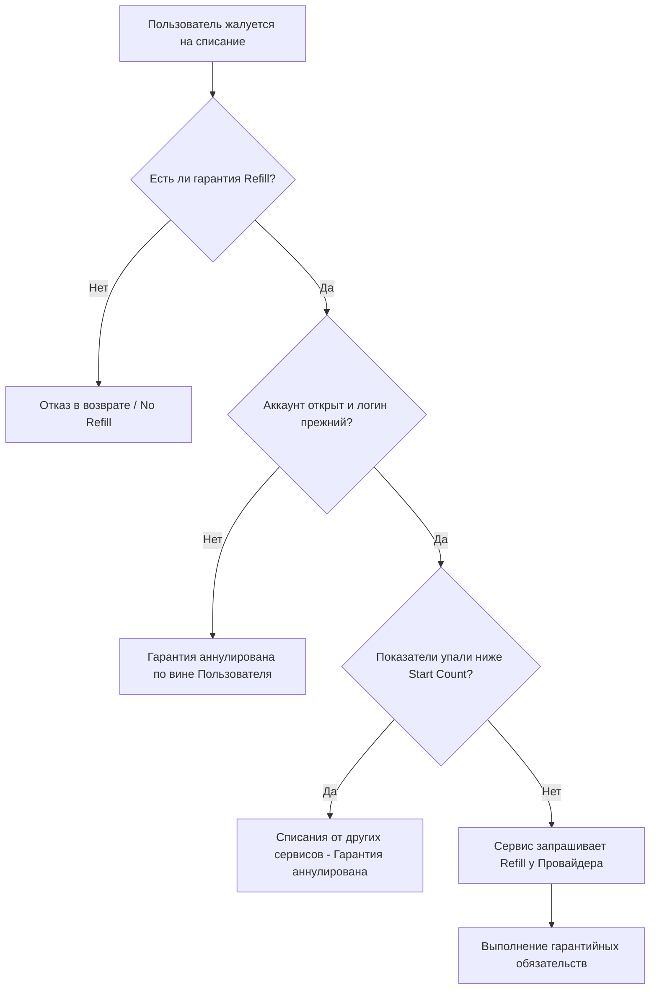
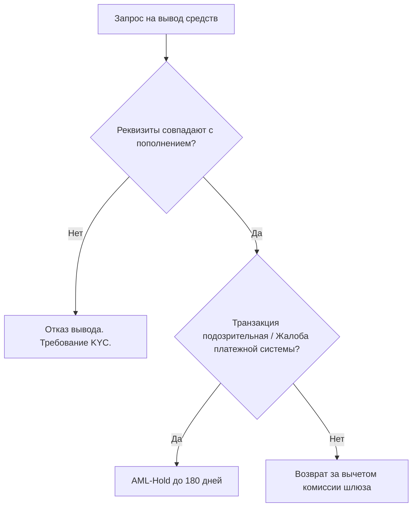

# Precedent Legal 001: Refund Abuse & Provider Failures

**Date:** 2026-06-25
**Type:** Legal 0-day Hardening
**Target:** Public Offer (Terms) & Refund Policy
**Agent:** gsd-legal-reverse-engineering

## 1. Сводка Уязвимостей (Vulnerability Summary)

В ходе реверс-инжиниринга юридической обвязки проекта Smmplan были выявлены 4 критические уязвимости (Legal 0-days), позволяющие злоупотреблять функцией возврата средств:

1.  **Drip-Feed Loophole:** Возможность требовать возврата за отложенные заказы при смене юзернейма.
2.  **Refill Warranty Void:** Отсутствие четких условий аннулирования гарантии (например, при удалении поста).
3.  **AML/Fraud Freeze:** Отсутствие легального права заморозить "грязные" (кардинг) депозиты до выяснения обстоятельств.
4.  **Dynamic Pricing Risk:** Отсутствие фиксации того факта, что цены зависят от курса ЦБ и могут меняться после пополнения баланса.

## 2. Внедренные Патчи (Patches Applied)

В файлы `scripts/seed-legal.ts` были добавлены:
*   Публичная Оферта: п. 2.4, обновлен п. 3.3, обновлен п. 4.1.
*   Политика Возврата: обновлен п. 1.3 (AML Hold до 180 дней), добавлен новый пункт в список невозвратных случаев.

## 3. Флоу ответственности (Chain of Liability & Refund Flow)

Ниже представлен граф распределения ответственности при возникновении спора (dispute):

## 4. Граф AML-комплаенса (AML Hold)

## 5. Вывод
Текущая юридическая архитектура усилена. Агентская модель и отказ от гарантий (Best Effort) явно артикулированы, что переносит риски списаний социальных сетей на Принципала (Пользователя).
