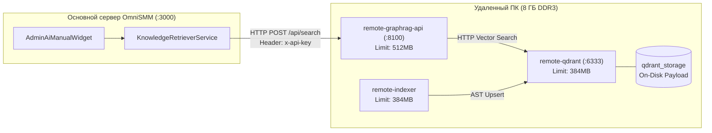

# Руководство по развертыванию векторной памяти на удаленном ПК (8 ГБ DDR3)

> **Целевая конфигурация:** Удаленный сервер или домашний ПК с 8 ГБ RAM DDR3.  
> **Стек:** Qdrant v1.13.4 + FastAPI RAG-шлюз + AST-индексатор.  
> **Потребление ресурсов:** Пиковое потребление памяти $\le 1.3$ ГБ RAM (остается $\ge 6.7$ ГБ для ОС).

---

## 1. Архитектура удаленного узла



---

## 2. Быстрый запуск на удаленном ПК

### Шаг 1. Клонирование репозитория
На удаленном ПК выполните:
```bash
git clone https://github.com/<ваш-репозиторий>/SMMplan.git
cd SMMplan/knowledge-service
```

### Шаг 2. Настройка токена доступа
Создайте или отредактируйте файл `.env` в папке `knowledge-service`:
```env
KNOWLEDGE_API_TOKEN=smmplan_remote_memory_token_2026
```

### Шаг 3. Запуск контейнеров

**На Linux / macOS:**
```bash
chmod +x deploy-remote-8gb.sh
./deploy-remote-8gb.sh
```

**На Windows (PowerShell):**
```powershell
.\deploy-remote-8gb.ps1
```

Либо напрямую через Docker Compose:
```bash
docker compose -f docker-compose.remote-8gb.yml up -d --build
```

---

## 3. Проверка работоспособности

Выполните запрос к healthcheck эндпоинту:
```bash
curl http://localhost:8100/health
# Ожидаемый ответ: {"status":"healthy"}
```

Проверка статистики коллекций:
```bash
curl http://localhost:8100/api/stats
```

---

## 4. Подключение основного сервера OmniSMM

На сервере, где запущена админ-панель (или в локальном `.env` на основном ПК разработки), укажите:

```env
# IP-адрес или Tailscale-адрес удаленного ПК
VECTOR_MEMORY_URL=http://<IP_УДАЛЕННОГО_ПК>:8100
KNOWLEDGE_API_TOKEN=smmplan_remote_memory_token_2026
```

Например, при использовании локальной сети:
```env
VECTOR_MEMORY_URL=http://192.168.1.50:8100
KNOWLEDGE_API_TOKEN=smmplan_remote_memory_token_2026
```

Или при использовании Tailscale VPN:
```env
VECTOR_MEMORY_URL=http://100.95.120.45:8100
KNOWLEDGE_API_TOKEN=smmplan_remote_memory_token_2026
```

---

## 5. Оптимизация для DDR3 памяти (Performance Tuning)

1. **`QDRANT__STORAGE__ON_DISK_PAYLOAD=true`**:
   - Полезная нагрузка векторов (исходные тексты, сниппеты кода, метаданные) хранится на SSD/диске и считывается по требованию через memory mapping, а не висит постоянно в DDR3 оперативной памяти.
2. **Локальная модель `all-MiniLM-L6-v2`**:
   - Размер модели составляет всего 80 МБ.
   - Скорость инференса на CPU: $<15$ мс на чанк.
   - Потребление RAM моделью: $<150$ МБ.
3. **Интервал индексатора `INDEX_INTERVAL=300`**:
   - Индексатор сканирует изменения каждые 5 минут, что предотвращает постоянную загрузку шины памяти DDR3.
